Deep Agents 架构评估报告
基于 LangGraph 的生产级 Agent 框架架构分析
## 1. 架构概览
### 1.1 整体架构图
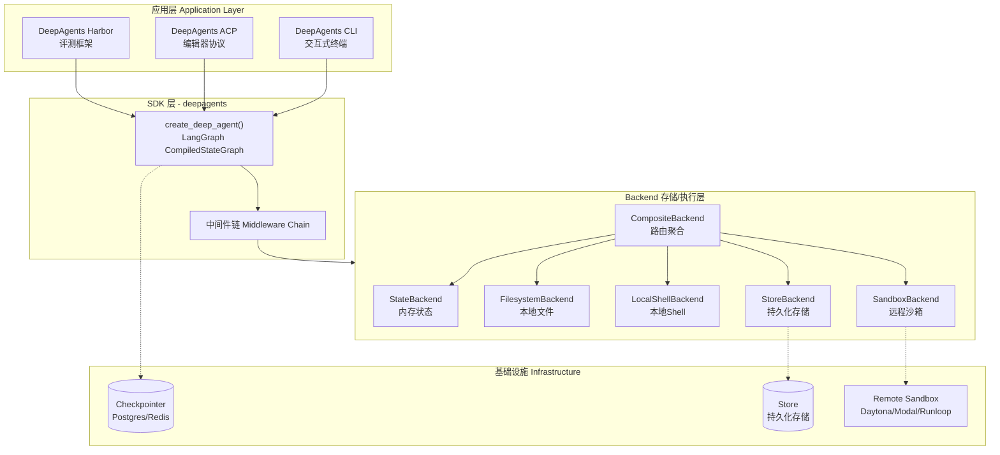
### 1.2 核心模块说明
|模块|路径|职责|
|-|-|-|
|**Agent 构建器**|`deepagents/graph.py`|`create_deep_agent()` 主入口，组装完整 Agent|
|**文件系统中间件**|`deepagents/middleware/filesystem.py`|提供 `ls/read/write/edit/glob/grep/execute` 工具|
|**子代理中间件**|`deepagents/middleware/subagents.py`|提供 `task` 工具，支持子代理调用|
|**技能中间件**|`deepagents/middleware/skills.py`|支持 Agent Skills 规范，动态加载技能文档|
|**记忆中间件**|`deepagents/middleware/memory.py`|加载 AGENTS.md 等记忆文件到系统提示|
|**摘要中间件**|`deepagents/middleware/summarization.py`|自动上下文压缩，防止 token 溢出|
|**Backend 协议**|`deepagents/backends/protocol.py`|定义 BackendProtocol 和 SandboxBackendProtocol|
|**State Backend**|`deepagents/backends/state.py`|基于 LangGraph 状态的文件存储|
|**Sandbox Backend**|`deepagents/backends/sandbox.py`|远程沙箱基类，支持命令执行|
|**Composite Backend**|`deepagents/backends/composite.py`|多后端路由聚合|

---

## 2. Middleware 处理流程
### 2.1 请求处理流水线
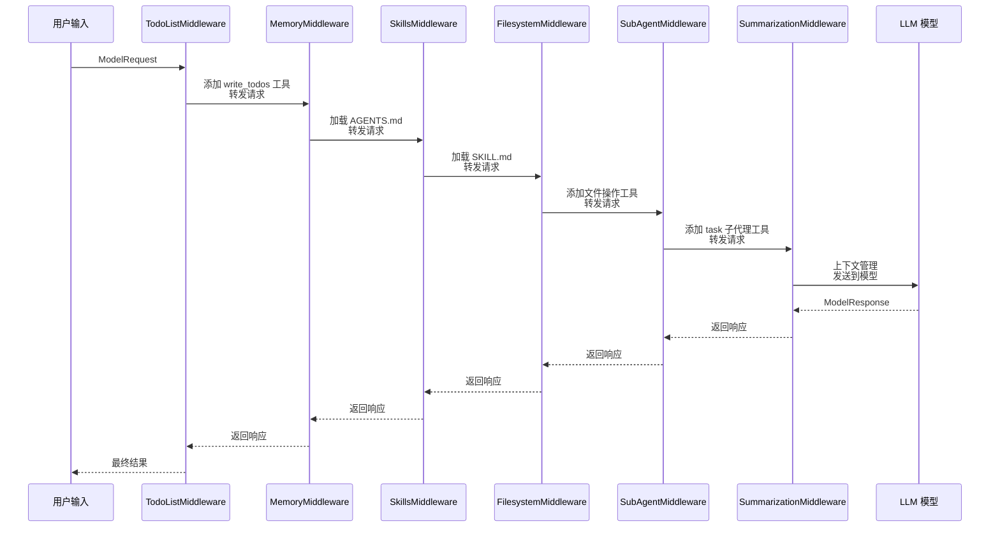
### 2.2 中间件栈结构
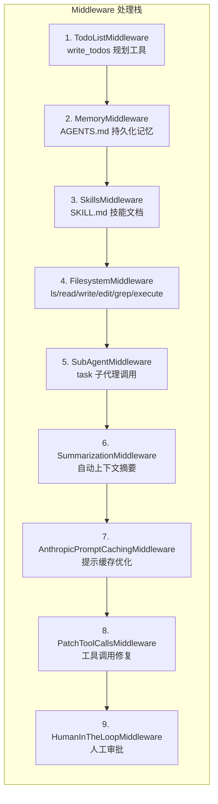
---

## 3. Backend 存储架构
### 3.1 Backend 类型对比
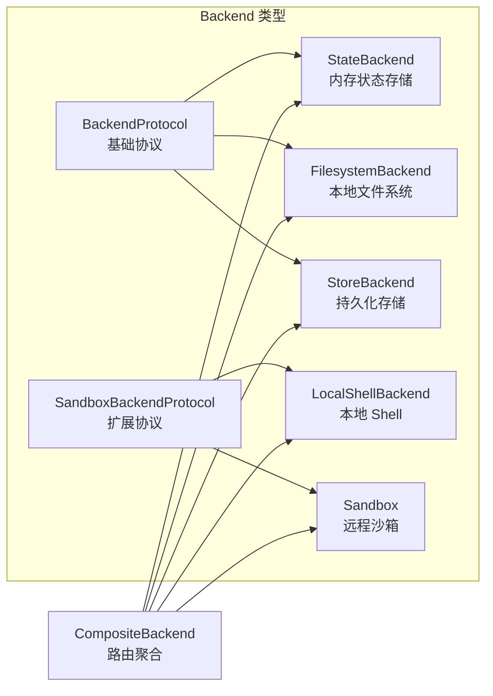
|Backend|存储位置|执行能力|适用场景|
|-|-|-|-|
|StateBackend|LangGraph 状态|否|临时文件，会话内有效|
|FilesystemBackend|本地磁盘|否|本地文件操作|
|LocalShellBackend|本地磁盘|是 (本地 shell)|本地开发环境|
|StoreBackend|LangGraph Store|否|持久化跨会话存储|
|Sandbox (Remote)|远程容器|是 (远程)|安全隔离执行|
|CompositeBackend|路由分发|取决于默认后端|混合存储需求|

### 3.2 CompositeBackend 路由示例
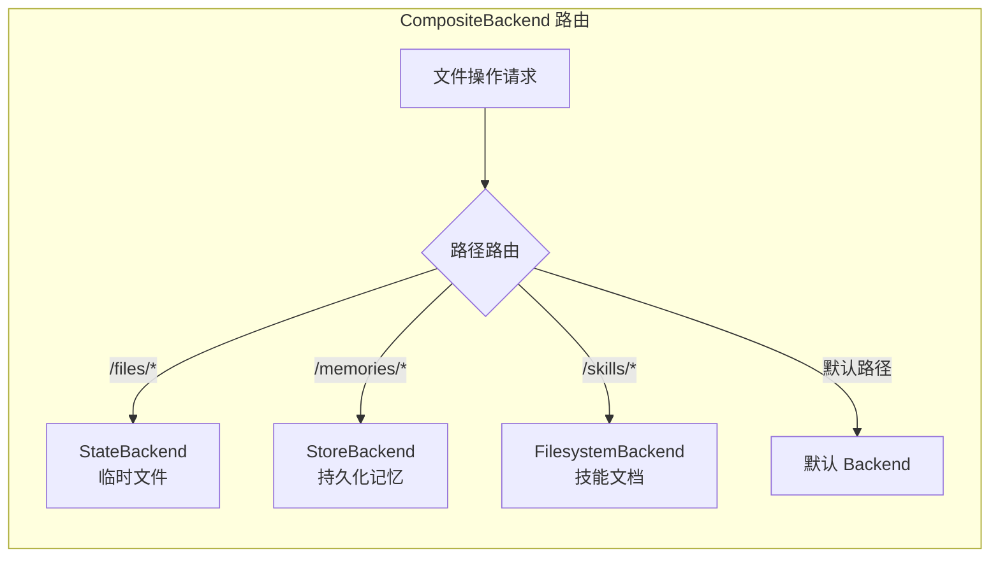
---

## 4. 能力边界评估
### 4.1 能力支持矩阵
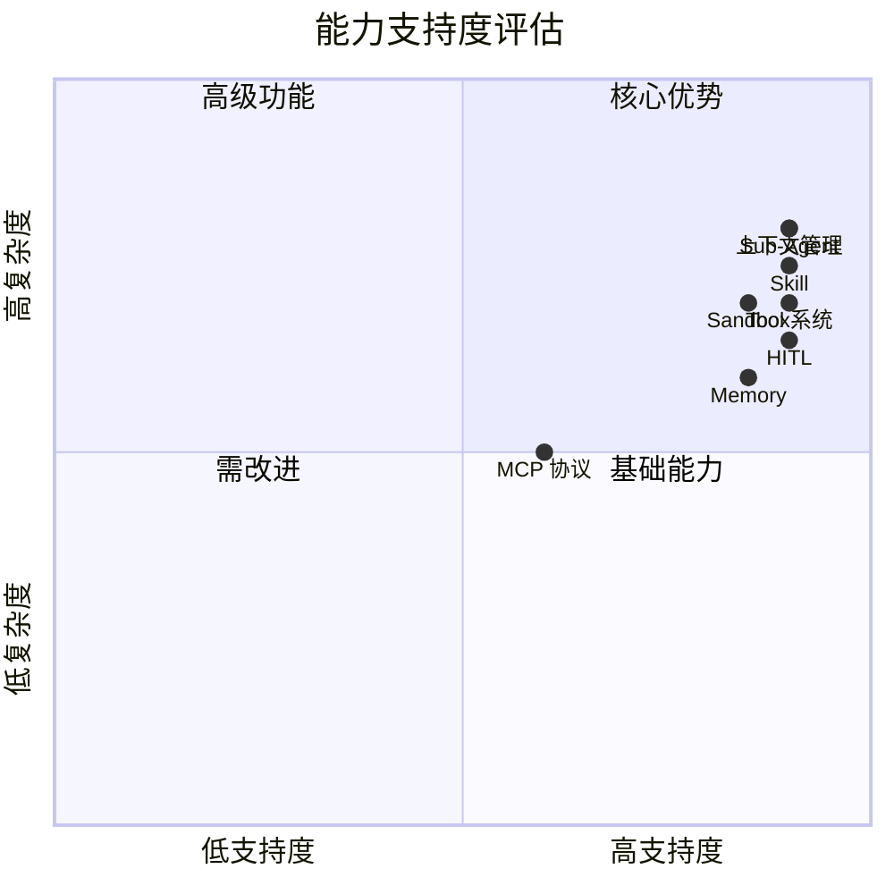
|能力|支持度|说明|
|-|-|-|
|**Tool 系统**|强|内置 7+ 文件/执行工具，支持自定义工具|
|**MCP 协议**|中|通过 `langchain-mcp-adapters` 支持|
|**Sub-Agent**|强|原生支持 `task` 工具，内置通用子代理|
|**Memory**|强|支持 AGENTS.md 持久化记忆，多源加载|
|**Skill**|强|完整实现 Agent Skills 规范，渐进式披露|
|**Sandbox**|强|支持本地 shell 和远程沙箱 (Daytona/Modal/Runloop)|
|**HITL**|强|内置人工审批，支持工具级中断配置|
|**上下文管理**|强|自动摘要、大结果驱逐、token 管理|

### 4.2 核心类设计
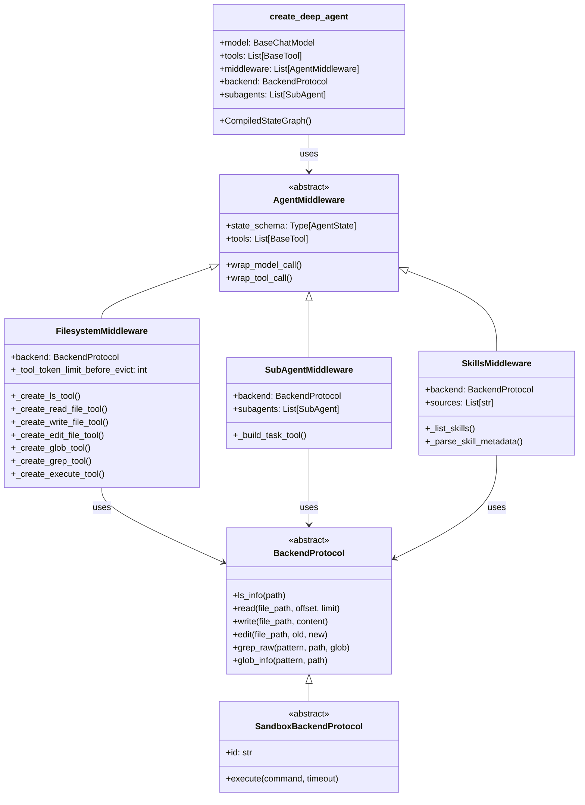
---

## 5. 特殊能力详解
### 5.1 Agent Skills 规范支持
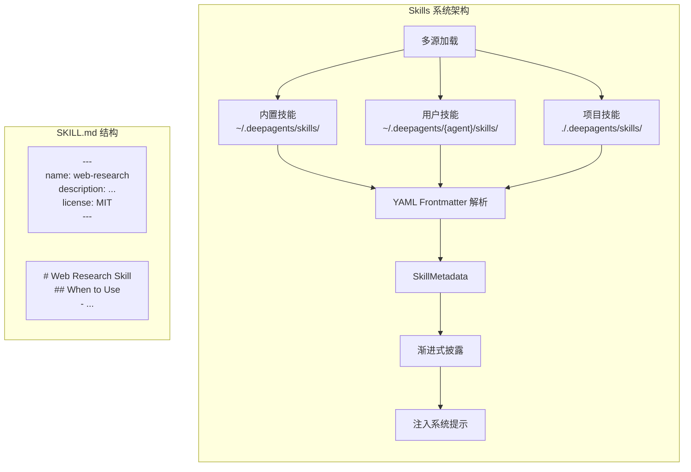
**特性**：

* YAML frontmatter 元数据解析
* 多源加载 (built-in → user → project)
* 渐进式披露 (列表显示，按需阅读)
* 工具限制声明 (`allowed-tools`)

### 5.2 上下文管理策略
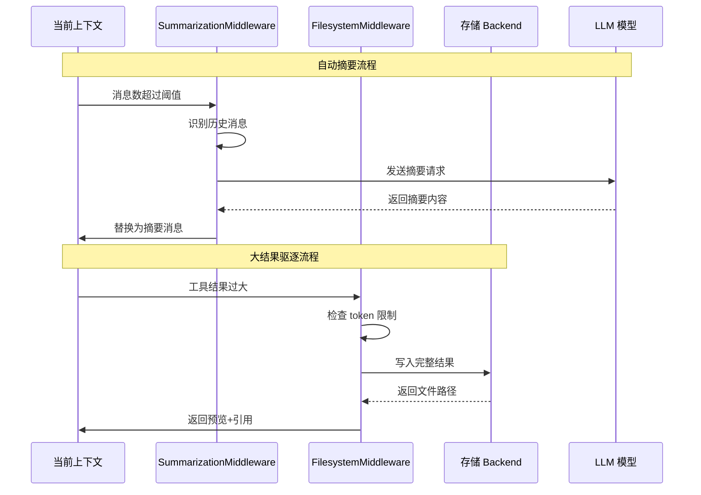
**自动摘要 (SummarizationMiddleware)**：

* 根据模型特性自动计算触发阈值
* 保留最近 N 条消息，摘要历史
* 支持 Claude 3 的 20K 输出和 GPT-4 的 8K 输出

**大结果驱逐 (FilesystemMiddleware)**：

* 工具结果超过 20K tokens 自动写入文件系统
* 返回预览 + 文件引用
* 避免上下文窗口溢出

### 5.3 子代理系统
```mermaid
flowchart TB
    subgraph MainAgent["主代理 Main Agent"]
        TaskTool["task 工具"]
    end

    subgraph SubAgents["子代理池"]
        direction TB
        GP["general-purpose<br/>通用子代理"]
        Custom1["content-reviewer<br/>内容审核"]
        Custom2["research-analyst<br/>研究分析"]
        Custom3["code-reviewer<br/>代码审查"]
    end

    TaskTool --> GP
    TaskTool --> Custom1
    TaskTool --> Custom2
    TaskTool --> Custom3

    subgraph Isolation["上下文隔离"]
        State1["独立 State"]
        Tools1["独立 Tools"]
        Model1["独立 Model"]
    end

    GP -.-> Isolation
    Custom1 -.-> Isolation
    Custom2 -.-> Isolation
    Custom3 -.-> Isolation
```
**特性**：

* 自动包含通用子代理 (general-purpose)
* 支持并行调用多个子代理
* 完全隔离的上下文窗口
* 子代理可拥有独立工具和模型

---

## 6. 使用复杂度评估
### 6.1 复杂度矩阵
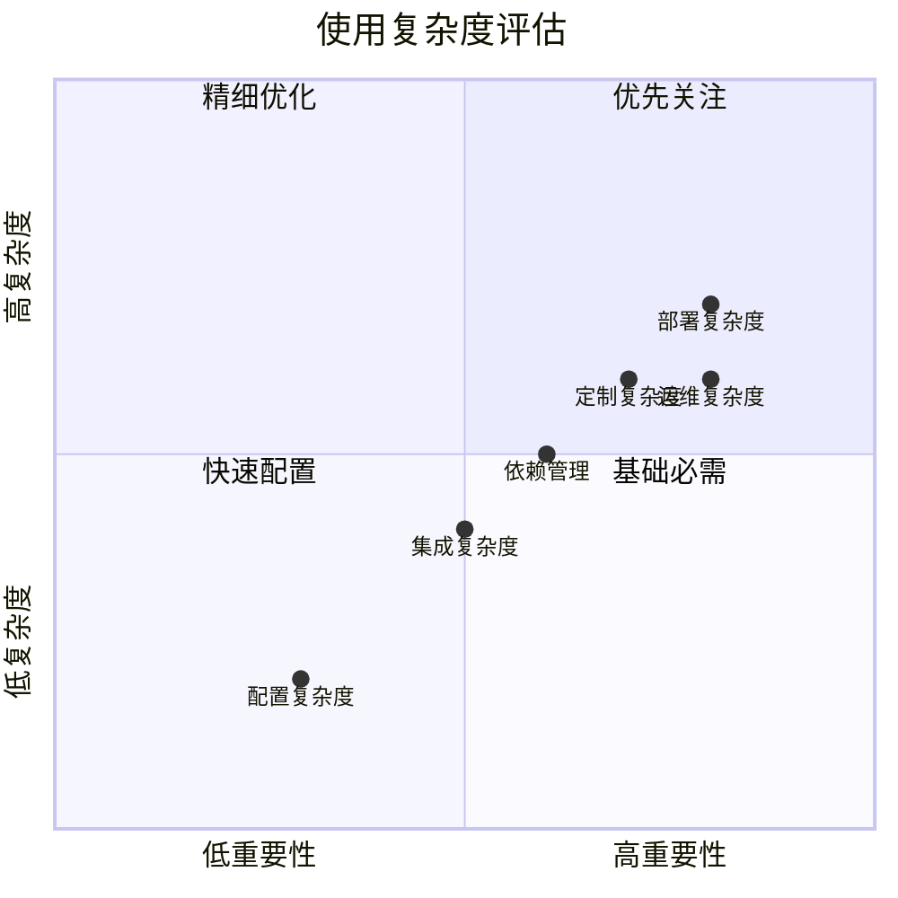
|维度|评级|说明|
|-|-|-|
|**依赖复杂度**|中|LangChain, LangGraph, 多种模型 SDK|
|**配置复杂度**|低|`create_deep_agent()` 开箱即用|
|**集成复杂度**|低|返回标准 LangGraph CompiledStateGraph|
|**定制复杂度**|中|Middleware/Backend 可插拔设计|
|**部署复杂度**|中|支持本地、容器、远程沙箱多种模式|

**核心代码量**: ~80K 行 Python（包含 SDK + CLI + 测试）

### 6.2 使用示例对比
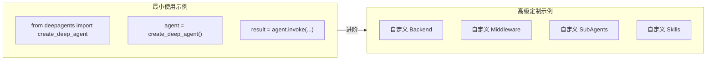
---

## 7. 分布式支持评估
### 7.1 当前架构的分布式能力
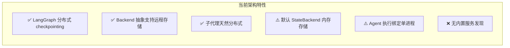
**已具备的基础**：

* LangGraph 原生支持分布式 checkpointing
* Backend 抽象支持远程存储
* 子代理天然分布式（无共享状态）

**限制点**：

|限制点|说明|影响|
|-|-|-|
|默认 StateBackend|文件存储在进程内存|实例重启状态丢失|
|单进程执行|Agent 执行绑定到单个进程|需要外部编排实现水平扩展|
|无内置服务发现|无服务注册/发现机制|需外部基础设施|

### 7.2 分布式部署方案
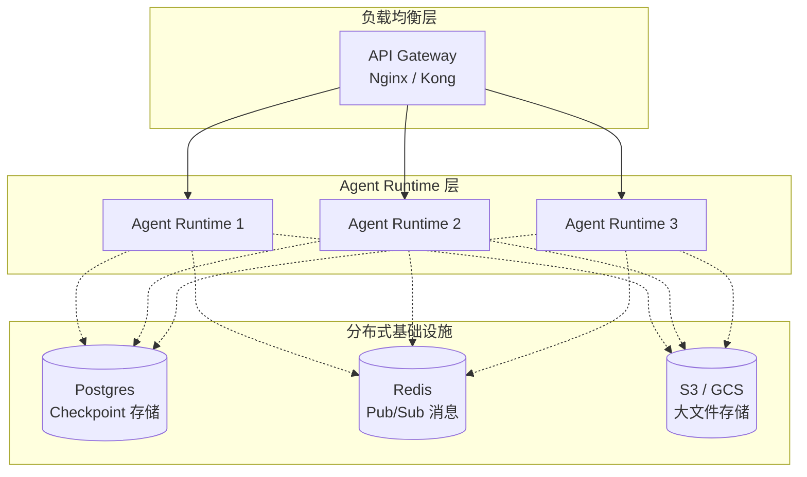
### 7.3 部署模式演进
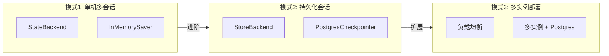
|组件|推荐方案|工作量|
|-|-|-|
|Checkpoint|PostgresCheckpointer / RedisCheckpointer|已内置|
|大文件存储|S3 / GCS Backend 扩展|1-2 天|
|任务队列|外部任务队列 (Celery / RQ)|需自建|
|状态共享|LangGraph Store (Postgres)|已支持|

---

## 9. 关键文件路径
### 9.1 SDK 核心文件
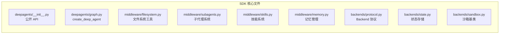
|文件|路径|说明|
|-|-|-|
|主入口|`libs/deepagents/deepagents/__init__.py`|公开 API|
|Agent 构建器|`libs/deepagents/deepagents/graph.py`|create_deep_agent|
|文件系统中间件|`libs/deepagents/deepagents/middleware/filesystem.py`|核心工具实现|
|子代理中间件|`libs/deepagents/deepagents/middleware/subagents.py`|task 工具|
|技能中间件|`libs/deepagents/deepagents/middleware/skills.py`|Skills 系统|
|记忆中间件|`libs/deepagents/deepagents/middleware/memory.py`|AGENTS.md 加载|
|Backend 协议|`libs/deepagents/deepagents/backends/protocol.py`|接口定义|
|State Backend|`libs/deepagents/deepagents/backends/state.py`|状态存储|
|Sandbox 基类|`libs/deepagents/deepagents/backends/sandbox.py`|沙箱基类|

### 9.2 CLI 核心文件
|文件|路径|说明|
|-|-|-|
|CLI Agent|`libs/cli/deepagents_cli/agent.py`|create_cli_agent|
|主入口|`libs/cli/deepagents_cli/main.py`|CLI 入口|
|UI 组件|`libs/cli/deepagents_cli/ui.py`|TUI 界面|
|配置管理|`libs/cli/deepagents_cli/config.py`|设置和配置|
|沙箱工厂|`libs/cli/deepagents_cli/integrations/`|Daytona/Modal/Runloop|

---

## 10. 结论与建议
### 10.1 架构优势
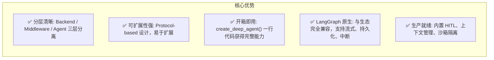
### 10.2 适用场景
**强烈推荐**：

* 需要快速构建代码/文件处理 Agent
* 需要子代理分工协作的复杂任务
* 需要 Skills 系统实现领域专业化
* 需要人机协作的工作流

**适合使用**：

* Claude Code 类工具的自建需求
* IDE/编辑器集成 (通过 ACP 协议)
* 自动化代码审查、文档生成
* 研究分析类任务

**需要评估**：

* 纯对话类 Agent (无文件操作需求)
* 超低延迟场景 (子代理有启动开销)
* 纯事件驱动架构 (当前为函数调用式)

### 10.3 集成建议
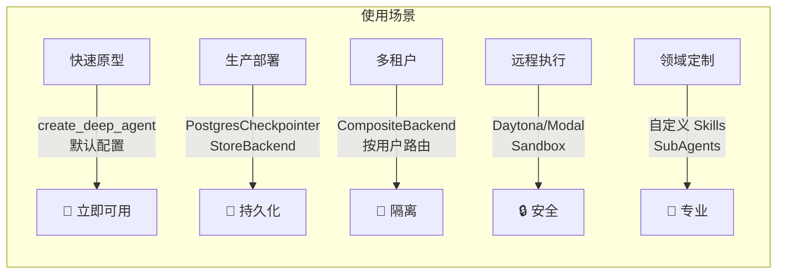
|场景|推荐方案|
|-|-|
|快速原型|`create_deep_agent()` 默认配置|
|生产部署|PostgresCheckpointer + StoreBackend|
|多租户|CompositeBackend + 按用户路由|
|远程执行|Daytona/Modal/Runloop Sandbox|
|领域定制|自定义 Skills + SubAgents|

### 10.4 总体评估
**Deep Agents** 是一个**生产就绪、架构清晰、扩展性强**的 Agent 框架。

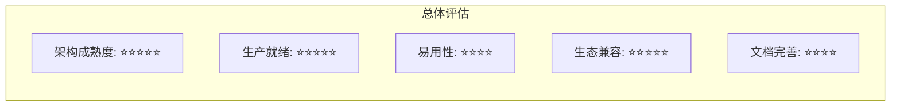
**总结**:

* Deep Agents 更适合需要与 LangChain/LangGraph 生态集成、需要生产级稳定性、需要 Skills 系统的场景
* OpenManus 更适合研究实验、需要原生 MCP 双模支持的场景
* 对于构建 Claude Code 类工具，Deep Agents 是更成熟的选择

---

*文档生成时间: 2026-02-24*
*基于 Deep Agents 最新代码分析*