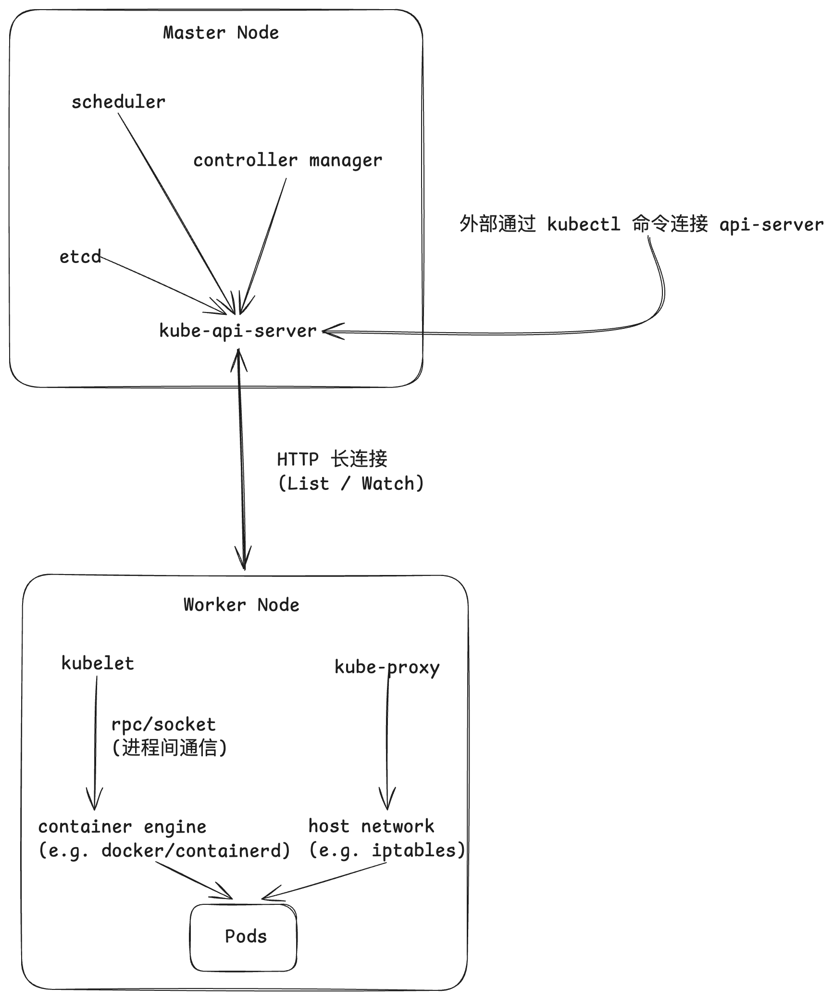
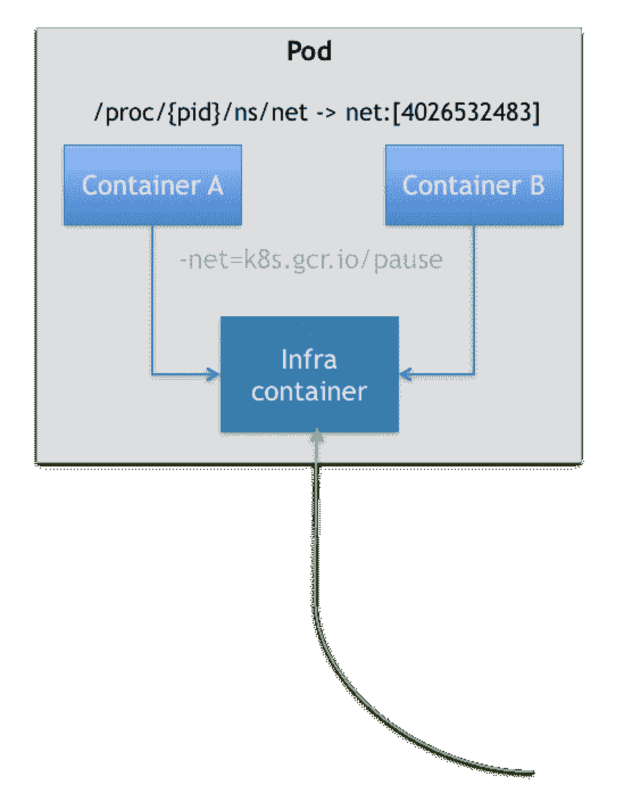

# 总览

先来看看 k8s 的一些核心概念

* **Pod（容器组）**：K8s 中能够创建和调度的最小计算单元。一个 Pod 并不是一个容器，而是包含一个或多个紧密相关的容器。同一个 Pod 中的容器共享网络 IP 和存储卷，它们通常被部署在同一台物理机或虚拟机上（Node）。
* **Node（节点）**：运行 K8s 工作负载的机器（可以是物理机或虚拟机）。一个 Node 可以部署多个 Pod，集群（Cluster）通常由多个 Node（既包含 worker 又包含 master） 组成。
* **Deployment（部署）**：用于声明应用的期望状态（比如“我需要这个应用同时运行 3 个副本”）。K8s 的控制器会自动监控并维持这个状态，如果某个 Pod 崩溃了，Deployment 会自动启动一个新的 Pod 来替换它。
* **Service（服务）**：因为 Pod 是极其脆弱的（随时可能被销毁重建），它们的 IP 地址是动态变化的。Service 提供了一个统一的入口地址和负载均衡机制，让你可以稳定地访问后端的一组 Pod，而无需关心具体的 Pod IP。
* **Namespace（命名空间）**：用于在一个物理集群中划分出多个虚拟集群。通常用来隔离不同的环境（如 `dev` 开发、`test` 测试、`prod` 生产），或者隔离不同团队的资源。
* **ConfigMap 和 Secret**：用于将配置文件或敏感信息（如数据库密码、证书）与容器镜像解耦，方便统一管理和注入到 Pod 中。

在一个集群之中，Deployment 主要管理集群中的内部计算资源（Pod），Service 主要对外提供一个统一的网络接口。Deployment 只保证该集群里永远有 N 个一模一样的 Pod 在运行，如果某一个 Pod 崩溃了，就自动拉起新的 Pod。在 K8s 的网络底层，Pod 是极其短命且不可靠的。每次 Deployment 重新拉起一个 Pod，底层的网络插件（CNI）都会给这个新 Pod 分配一个全新的、随机的 IP 地址。这就是为什么还需要 Service，它为集群提供一个永远不变的 IP 和端口，通过 Label 识别 Pod 并把流量分发给集群中的 Pod，实现负载均衡。

```yaml

# Deployment 
apiVersion: apps/v1
kind: Deployment
metadata:
    name: my-web-app
spec:
    replicas: 3 # 我们声明需要 3 个 Nginx 副本
    selector:
        matchLabels:
            app: nginx
    template:
        metadata:
            labels:
                app: nginx # 给这些 Pod 贴上标签，方便后面寻找
        spec:
            containers:
                - name: nginx
                  image: docker.m.daocloud.io/library/nginx:alpine
                  ports:
                      - containerPort: 80

---
# Service 
apiVersion: v1
kind: Service
metadata:
    name: my-web-service
spec:
    type: NodePort # 允许从宿主机直接访问
    selector:
        app: nginx # 重点：Service 会自动把流量打给所有带有 app:nginx 标签的 Pod
    ports:
        - port: 80
          targetPort: 80
          nodePort: 30080 # 我们在宿主机上暴露的端口

```


K8s 采用的是主从架构，一个集群主要分为控制平面（Master Node）和工作节点（Worker Node）两大部分。

Master Node 负责全局决策、响应集群事件以及调度。

* **kube-apiserver**：相当于一个集群的网关（类似于 nginx 吧）。所有的组件交互以及外部客户端（如命令行工具 `kubectl`）的操作，都必须通过 API Server 进行。
* **etcd**：一个高可用、强一致性的键值存储数据库。作为集群的最终事实来源，保存了整个集群的所有状态数据和配置信息。
* **kube-scheduler**：负责“相亲分配”。它会监控新创建但尚未分配运行节点的 Pod，并根据 CPU/内存需求、硬件约束等条件，将 Pod 调度到最合适的工作节点上。
* **kube-controller-manager**：内部包含了多种控制器（如节点控制器、副本控制器等），不断循环对比集群的“当前状态”和“期望状态”，并努力将当前状态调节至期望状态。

Worker Node 负责真正运行容器化的应用。

* **kubelet**：每个 worker node 上最重要的主管进程，接收 master node 的指令，负责管理节点上所有 Pod 的生命周期，确保容器健康运行。
* **kube-proxy**：维护节点上的网络规则。它实现了 K8s Service 的网络代理功能，负责将流量正确地路由和负载均衡到对应的 Pod 上。
* **Container Runtime**：负责拉取镜像和真正运行容器的底层软件。K8s 支持多种遵循 OCI 标准的运行时，如 containerd、CRI-O 和 Docker。

我们平常在 worker node 上主要就通过 `kubectl` 命令控制一个集群以及所属节点。



# 一些底层原理

## Pod

Pod 本质上就是共享 name space 的容器组，比如我们按照下面这个配置文件 `kubectl apply -f demo-pod.yaml` 启动一个 pod，可以通过 `kubectl get pods -w` 查看多个 pod 状态：

```yaml
apiVersion: v1
kind: Pod
metadata:
  name: hardcore-pod
spec:
  containers:
  - name: web-server
    image: nginx:alpine
  - name: debug-shell
    image: busybox:latest
    command: ["sleep", "3600"]
```

然后我们可以通过 k8s 官方提供的 `crictl` 命令来在 node 上检查和调试容器运行时、镜像以及容器的运行状态。如果我们执行 `sudo crictl ps -a | grep hardcore-pod` 查看我们启动的 pod 中的容器进程状态，除了我们启动的业务容器，k8s 还自动启动了一个 `k8s.gcr.io/pause` 容器。当 k8s 启动一个 pod 时，kubelet 首先拉起一个极小的永远 `sleep` 的 C 语言程序（即 pause 容器）。kubelet 为这个 pause 容器创建了全新的 network namespace 和 ipc namespace。接着，kubelet 拉起通过配置文件声明的业务容器（比如我们上面声明的 nginx 和 busybox）。kubelet **不为它们创建新的网卡和网络隔离**，而是直接使用 `setns` 系统调用（因为业务容器进程不是 pause 容器进程通过 clone/fork 创建的，不共享 ns），把业务容器的 namespace 设置为 pause 容器的 network namespace。最后在这个 pod 里，不同的业务容器仿佛运行在同一台物理机上，它们可以通过 `127.0.0.1` 直接互相通信，共享同一个 MAC 地址和 IP。
