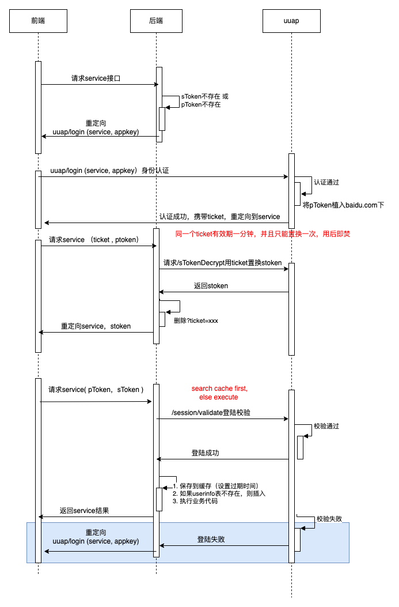

### 1. 传统 Cookie + Session 登录

这是最经典的登录方式，主要依赖浏览器的 Cookie 机制和后端的 Session 存储。

- **工作流程：**
    
    1. 前端将用户名和密码发送给后端。
    
    2. 后端验证通过后，在服务器内存或数据库中创建一条 Session 记录，并生成一个唯一的 `Session ID`。
        
    3. 后端通过 HTTP 响应头中的 `Set-Cookie` 将 `Session ID` 下发给浏览器。
        
    4. 浏览器之后的每次请求都会自动携带带有 `Session ID` 的 Cookie。
        
    5. 后端接收到请求后，根据 Cookie 中的 `Session ID` 查找对应的用户信息。
        
- **优点：** 前端几乎不需要复杂的代码（浏览器自动处理 Cookie）；后端状态管理清晰。
    
- **缺点：** 存在 **CSRF（跨站请求伪造）** 风险；不适合跨域请求；服务器需要存储 Session，对于分布式/高并发架构不太友好（需要做 Session 共享）。
    

---

### 2. Token / JWT (JSON Web Token) 登录

随着前后端分离和移动端的普及，基于 Token 的无状态登录成为主流（特别是 JWT）。

- **工作流程：**
    
    1. 前端发送账号密码到后端进行认证。
        
    2. 认证通过后，后端使用特定算法生成一个包含用户基础信息的 Token（通常是 JWT），并返回给前端。
        
    3. 前端将 Token 存储起来（通常存在 `localStorage`、`sessionStorage` 或非 HttpOnly 的 `Cookie` 中）。
        
    4. 前端在后续的每次请求中，手动将 Token 添加到 HTTP 请求头中（通常是 `Authorization: Bearer <token>`）。
        
    5. 后端校验 Token 的有效性和签名，完成鉴权。
        
- **优点：** 服务器**无状态**，易于扩展；天然防 CSRF（如果不用 Cookie 存储）；适合多端（Web、App、小程序）共用一套后端 API；支持跨域。
    
- **缺点：** 存在 **XSS（跨站脚本攻击）** 风险（如果存储在 `localStorage`）；Token 一旦签发，在过期前很难主动作废（通常需要配合后端的黑名单机制使用双 Token：`Access Token` + `Refresh Token`）。
    

---

### 3. SSO (Single Sign-On) 单点登录

在企业级应用中，用户通常需要访问公司内部的多个系统。SSO 可以让用户“登录一次，访问所有互信的子系统”。

- **工作流程（以传统的 CAS 方案为例）：**
    
    1. 用户访问系统 A，系统 A 发现用户未登录，将其重定向到**统一的认证中心（SSO 侧）**。
        
    2. 用户在认证中心完成登录，认证中心生成全局的 Ticket，并重定向回系统 A，同时带上 Ticket。
        
    3. 系统 A 拿着 Ticket 去认证中心验证，验证通过后，系统 A 建立自己的局部会话。
        
    4. 用户接着访问系统 B，系统 B 发现未登录，重定向到认证中心。
        
    5. 认证中心发现该用户已经有全局登录状态，直接带着 Ticket 重定向回系统 B。
        
    6. 系统 B 验证 Ticket 后建立局部会话。
        
- **应用场景：** 企业内部 OA、ERP 等多系统矩阵。
    

---

### 4. OAuth 2.0 / 第三方登录

利用大型平台（如微信、GitHub、Google、QQ）的身份凭证来登录自己的网站。

- **工作流程（授权码模式 Authorization Code）：**
    
    1. 前端提供一个“使用微信登录”的按钮。
        
    2. 用户点击后，页面跳转到微信的授权页面。
        
    3. 用户同意授权后，微信将页面重定向回你的网站，并在 URL 中附带一个授权码（`code`）。
        
    4. 前端将 `code` 发送给自己的后端。
        
    5. 后端使用 `code` 加上自己的 `App Secret` 去向微信服务器换取 `Access Token` 和用户信息。
        
    6. 后端拿到用户信息后，与自己系统的用户表进行绑定或新建用户，并走自己系统的登录流程（如生成 JWT 返回给前端）。
        
- **优点：** 降低用户注册门槛，提升转化率。
    

---

### 5. 其他现代登录方案

除了上述核心架构，前端在交互层面也演变出了许多新方案：

- **扫码登录：** Web 端展示二维码，App 端扫码确认授权。本质上是 Web 端通过长轮询（Long Polling）或 WebSocket 监听二维码状态，App 端将扫码结果和 Token 提交给服务器。
    
- **短信验证码 / 邮箱魔法链接 (Magic Link)：** 无密码登录。前端请求发送验证码，用户输入后直接验证登录；或发送一个带有一次性 Token 的链接，用户点击链接直接登录。
    
- **WebAuthn / 生物识别登录：** 现代浏览器支持的无密码标准，允许通过设备的指纹、面容 ID (FaceID) 或 Windows Hello 直接完成身份验证。
    

---

### 💡 前端登录安全注意事项汇总

|**攻击类型**|**简述**|**防御手段**|
|---|---|---|
|**XSS**|攻击者注入恶意脚本，窃取 `localStorage` 中的 Token。|避免在页面中渲染未过滤的用户输入；如果是 Token，可考虑存入开启了 `HttpOnly` 的 Cookie 中。|
|**CSRF**|攻击者诱导用户访问第三方网站，利用浏览器自动携带 Cookie 的特性发送伪造请求。|使用 Token 放在 Header 中（不走 Cookie）；如果用 Cookie，设置 `SameSite=Strict` 或加入 CSRF Token 校验。|
|**中间人攻击**|攻击者在网络传输过程中窃听或篡改数据（如截获明文密码）。|**全站强制使用 HTTPS**。前端也可在传输前对密码进行哈希或非对称加密处理（增加破解难度）。|

---

这张图展示了一个非常典型的**企业级单点登录（SSO）架构**的完整交互时序图。

以下是对这张架构图中核心机制和交互流程的详细分析：

### 1. 核心角色

- **前端 (Client)：** 用户直接交互的界面。
    
- **后端 (Service Provider, SP)：** 具体的业务服务，本身不负责账号密码验证，只负责自身业务逻辑。
    
- **uuap (Identity Provider, IdP)：** 统一身份认证平台（统一登录中心），负责校验用户的身份并颁发凭证。
    

### 2. 三种核心凭证 (Tokens)

理解这个架构的关键在于理清图中的三种凭证：

- **pToken (Passport/Platform Token)：** **全局登录态标识**。由 uuap 签发，通常以 Cookie 的形式种在主域名下（如图中的 `baidu.com`）。只要有这个 Token，访问主域名下的任何子系统都会被认为在 SSO 中心是已登录状态。
    
- **ticket：** **一次性授权码**。用于从前端安全地向后端传递“授权成功”的信号。图中标注了“有效期一分钟，只能置换一次，用后即焚”，这是非常标准的防止重放攻击（Replay Attack）的安全设计。
    
- **sToken (Service Token)：** **局部登录态标识**。是当前业务“后端”用来识别用户的专属 Session/Token。
    

---

### 3. 完整交互流程拆解

整张图可以划分为四个主要阶段：

#### 阶段一：首次拦截与重定向 (未登录状态)

1. 前端发起业务请求到“后端”。
    
2. 后端发现请求中缺少 `sToken` 或 `pToken`，判断为未登录。
    
3. 后端返回重定向指令，让前端跳转到 `uuap/login` 页面，并在 URL 参数中带上当前服务的标识 (`service`, `appkey`)，告诉 SSO 中心“用户登录后请送回到我这里”。
    

#### 阶段二：在 SSO 中心完成认证

1. 前端被重定向到 `uuap`，用户在此处输入账号密码进行身份认证。
    
2. **关键动作：** 认证通过后，`uuap` 会将 `pToken`（全局态）作为 Cookie 种入浏览器的主域名（`baidu.com`）下。
    
3. `uuap` 生成一个一次性的 `ticket`，并携带这个 `ticket` 将页面重定向回刚才的“前端”业务页面。
    

#### 阶段三：Ticket 置换局部 Token (建立局部会话)

1. 前端带着 URL 中的 `ticket` 和浏览器自动携带的 `pToken` 再次请求后端。
    
2. 后端截获到 `ticket`，不会直接信任，而是作为服务端发起请求，调用 `uuap` 的接口去**置换** `sToken`。
    
3. `uuap` 验证 `ticket` 有效后，返回该业务专属的 `sToken`，并将该 `ticket` 销毁。
    
4. 后端拿到 `sToken` 后，将其下发给前端（或者种在业务域名的 Cookie 中），并清洗掉 URL 中的 `ticket` 参数（图中的“删除?ticket=xxx并重定向”），使得前端 URL 保持整洁且安全。
    

#### 阶段四：常规鉴权与业务请求 (已登录状态)

1. 前端后续再请求后端时，会带上 `pToken` 和 `sToken`。
    
2. 后端接收到请求后，需要校验登录态（`/session/validate`）。
    
    - **性能优化点：** 图中红字标注了 `search cache first, else execute`。这意味着后端不会每次都去调 `uuap` 校验，而是先查本地缓存（如 Redis），缓存未命中才去 `uuap` 校验，这大大减轻了 SSO 中心的并发压力。
        
3. 如果校验成功，后端会将用户信息存入缓存（设置过期时间），并在本地数据库记录用户信息（如 `userinfo` 表不存在则插入），最后执行真实的业务逻辑并返回结果。
    
4. 如果校验失败（例如 `sToken` 过期或伪造），后端会像“阶段一”那样，再次让前端重定向到 `uuap` 去重新登录。
    

### 总结

全链路一段话口述：用户访问内部后端系统 A，系统 A 发现请求缺少 stoken 和 ptoken，判断用户为“未登录”状态，将请求定向到企业内部统一认证平台（UUAP），并在重定向时携带 appkey（表明系统 A 身份）和 service（回调地址）参数。用户对 UUAP 发起 login 请求进行认证，一旦成功，生成 ptoken（platform token）和 ticket，且将 ptoken 放到主域名的 cookie 中，此后只要 ptoken 存在，访问 UUAP 平台都会被判断为“已登陆”状态。登陆成功后，UUAP 根据此前提供的 service 回调地址，携带 ticket 重定向回系统 A，对系统 A 重新发起请求。系统 A 仍然保持零信任，此时浏览器带着 ticket 和 ptoken 请求系统 A，接着系统 A 的后端发起服务端调用，携带 ticket 访问 UUAP 平台，UUAP 校验通过后置换出 stoken（service token）返回给系统 A，并立刻将该 ticket 销毁（用后即焚，防止重放攻击）。系统 A 发现 UUAP 认证通过，会将获取到的 stoken 缓存在本地（后续优先查本地缓存以减轻 UUAP 压力），随后就和客户端通过 stoken 进行通信，使得客户端可以访问系统 A 的各种服务。

这是一个非常标准且健壮的分布式鉴权架构。它通过 **pToken 保证全局单点登录体验**，通过 **一次性 Ticket 保证前端到后端跨域/跳转时的安全性**，再通过 **sToken 隔离各个子系统的会话风险**，同时后端加入了**缓存机制**保障了高并发下的性能。