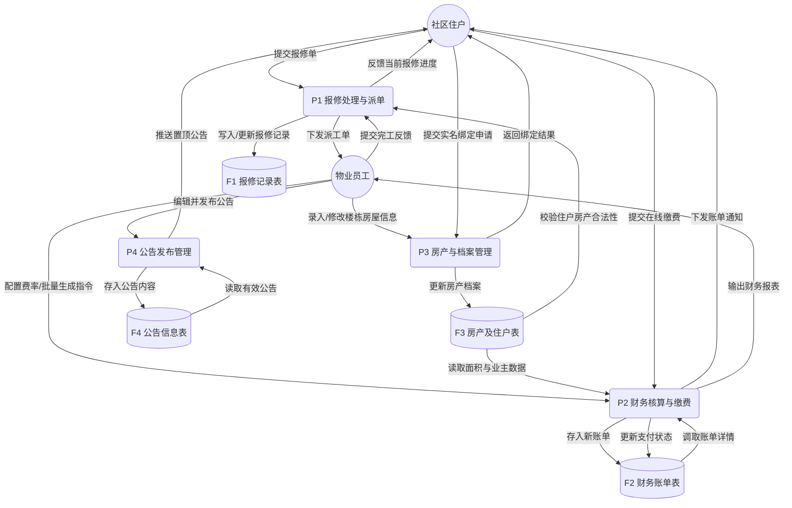

```mermaid
flowchart TD
    %% 外部实体
    User((社区住户))
    Staff((物业员工))

    %% 处理逻辑 (Processes)
    P1(P1 报修处理与派单)
    P2(P2 财务核算与缴费)
    P3(P3 房产与档案管理)
    P4(P4 公告发布管理)

    %% 数据存储 (Data Stores)
    D1[(F1 报修记录表)]
    D2[(F2 财务账单表)]
    D3[(F3 房产及住户表)]
    D4[(F4 公告信息表)]

    %% 数据流 - 报修模块
    User -->|提交报修单| P1
    P1 -->|写入/更新报修记录| D1
    D3 -->|校验住户房产合法性| P1
    P1 -->|反馈当前报修进度| User
    P1 -->|下发派工单| Staff
    Staff -->|提交完工反馈| P1

    %% 数据流 - 财务模块
    Staff -->|配置费率/批量生成指令| P2
    D3 -->|读取面积与业主数据| P2
    P2 -->|存入新账单| D2
    D2 -->|调取账单详情| P2
    P2 -->|下发账单通知| User
    User -->|提交在线缴费| P2
    P2 -->|更新支付状态| D2
    P2 -->|输出财务报表| Staff

    %% 数据流 - 房产与档案
    Staff -->|录入/修改楼栋房屋信息| P3
    P3 -->|更新房产档案| D3
    User -->|提交实名绑定申请| P3
    P3 -->|返回绑定结果| User

    %% 数据流 - 公告模块
    Staff -->|编辑并发布公告| P4
    P4 -->|存入公告内容| D4
    D4 -->|读取有效公告| P4
    P4 -->|推送置顶公告| User
```
