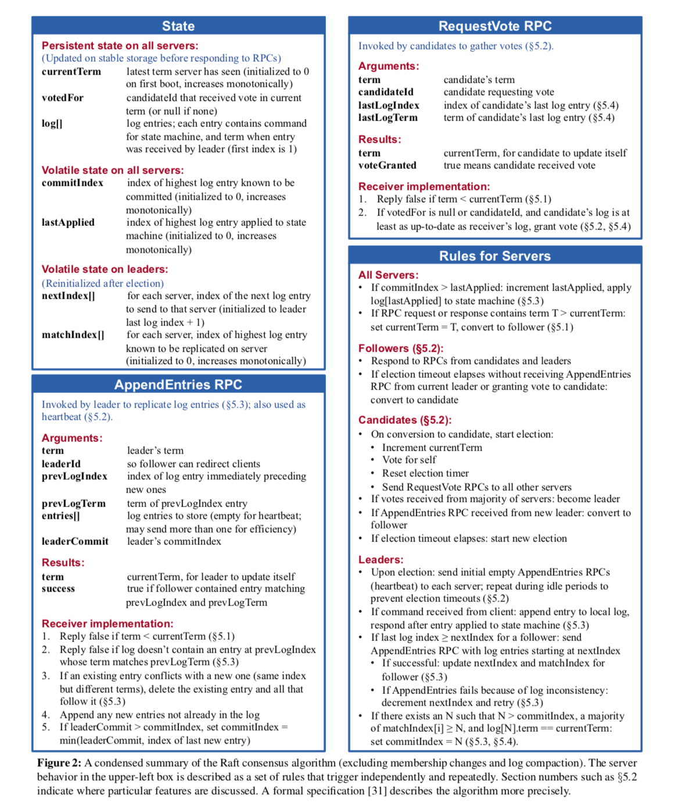

# 脑裂

比如一个完整的系统由 A 和 B 两台服务器组成，之间通过网络通信。如果某个时刻网络连接断了，也就是所谓的“网络分区”，双方都不清楚对方的状态，所以共同修改整个系统的数据，互相都认为自己现在独自管理整个系统（都认为自己是 Master），从而造成系统的混乱。即：**由于网络故障，导致系统内的不同部分互相失去联系，进而各自为政，最终引发数据冲突或资源争抢的灾难**。一种可能的解决方法是，将系统的数据视为被共享的资源，从而引入锁的抢占机制，谁抢到锁就作为新的 Master，另一个就自杀，从而避免脑裂。

脑裂通常是由于不同网络分区中的服务器数量相等，比如 1:1。所以 raft 的过半票决系统即：**如果系统有 `2 * F + 1` 个服务器，那么系统最多可以接受F个服务器出现故障，仍然可以正常工作**。过半票决的本质是想要多副本达成共识，通过协同合作，对某个提议（例如：更新一条数据、决定谁是主节点）达成绝对一致的决定，这也是为什么 raft 被称为共识算法。

raft 将“如何达成共识”这个问题分为三个方面：

1. leader 选举
2. 日志复制
3. 安全性

# leader 选举

在 raft 集群中，leader 选举流程由心跳超时驱动，并通过随机定时器（election timer）与多数派原则（也就是前面说的过半票决）完成状态流转：

无论是集群冷启动还是 leader 节点故障，处于 follower 状态的节点一旦在随机分布的选举超时时间（通过 election timer 不断计时）内未收到心跳，就会认为目前的 leader 已经死了，便会自增任期号（term）转换为 candidate，在为自己投票后向全网并发广播 RequestVote RPC；其余节点在严格校验该候选人的 term 不落后且日志不旧于自身后，方可投出单一赞成票并重置 timer；当且仅当某候选人收集到集群过半数节点的选票时，方能晋升为新任 leader，并立即通过广播心跳包（AppendEntries）中断其余节点的选举动作；若因选票平分陷入平局未达多数派，各节点将依赖定时器的随机性错峰超时，自增任期号并无缝发起新一轮选举，从而在系统初始化或异常状态下实现安全、确定的控制权交接。

此外，follower 的 election timer 要足够随机，避免多个 follower 同时参加竞选，从而不会出现不断分割选票（即 split vote）的情况。

# 日志复制

在基于 raft 的多副本架构中，对底层容错机制无感知的客户端会将请求直接发给 Leader 节点的应用层；但 leader 并不会立即执行，而是将请求下沉给底层的 raft 引擎进行日志广播，**当且仅当该操作被集群中过半的节点成功复制后**，raft 层才会向上回调通知 leader 的应用层真正执行该业务逻辑（如更新或读取数据），并最终将结果安全地返回给客户端。

日志系统的作用可以从以下几个方面来看待：

对于 leader：

- 排序：面对客户端的多个并发请求，leader 通过 log 的有序槽位（数组索引）为所有操作排出一个绝对的先后顺序，强制所有副本的状态机必须按照这个顺序来执行。
- 缓存：leader 会在本地保留日志（包括已提交的），专门用来给因为网络抖动或短时间离线而掉队的 follower 补发缺失的操作。

对于 follower：

- 暂存：follower 收到新的操作后，在还没得到 leader 的 commit 确认前，先把它暂存在 log 中备用，如果后续发现不对，这部分日志是可以被丢弃或覆盖的。
- 持久化：所有节点都会把 log 持久化写入本地磁盘。一旦节点崩溃重启，它可以依靠从头重放磁盘里的 log，重建死机前的内存状态，这也是很重要的容错机制。

# 安全性