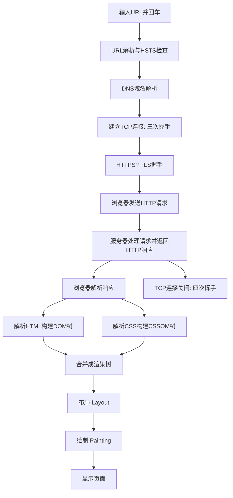

我们可以将其分为以下几个核心步骤：

---

第一步：URL解析与检查

1. 地址栏输入： 用户输入URL（例如 `https://www.example.com/index.html`）并按下回车。
2. 解析URL： 浏览器会解析你输入的URL，将其分解成不同的部分：  
· 协议（Scheme）: https  
· 主机名（Host）: [www.example.com](http://www.example.com)  
· 端口（Port）: https 默认是 443（如果省略则使用默认端口）  
· 路径（Path）: /index.html  
· 查询参数（Query String）: ?key=value（如果有的话）  
· 片段（Fragment）: #section（用于页面内锚点）
3. 检查合法性 & HSTS：  
· 浏览器会检查输入的URL是否合法。  
· 它还会检查HSTS（HTTP Strict Transport Security） 预加载列表。如果网站在这个列表中，浏览器会强制使用HTTPS进行连接，即使用户输入的是 http://。

---

第二步：DNS域名解析

浏览器需要知道目标服务器的IP地址才能建立连接，而人类只记得域名。

1. 检查缓存： 浏览器会按顺序检查以下缓存，看是否有该域名的IP地址记录：  
· 浏览器缓存 → 操作系统缓存（hosts文件） → 路由器缓存 → ISP的DNS服务器缓存。
2. DNS查询： 如果所有缓存中都没有找到，就会开始正式的DNS查询过程：  
· 递归查询： 浏览器将查询发送到本地DNS服务器（通常由你的ISP提供）。  
· 迭代查询： 本地DNS服务器如果也没有记录，它会代表浏览器从DNS根服务器开始，依次向顶级域服务器（.com）、权威域名服务器（example.com） 发起查询，直到找到 [www.example.com](http://www.example.com) 对应的IP地址。
3. 返回IP： 最终，本地DNS服务器将查到的IP地址返回给浏览器。

至此，浏览器拿到了目标服务器的IP地址。

---

第三步：建立TCP连接（三次握手）

浏览器通过操作系统的网络接口，使用获得的IP地址和端口号与服务器建立可靠的TCP连接。

1. SYN： 客户端（浏览器）发送一个SYN（同步序列编号）包到服务器，请求建立连接。
2. SYN-ACK： 服务器收到SYN包后，回应一个SYN-ACK（确认）包以示同意。
3. ACK： 客户端再回一个ACK包确认连接。至此，TCP连接建立成功。

对于HTTPS，在此之后还有一个额外的TLS握手过程：

· 协商加密协议版本和密码套件。  
· 服务器发送其SSL证书（包含公钥）给浏览器验证。  
· 浏览器验证证书的颁发机构、有效期等信息。验证通过后，生成一个“预主密钥”，用服务器的公钥加密后发送过去。  
· 服务器用自己的私钥解密后，双方就拥有了相同的会话密钥，后续的通信内容都用这个密钥进行对称加密。

---

第四步：浏览器发送HTTP请求

连接建立后，浏览器会向服务器发送一个HTTP请求报文。这个报文包含所有必要的信息。

一个典型的请求报文包括：

· 请求行： GET /index.html HTTP/1.1（方法、路径、协议版本）  
· 请求头（Headers）：  
  · Host: [www.example.com](http://www.example.com)  
  · User-Agent： 浏览器身份标识  
  · Accept： 告诉服务器客户端可以处理哪些类型的内容（如 text/html）  
  · Cookie： 将本地存储的与该网站相关的Cookie发送给服务器  
  · Connection: keep-alive（允许连接复用）  
  · ... 以及其他许多头信息  
· 请求体（Body）： 对于 POST 等请求方法，这里会包含要发送给服务器的数据（如表单数据）。

---

第五步：服务器处理请求并返回响应

服务器接收到请求报文后，会对其进行处理并返回一个HTTP响应报文。

1. 处理请求： Web服务器（如Nginx, Apache）将请求路由到相应的应用服务器或静态文件。
2. 生成响应： 应用服务器执行必要的业务逻辑（如查询数据库），生成HTTP响应。
3. 发送响应： 服务器发回一个响应报文，包括：  
· 状态行： HTTP/1.1 200 OK（状态码和状态信息）  
· 响应头（Headers）：  
  · Content-Type: text/html; charset=UTF-8（告诉浏览器返回的内容类型）  
  · Content-Length： 响应体的长度  
  · Set-Cookie： 指令浏览器设置Cookie  
  · Cache-Control： 指示如何缓存资源  
· 响应体（Body）： 请求的实际内容，通常是HTML文档。

---

第六步：浏览器解析和渲染页面

浏览器接收到响应后，就开始解析内容并渲染页面。这是一个非常复杂的过程。

1. 解析HTML，构建DOM树： 浏览器解析HTML字节流，将其转换为令牌（Token），然后构建成DOM（文档对象模型）树。
2. 解析CSS，构建CSSOM树： 同时，浏览器解析CSS（包括外部CSS文件、内联样式），构建CSSOM（CSS对象模型）树。
3. 合并成渲染树（Render Tree）： 将DOM树和CSSOM树合并，形成渲染树。渲染树只包含需要显示的节点（例如，不包含 display: none 的元素）。
4. 布局（Layout / Reflow）： 计算渲染树中每个节点的确切大小和位置（视口内的坐标）。
5. 绘制（Painting）： 将布局计算后的每个节点转换成屏幕上的实际像素。这包括绘制文本、颜色、图像、边框、阴影等。
6. 合成（Compositing）： 将各层绘制结果合并成一幅完整的图像，最终显示在屏幕上。

注意：在解析过程中，如果遇到 

---

第七步：连接结束与后续处理

1. TCP连接关闭（四次挥手）： 如果HTTP头中 Connection 不是 keep-alive，TCP连接会在数据传输完成后经过四次挥手过程被关闭。现代浏览器默认使用保持连接（Keep-Alive），以便在同一连接上发送后续请求（如加载图片、CSS、JS等），避免重复握手，提升性能。
2. 处理异步资源： 页面基础HTML渲染完成后，浏览器通常会发起新的HTTP请求来加载页面中引用的其他资源，如图片、CSS、字体、JavaScript文件等。这些请求会重复步骤三到步骤五的过程。

---

总结流程图

这个过程在现代高速浏览器中几乎是瞬间完成的，但其背后是无数工程师精心设计和优化的复杂工程。

