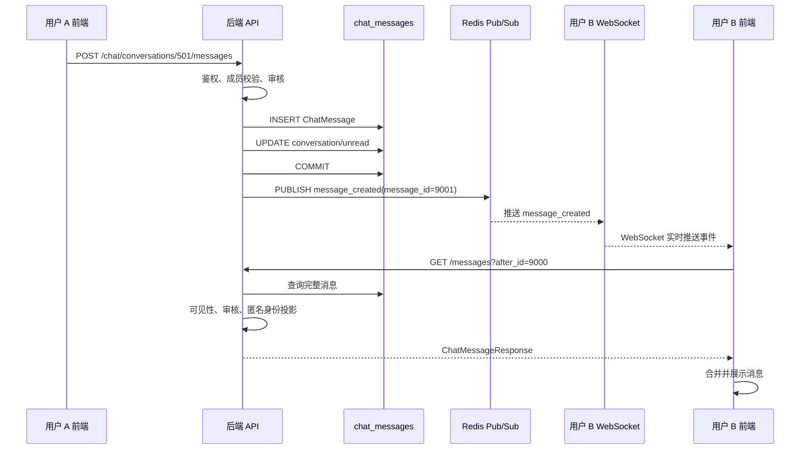

## 一、整体认识

一个 IM 系统通常同时包含三条链路：

```text
消息写入链路：
客户端提交消息
    ↓
身份认证、会话权限、内容校验
    ↓
内容审核
    ↓
数据库事务写入消息
    ↓
事务提交后发布实时事件

---

消息通知链路：
实时事件总线
    ↓
各个后端实例上的订阅者
    ↓
当前会话对应的 WebSocket 或 SSE 连接
    ↓
客户端收到“有新消息”的通知

---

消息读取链路：
客户端根据通知或轮询发起 REST 查询
    ↓
服务端重新执行会话访问控制
    ↓
按游标查询消息
    ↓
过滤不可见内容并生成客户端投影
    ↓
客户端更新消息列表
```

这三条链路各自承担不同职责：

| 链路 | 核心问题 | 当前业务中的典型实现 |
| --- | --- | --- |
| 写入 | 这条消息是否允许产生，怎样保证可靠落库 | REST 接口 + 数据库事务 |
| 通知 | 哪些在线客户端需要尽快知道有新消息 | Redis Pub/Sub + WebSocket |
| 读取 | 客户端最终应该看到哪些消息 | REST 增量查询 |
| 补偿 | 通知丢失、连接断开后怎样恢复 | 断线重连、轮询、游标拉取 |

理解这几个职责之后，很多设计选择会清晰起来：

- 数据库记录是消息事实，决定消息是否真正存在。
- Redis 事件用于唤醒在线连接，缩短消息到达客户端的时间。
- WebSocket 或 SSE 负责把实时变化告诉客户端。
- REST 查询负责返回完整、经过权限过滤的消息视图。
- 断线恢复依赖消息游标，不依赖某一次实时通知。

因此，一条消息的“发送成功”“通知成功”“客户端收到”“用户读到”是四个不同的状态。系统需要分别处理它们。

### 一条消息从发送到展示的时序



这张图把写入、发布、实时通知和增量读取串在了一起。后续各节会分别解释其中的数据对象、权限判断和故障补偿。

## 二、IM 系统的核心对象

### 1. 会话 Conversation

会话表示一组用户共同使用的消息空间。它可以是群聊，也可以是一对一聊天。

以当前业务为例，一张桌子对应一个群聊会话，两个用户之间还可以有私聊会话。会话本身通常包含这些逻辑信息：

```text
conversation_id
conversation_type       # table_group / direct_message
event_id                # 关联业务活动，群聊场景可能使用
table_id                # 群聊对应的桌次，私聊场景可能为空
status                  # active / closed 等
title
last_message_id
last_message_at
created_at
updated_at
```

会话表主要解决两个问题：

1. 给消息提供稳定的归属关系。
2. 给成员权限、未读数和会话列表提供聚合入口。

例如，chat_messages.conversation_id 指向某个会话，服务端就能根据会话找到成员、会话状态和消息读取规则。

### 2. 成员 Participant

成员表描述“谁属于这个会话”以及“这个成员目前具有什么状态”。

```text
conversation_id
user_id
state                   # active / removed / exited
joined_at
left_at
hidden_at               # 成员被隐藏或屏蔽的时间，可选
muted_until             # 成员个人禁言截止时间，可选
last_read_message_id    # 该成员的已读游标
metadata_json           # 角色、展示身份等扩展信息
```

成员关系和用户表是两件事：

- 用户表说明这个人是谁。
- 成员表说明这个人能否访问当前会话，以及在当前会话中具有什么权限。

所有读写消息的接口都应该把会话成员关系纳入授权判断。只验证“用户已经登录”远远不够。

### 3. 消息 Message

消息是需要长期保存的业务事实。典型字段如下：

```text
id
conversation_id
sender_user_id
client_message_id      # 客户端生成的幂等键
message_type           # text / image / event_card / system_notice
content_json            # 结构化内容
created_at
moderation_status      # pending / approved / rejected
visibility_status      # visible / hidden / deleted
metadata_json
```

其中有三个字段很重要：

- conversation_id 决定消息属于哪个会话。
- client_message_id 让服务端可以识别重试，避免网络抖动造成重复消息。
- message_type 和 content_json 共同描述消息内容，支持同一张消息表存放多种消息类型。

### 4. 事件 Event

事件用于告诉其他组件“某件事发生了”。消息创建事件可以这样表达：

```json
{
  "type": "message_created",
  "conversation_id": 501,
  "message_id": 10086,
  "occurred_at": "2026-08-14T10:30:00Z"
}
```

事件一般只携带稳定标识和必要元数据。客户端需要展示的完整消息内容，可以通过 REST 接口读取。

### 5. 投影 Projection

数据库里的消息记录是内部事实，客户端看到的是经过权限、身份和内容状态处理后的投影。

同一条消息可能有不同的展示结果：

- 会话成员看到完整文本。
- 被隐藏的内容显示为“该消息不可见”。
- 运营审核中的内容显示为“审核中”。
- 退出会话的用户只能看到退出前的历史消息。
- 不同客户端可以得到不同的身份展示字段。

把“数据库记录”和“客户端响应”分开，有助于保护隐私，也能避免把内部字段直接暴露给前端。

## 三、当前业务中，一个群聊是怎样建立的

当前业务的群聊围绕线下活动和桌次产生，逻辑可以抽象成：

```text
用户报名活动
    ↓
系统确认活动资格与桌次归属
    ↓
根据 event_id + table_id 查找或创建群聊会话
    ↓
将该桌成员同步到 chat_participants
    ↓
客户端获得会话信息并开始读取消息
```

以当前业务的接口形态为例，客户端进入桌组页面后会请求类似下面的资源：

```http
GET /chat/events/{event_id}/table-group
```

服务端通常会完成这些检查：

1. 当前用户是否已经登录。
2. 当前活动是否存在，是否处于允许访问的时间和状态。
3. 当前用户是否具有该活动的参与资格。
4. 当前用户是否属于某个桌次。
5. 当前桌次对应的会话是否已创建。
6. 当前用户是否已经同步到 chat_participants。
7. 是否需要补发系统通知，例如入组提示、活动提醒或桌组说明。

会话创建与成员同步需要具备幂等性。客户端重复进入页面、接口超时后重试，都不应该产生重复会话或重复成员关系。

一个通用的“确保会话存在”逻辑类似这样：

```python
conversation = find_conversation(
    conversation_type="table_group",
    event_id=event_id,
    table_id=table_id,
)

if conversation is None:
    conversation = create_conversation(
        conversation_type="table_group",
        event_id=event_id,
        table_id=table_id,
        status="active",
    )

ensure_participant(
    conversation_id=conversation.id,
    user_id=current_user.id,
    state="active",
)
```

实际数据库层还需要给群聊业务键增加唯一约束，例如活动和桌次的组合。应用层查询只能降低重复创建概率，数据库约束才是并发场景下的最终保护。

## 四、发送一条消息的完整写入链路

### 1. 客户端提交消息

客户端一般为每次发送生成一个 client_message_id。它在网络重试时保持不变。

```http
POST /chat/conversations/{conversation_id}/messages
Content-Type: application/json
Authorization: Bearer <access-token>

{
  "client_message_id": "01J9EXAMPLE7Y2Q",
  "message_type": "text",
  "content": {
    "text": "大家周六见"
  }
}
```

客户端可以先把消息放进本地列表，展示“发送中”。这就是所谓的乐观更新。服务端成功返回后，客户端再将临时消息替换为带有正式 message_id 的消息。

### 2. 身份认证

服务端从访问令牌或会话中得到当前用户身份。客户端传入的 sender_user_id 不能作为可信身份来源。

身份认证解决“请求来自谁”，成员权限解决“这个人能否在当前会话执行操作”。两层都需要存在。

### 3. 会话和成员权限校验

服务端先通过 conversation_id 找到会话，再检查当前用户在 chat_participants 中的关系。

逻辑可以概括为：

```python
conversation = get_conversation(conversation_id)

if conversation is None:
    raise NotFound("conversation not found")

participant = get_participant(
    conversation_id=conversation.id,
    user_id=current_user.id,
)

if participant is None:
    raise Forbidden("user is not a participant")

if participant.state != "active":
    raise Forbidden("participant is not active")

if participant.hidden_at is not None:
    raise Forbidden("participant is hidden")

if participant.muted_until is not None:
    if participant.muted_until > now():
        raise Forbidden("participant is muted")

if conversation.status != "active":
    raise Conflict("conversation is closed")

if current_user_is_under_operation_mute(current_user.id, conversation.id):
    raise Forbidden("sending is temporarily disabled")
```

这里的字段名可以因实现调整，判断逻辑保持一致。常见的权限条件包括：

| 检查项 | 目的 |
| --- | --- |
| 会话存在 | 防止向未知会话写入 |
| 成员关系存在 | 防止越权向他人会话发消息 |
| state = active | 区分正常成员、已退出成员和被移除成员 |
| 隐藏或屏蔽状态 | 处理运营封禁、风控隔离等情况 |
| 个人禁言 | 只限制当前成员发送 |
| 会话状态 | 活动结束、会话关闭后停止发送 |
| 业务发送窗口 | 例如活动开始前后允许发送的时间 |
| 运营级禁言 | 处理整场活动或整个会话的特殊状态 |

读取接口也要执行相应的访问检查。发送接口检查成员关系，读取接口同样不能只依赖前端隐藏入口。

### 4. 消息内容校验

内容校验分为格式校验、业务校验和安全审核。

格式校验关注：

- message_type 是否在允许集合内。
- 文本长度、图片数量和字段结构是否符合限制。
- 图片 URL 是否来自允许的对象存储域名。
- JSON 结构是否能够被服务端安全解析。

业务校验关注：

- 当前会话是否允许这种消息类型。
- 活动结束后是否仍允许发送。
- 系统通知是否只能由服务端产生。
- 用户是否有发送图片、卡片或特殊内容的权限。

安全审核可以同步完成，也可以进入异步状态：

```python
decision = moderation.check(
    user_id=current_user.id,
    conversation_id=conversation.id,
    message_type=message_type,
    content=content,
)

if decision.status == "rejected":
    raise UnprocessableEntity("message rejected")

if decision.status == "pending":
    visibility_status = "hidden"
    moderation_status = "pending"
else:
    visibility_status = "visible"
    moderation_status = "approved"
```

审核服务超时时，要根据产品策略决定：

- 拒绝发送并提示重试。
- 先保存为审核中，审核完成后再展示。
- 允许发送，但暂时限制可见范围。

这个策略会影响消息状态机、客户端提示和后续通知，应该在产品层面明确。

### 5. 幂等检查

客户端可能因为超时重复提交同一条消息。服务端可以用下面的组合查重：

```sql
SELECT id
FROM chat_messages
WHERE conversation_id = :conversation_id
  AND sender_user_id = :sender_user_id
  AND client_message_id = :client_message_id;
```

更稳妥的方式是给这组字段增加唯一约束，然后在应用层处理冲突：

- 查到已存在的消息：返回原消息。
- 插入时遇到唯一键冲突：重新查询并返回原消息。
- 不要因为一次网络重试就生成第二条相同消息。

幂等键的生命周期需要覆盖客户端重试窗口。服务端也可以限制同一用户在同一会话中的重复键格式和长度。

### 6. 在一个事务中保存消息

消息落库、更新会话摘要、记录待发送事件，最好围绕同一个事务设计。

一个简化的事务模型如下：

```python
with database.transaction():
    existing = find_by_client_message_id(
        conversation_id=conversation.id,
        sender_user_id=current_user.id,
        client_message_id=client_message_id,
    )

    if existing is not None:
        result = existing
    else:
        result = insert_message(
            conversation_id=conversation.id,
            sender_user_id=current_user.id,
            client_message_id=client_message_id,
            message_type=message_type,
            content=content,
            moderation_status=moderation_status,
            visibility_status=visibility_status,
        )

        update_conversation_summary(
            conversation_id=conversation.id,
            last_message_id=result.id,
            last_message_at=result.created_at,
        )

# 事务提交成功后再发实时通知
publish_message_created(
    conversation_id=conversation.id,
    message_id=result.id,
)
```

这里有一个关键顺序：先提交数据库事务，再发布 Redis 实时事件。

如果先发布、后提交，订阅者可能马上去查询一条尚未提交的消息，遇到短暂的“查不到”。如果事务最终回滚，客户端还可能收到一条永远不存在的消息通知。

### 7. 服务端响应的含义

接口返回成功时，推荐明确表达消息状态：

```json
{
  "id": 10086,
  "conversation_id": 501,
  "client_message_id": "01J9EXAMPLE7Y2Q",
  "message_type": "text",
  "content": {
    "text": "大家周六见"
  },
  "moderation_status": "approved",
  "visibility_status": "visible",
  "created_at": "2026-08-14T10:30:00Z"
}
```

这个响应通常表示：

- 服务端已经接受请求。
- 消息已经完成数据库持久化，或者已经进入明确的审核状态。
- 消息拥有正式的服务端 ID。

它不自动代表：

- 所有在线成员都已经收到通知。
- 所有客户端都已经刷新消息列表。
- 用户已经阅读了消息。

## 五、消息表如何支持多种消息类型

一张消息表可以支持多种消息类型，关键在于把“消息类型”和“类型对应的内容结构”分开。

### 1. 推荐的抽象

```json
{
  "id": 10087,
  "conversation_id": 501,
  "sender_user_id": 42,
  "message_type": "image",
  "content": {
    "url": "https://object-storage.example/image/abc.jpg",
    "width": 1280,
    "height": 960,
    "thumbnail_url": "https://object-storage.example/image/abc-thumb.jpg"
  },
  "created_at": "2026-08-14T10:31:00Z"
}
```

不同类型使用不同的内容结构：

| 类型 | 内容示例 | 常见用途 |
| --- | --- | --- |
| text | {"text": "你好"} | 普通文字 |
| image | {"url": "...", "width": 800, "height": 600} | 图片 |
| event_card | {"event_id": 100, "title": "周六晚餐"} | 活动卡片 |
| system_notice | {"code": "member_joined", "user_id": 42} | 入组、退出、规则提示 |
| custom | 业务自定义 JSON | 需要扩展时使用 |

比如这里图片 URL 就是让图片先上传到我们购买的 OSS 云服务得到一个公网的 URL 再存储。

### 2. 为什么要有 message_type

只保存一段 JSON，客户端需要猜测内容形状，校验和版本兼容都会变得困难。message_type 提供显式的协议分发入口：

```typescript
switch (message.message_type) {
  case "text":
    return renderText(message.content)
  case "image":
    return renderImage(message.content)
  case "event_card":
    return renderEventCard(message.content)
  case "system_notice":
    return renderSystemNotice(message.content)
  default:
    return renderUnsupportedMessage()
}
```

服务端也应该对每种类型单独校验 schema。客户端和服务端共同维护消息协议版本，新增类型要考虑旧客户端的降级展示。

### 3. 系统消息也应该进入统一消息模型

入组提示、成员退出、活动提醒等内容可以写入统一消息表，并通过 sender_user_id = NULL 或专门的系统身份标识区分。

这样做的好处是：

- 历史消息查询路径统一。
- 未读计数可以统一处理。
- 实时通知逻辑不需要为系统消息再设计一套通道。
- 审计和删除策略更容易统一。

## 六、消息落库后，Pub/Sub 到底做了什么

### 1. 数据库不会主动唤醒 WebSocket

一条记录写入 chat_messages 后，数据库知道数据发生了变化，但它通常不知道应该通知哪几个应用进程、哪几个用户连接。

WebSocket 连接位于应用进程内：

```text
用户 A 的连接 ──┐
用户 B 的连接 ──┼── 后端实例 1
用户 C 的连接 ──┘

用户 D 的连接 ─────── 后端实例 2

消息写入请求可能落到后端实例 1。
订阅用户 C 的连接可能在实例 2。
```

因此需要一个跨进程、跨实例的事件通道。Redis Pub/Sub 在这里承担的是“广播消息已发生”的职责。

### 2. 会话 channel 的概念

可以把每个会话通过 conversation_id 映射到一个逻辑 channel：

```text
conversation:501
conversation:502
conversation:503
```

消息写入成功后发布：

```python
event = {
    "type": "message_created",
    "conversation_id": conversation_id,
    "message_id": message_id,
    "occurred_at": created_at,
}

redis.publish(
    "conversation:" + str(conversation_id),
    serialize(event),
)
```

订阅了 conversation:501 的实时连接可以收到这个事件。多个成员的连接都能因此被唤醒，形成会话范围内的广播效果。

实现层面不一定要让每个 WebSocket handler 建立一个独立 Redis 订阅。后端进程可以采用进程级订阅、channel multiplexing 或模式订阅，再把事件分发给本机连接。这样能减少 Redis 连接和订阅数量。

### 3. 事件里为什么只放消息 ID

事件可以直接携带完整消息，也可以只携带 message_id。当前业务采用通过 REST 接口“通知 + 增量查询”的思路时，事件通常只需要提供：

```json
{
  "type": "message_created",
  "conversation_id": 501,
  "message_id": 10086
}
```
 
客户端收到事件后，再请求：

```http
GET /chat/conversations/501/messages?after_id=10085&limit=50
```

这种设计有几个优点：

- 数据库仍然是完整消息的唯一来源。
- 权限和内容可见性在每次读取时重新计算。
- 一次通知可以覆盖多条待读取消息。
- 客户端不需要处理“事件内容”和“REST 内容”两套格式。
- Redis 中不会长期存放大量消息正文。

实时事件也可以附带一份预览内容，用于降低一次 REST 请求的延迟。客户端仍应以读取接口返回的完整消息为准。

### 4. Redis Pub/Sub 的可靠性边界

Redis Pub/Sub 具有瞬时广播语义：

- 订阅者在线时，可以尽快收到消息。
- 订阅者断线期间，已经发布的事件不会自动补发。
- 消费者重启后，历史事件也不会自动重放。
- Redis Pub/Sub 本身不提供消息持久化、消费确认和按消费者重试。

因此，Pub/Sub 更适合作为实时提醒通道。消息可靠性由数据库事实和游标查询来保证：

```text
收到实时事件 ──→ after_id 增量查询 ──→ 补齐消息
连接断开    ──→ 重连后读取最后游标之后的消息
Redis 异常   ──→ 短轮询继续读取消息
```

如果业务需要可靠事件处理，例如必须保证每条事件都被消费、支持重放或跨服务处理，可以引入 Outbox、持久化队列或 Redis Streams。

### 5. 事务提交与实时事件的间隙

数据库提交成功、实时事件发布失败时，会出现一个短暂的通知缺口：

```text
数据库：消息已经存在
Redis：这次通知没有发出去
客户端：暂时不知道有新消息
```

只要客户端后续会进行增量查询，消息最终仍能出现。这个方案的恢复能力取决于：

- 查询接口是否支持稳定游标。
- 客户端是否在重连后主动补拉。
- 是否有轮询或页面重新进入触发刷新。
- 消息可见性条件是否和实时事件保持一致。

对更高可靠性的系统，可以在同一数据库事务里写入消息和 Outbox 事件：

```python
with database.transaction():
    message = insert_message(...)
    insert_outbox_event(
        event_type="message_created",
        aggregate_id=message.conversation_id,
        payload={"message_id": message.id},
    )

# 独立 relay 持续读取 outbox，发布成功后标记已发送
```

Outbox 让“消息存在”和“待发送事件”拥有一致的事务边界。它增加了事件表、relay、重试和清理逻辑，是否采用取决于可靠性要求。

## 七、WebSocket 在这条链路中的位置

### 1. WebSocket 是一条长连接

普通 HTTP 请求通常是：

```text
客户端 ──请求──→ 服务端
客户端 ←─响应── 服务端
连接结束
```

WebSocket 建立连接时仍然从 HTTP 开始，握手成功后会升级成长连接：

```text
客户端 ──HTTP Upgrade──→ 服务端
客户端 ←─握手成功────── 服务端

客户端 ←────双向消息────→ 服务端
连接持续存在，直到主动关闭或网络中断
```

连接建立后，双方都可以主动发送消息。服务端不需要等客户端重新发 HTTP 请求，就可以把事件推送出去。

### 2. 当前业务使用 WebSocket 做什么

当前业务的消息发送和完整读取仍然走 REST：

```text
发送消息：POST /chat/conversations/{id}/messages
读取消息：GET  /chat/conversations/{id}/messages?after_id=...
实时通知：WebSocket 推送 message_created
```

因此，当前 WebSocket 的主要职责是：

1. 告诉客户端某个会话出现了新消息。
2. 携带会话 ID 和消息 ID。
3. 让客户端立即触发增量查询。
4. 维持连接状态，并在必要时发送心跳。

客户端接收到通知后的处理逻辑可以写成：

```typescript
function onRealtimeEvent(event) {
  if (event.type !== "message_created") {
    return
  }

  if (!subscribedConversationIds.has(event.conversation_id)) {
    return
  }

  fetchMessagesAfterCursor(
    event.conversation_id,
    messageCursor[event.conversation_id] || 0,
  )
}
```

服务端推送的消息可以很轻量：

```json
{
  "type": "message_created",
  "conversation_id": 501,
  "message_id": 10086
}
```

也可以推送完整消息。选择哪一种，需要结合消息体大小、权限模型、客户端实现复杂度和一致性要求决定。

### 3. WebSocket 连接建立时需要做什么

一个完整的连接流程一般包括：

```text
1. 客户端携带访问令牌发起 WebSocket 握手
2. 服务端验证令牌并确定用户身份
3. 服务端确认用户可以订阅哪些会话
4. 连接注册到对应会话的本机连接集合
5. 后端进程订阅实时事件
6. 收到事件后筛选目标会话并推送
7. 客户端定期发送心跳或响应服务端 ping
8. 连接断开后自动重连并补拉游标之后的消息
```

订阅授权不能只发生在页面打开时。用户被移除、会话关闭或权限改变后，服务端仍要在事件推送和消息读取阶段重新判断。

### 4. WebSocket 的状态管理

长连接需要关注几个状态：

- 连接是否已经鉴权。
- 当前连接订阅了哪些会话。
- 最近一次心跳时间。
- 最近一次成功推送时间。
- 客户端最后确认的消息游标。
- 连接是否正在重连。
- 同一用户是否存在重复连接。

可以把它理解为：

```text
连接状态：connected / reconnecting / closed
订阅状态：conversation_id 集合
消息状态：last_seen_message_id
网络状态：online / offline
```

前端切换页面时，建议保留必要的连接并调整订阅集合，避免每进入一个会话就新建大量长连接。

## 八、读取接口是实时系统的最终落点

实时事件只解决“尽快发现变化”，完整消息仍需要通过读取接口获取。

### 1. 为什么使用增量查询

客户端维护每个会话的读取游标：

```json
{
  "501": 10085,
  "502": 20310
}
```

当客户端收到 conversation_id = 501 的事件时，请求：

```http
GET /chat/conversations/501/messages?after_id=10085&limit=50
```

服务端返回 ID 大于游标的可见消息。客户端处理成功后，将游标推进到本次结果中最大的消息 ID。

相比只按时间查询，单调递增的消息 ID 或会话内序号更容易处理：

- 同一时间戳的消息仍然可以排序。
- 网络重试不会漏掉边界消息。
- 请求重复执行更容易做到幂等。
- 客户端可以明确表达“我已经处理到哪里”。

如果全局消息 ID 不保证和会话顺序一致，可以为每个会话增加独立的 sequence 字段。

### 2. 读取时重新检查权限

读取流程通常是：

```python
conversation = get_conversation(conversation_id)
participant = get_active_or_historical_participant(
    conversation_id=conversation.id,
    user_id=current_user.id,
)

authorize_read(
    conversation=conversation,
    participant=participant,
)

messages = query_messages_after(
    conversation_id=conversation.id,
    after_id=after_id,
    limit=limit,
)

return project_messages_for_client(
    messages=messages,
    viewer=current_user,
)
```

服务端要在查询条件或投影阶段处理：

- 成员是否仍然可以访问会话。
- 用户退出后可见的历史范围。
- 被删除、屏蔽或审核中的消息。
- 发送者身份应该如何展示。
- 图片和卡片链接是否仍然有效。
- 当前用户是否有查看某类消息的权限。

### 3. 读取接口和实时事件的关系

可以把二者理解为：

```text
实时事件：提醒客户端“读取位置可能落后了”
读取接口：告诉客户端“截至当前时刻，你真正能看到什么”
```

实时事件丢失时，读取接口可以补偿。读取接口短暂失败时，客户端可以保留当前游标，稍后重新拉取。

## 九、未读数、已读游标和会话列表

### 1. 用游标表示已读位置

常见做法是在成员关系或独立的已读表中记录：

```text
conversation_id
user_id
last_read_message_id
last_read_at
```

用户打开会话并成功渲染消息后，客户端可以上报：

```http
POST /chat/conversations/501/read
Content-Type: application/json

{
  "last_read_message_id": 10086
}
```

服务端应当只允许游标向前移动：

```python
current = get_last_read_message_id(conversation_id, user_id)

if requested_message_id > current:
    update_last_read_message_id(
        conversation_id=conversation_id,
        user_id=user_id,
        message_id=requested_message_id,
    )
```

这样能防止旧请求覆盖较新的已读位置。

### 2. 未读数的计算

未读数可以实时计算，也可以通过摘要字段、缓存或异步聚合加速。基本逻辑是：

```text
会话中可见消息总数
    - 当前用户已读游标之前的可见消息数
    = 未读数
```

实际系统还要处理：

- 系统消息是否计入未读。
- 被审核隐藏的消息是否计入未读。
- 用户退出和重新加入后的计算边界。
- 会话列表是否展示免打扰会话。
- 删除消息后未读数是否回退。

### 3. 会话列表是消息摘要的消费方

会话列表通常关心：

- 会话标题和头像。
- 最近一条可见消息。
- 最近消息时间。
- 未读数量。
- 会话是否置顶、免打扰或关闭。
- 当前用户在会话中的状态。

last_message_id、last_message_at 这类字段适合作为列表查询的索引或缓存摘要。它们属于派生信息，不能替代 chat_messages 中的原始消息事实。

## 十、消息适配层和可替换的承载方式

很多系统会把消息服务抽象成一个适配接口，让上层业务不绑定某一种消息承载方式。

```python
class MessageDeliveryAdapter:
    def send_message(self, message):
        raise NotImplementedError

    def recall_message(self, message):
        raise NotImplementedError

    def sync_conversation(self, conversation):
        raise NotImplementedError
```

上层业务关心的是：

- 消息是否被接受。
- 消息是否有正式 ID。
- 消息属于哪个会话。
- 消息是否可以被读取。
- 是否需要发送实时事件。

适配层负责把这些动作映射到具体承载方式，例如：

- 业务数据库消息表。
- 外部消息服务。
- 测试环境的内存实现。
- 未来新增的消息基础设施。

当前业务保留了可替换的外部消息服务适配能力，同时以自有数据库消息链路承载主流程。通用设计上应保持以下边界：

1. chat_conversations 和 chat_messages 保存业务需要的稳定事实。
2. 外部服务的会话 ID、消息 ID和同步状态可以放在扩展字段中。
3. 外部服务不可用时，应用层要有明确的失败和重试策略。
4. 上层 API 不应把某个外部系统的字段直接暴露成业务协议。
5. 迁移到另一种承载方式时，客户端尽量保持接口和消息模型稳定。

适配层的价值在于隔离变化。它需要保持小而清晰，避免把权限、审核、未读和业务活动状态全部塞进发送接口。

## 十一、WebSocket 和 SSE 怎么选择

### 1. 两种方式的基本差异

| 对比项 | WebSocket | SSE |
| --- | --- | --- |
| 通信方向 | 客户端和服务端都能主动发送 | 服务端到客户端 |
| 客户端发送消息 | 可以走同一条连接 | 通常继续走 REST |
| 浏览器自动重连 | 需要自行设计，也可封装实现 | 原生支持基础重连机制 |
| 数据格式 | 文本或二进制 | 文本事件流 |
| 连接语义 | 更灵活 | 更贴合单向通知 |
| 典型场景 | 聊天、输入状态、已读回执、实时协作 | 通知、进度、状态变化、消息提醒 |

如果系统只需要服务端通知“有新消息”，发送和读取都走 REST，SSE 的模型会更直接：

```text
客户端 ──POST REST──→ 发送消息
客户端 ←─SSE───────── 服务端推送新消息事件
客户端 ──GET REST───→ 拉取完整消息
```

当前业务的消息通知语义符合 SSE 的适用方向，因此 SSE 可以作为候选方案进行评估。

### 2. 换成 SSE 后 Redis 仍然有价值

SSE 只改变“后端如何把事件送到客户端”。当服务部署在多个实例上时，消息写入请求和 SSE 连接可能位于不同实例：

```text
实例 A：REST 写入消息
实例 B：SSE 连接用户甲
实例 C：SSE 连接用户乙

实例 A 仍需要通过 Redis、消息队列或其他事件总线通知 B、C。
```

所以，SSE 不能替代跨实例事件分发。它可以替代 WebSocket 的客户端通知部分。

### 3. 选择 SSE 前要验证的条件

对于跨端客户端或小程序运行时，至少需要验证：

- 运行时是否稳定支持长时间 HTTP 流。
- 是否支持带鉴权信息的连接。
- 代理、网关和 CDN 是否会缓冲事件。
- 心跳和超时配置是否完整。
- 网络切换时的重连行为。
- 一个用户同时订阅多个会话的方式。
- 后台运行、前后台切换和系统休眠后的恢复。
- 服务端连接数量和单实例内存占用。
- 是否未来需要输入状态、已读回执或客户端 ACK。

如果未来会大量使用客户端到服务端的实时信号，WebSocket 的扩展空间更大。如果长期保持“REST 写入 + 实时单向通知 + REST 读取”，SSE 的维护成本通常更低。

最终选型应以目标客户端、网关能力和实际连接压测结果为准。

## 十二、完整的业务链路

以当前业务的桌组群聊为例，可以把一条消息完整地描述为：

```text
1. 用户进入活动页面，服务端确认活动和桌次资格。
2. 系统找到或创建对应的群聊会话。
3. 用户被同步为 chat_participants.active。
4. 客户端发送：
       POST /chat/conversations/{conversation_id}/messages
5. 服务端从访问令牌识别用户。
6. 服务端确认用户属于该会话，且没有被移除、隐藏或禁言。
7. 服务端校验消息类型、内容结构和发送窗口。
8. 内容进入审核流程。
9. 服务端用 client_message_id 做幂等判断。
10. 消息写入 chat_messages。
11. 会话摘要和未读相关数据按事务更新。
12. 数据库事务提交成功。
13. 服务端向 conversation:{conversation_id} 发布 message_created。
14. 订阅该会话的后端连接收到事件。
15. WebSocket 向在线客户端推送 conversation_id 和 message_id。
16. 客户端使用自己的游标调用增量消息接口。
17. 服务端再次检查读取权限并返回可见消息。
18. 客户端更新列表、正式消息 ID 和本地游标。
19. 用户打开或停留在会话中后，上报 last_read_message_id。
```