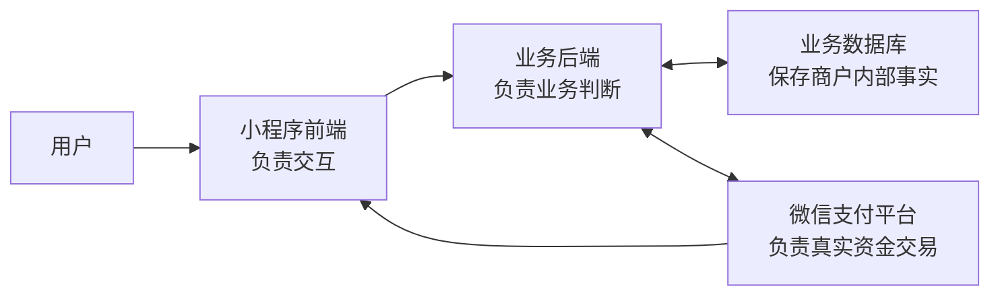
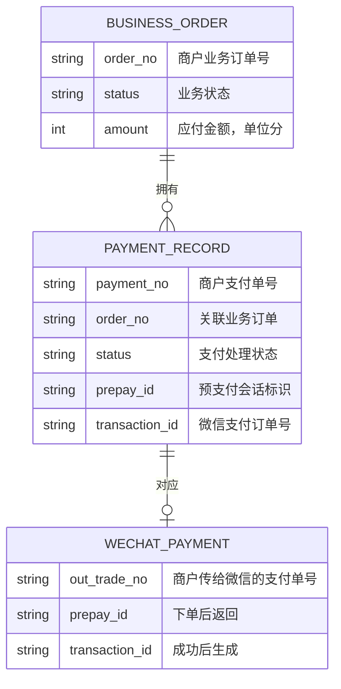
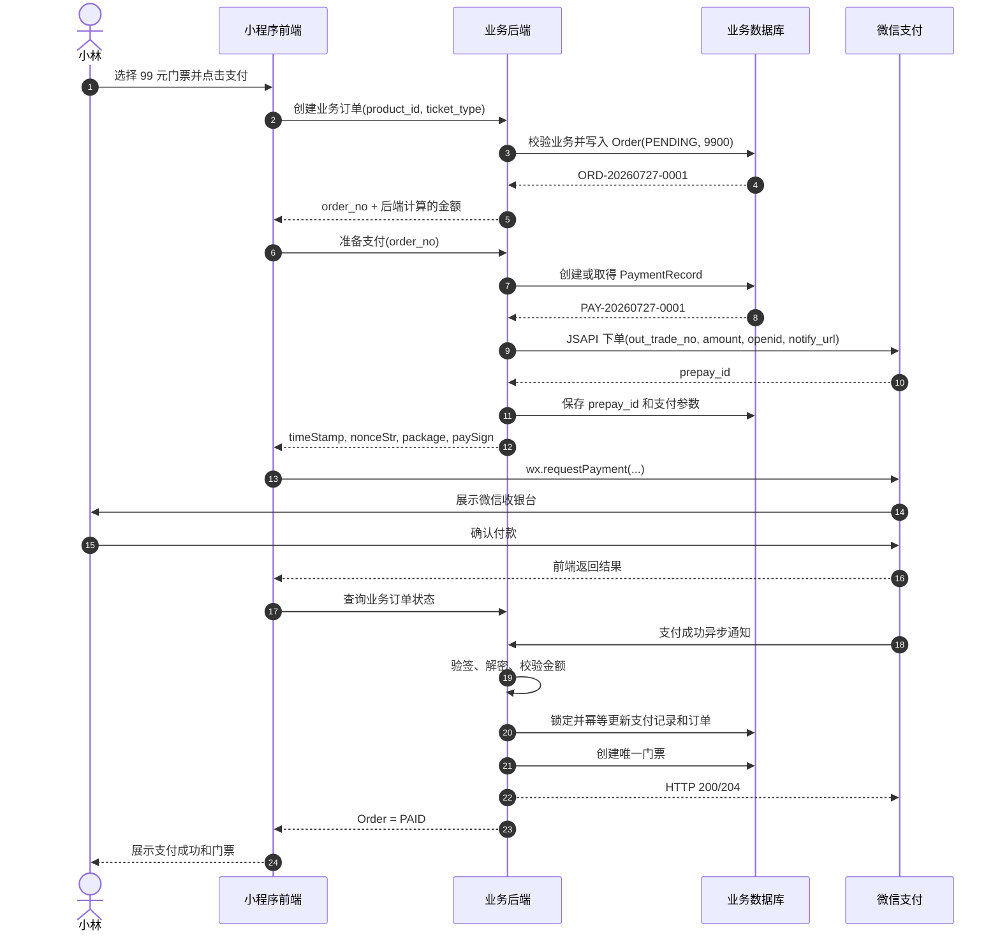
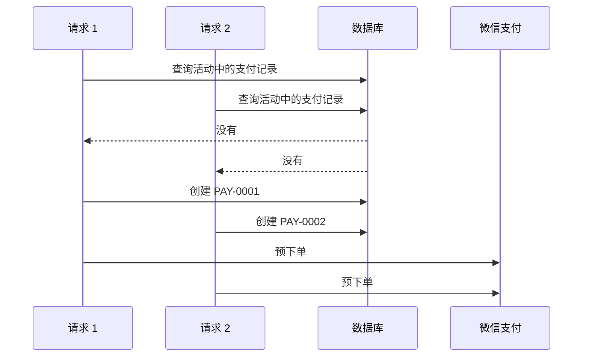
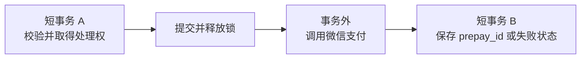

# 支付链路学习导读：以微信小程序购买活动门票为例

> 本文是一份脱敏的支付系统学习材料。它不对应某个具体项目，而是通过“用户在微信小程序购买活动门票”这个例子，讲清前端、业务后端、数据库和微信支付平台之间的数据如何流转，以及支付链路为什么需要幂等和并发控制。

## 先说结论：支付不是前端调用一次 SDK

用户看到的支付流程通常只有几秒钟：

```text
点击支付 → 输入密码 → 看到成功
```

系统真正经历的流程却是：

```text
创建业务订单
→ 后端向微信支付下单
→ 前端调起微信收银台
→ 用户在微信完成付款
→ 微信通知商户后端
→ 后端核实支付结果
→ 更新订单
→ 发放门票或报名资格
```

这里最核心的原则是：

> 前端可以发起支付和展示结果，但只有业务后端能够改变业务订单；业务后端也不能仅凭前端的一句“支付成功”就认定已经到账，而要以经过验证的微信支付结果为准。

## 一、先认识支付系统的四个参与方

假设小林准备在一个活动小程序里购买一张 99 元的活动门票。

整个支付链路里有四个主要参与方：

| 参与方 | 主要职责 | 不应该负责什么 |
| --- | --- | --- |
| 小程序前端 | 展示商品和金额、发起业务请求、调用 `wx.requestPayment`、展示结果 | 不能自行决定订单已经支付 |
| 业务后端 | 计算真实价格、创建订单、调用微信支付、核验支付结果、发放权益 | 不能把客户端上报的金额和成功状态直接当真 |
| 业务数据库 | 保存订单、支付记录、报名资格和处理状态 | 不能代替微信判断用户是否真的完成扣款 |
| 微信支付平台 | 展示收银台、完成扣款、生成支付结果、通知商户 | 不理解商户内部的活动、报名和门票业务 |

可以把它们理解成下面的分工：



微信只知道“某个商户订单支付了 99 元”，并不知道这 99 元对应哪场活动。业务后端知道用户买了哪张票，但不能凭空判断钱是否到账。因此，业务后端是业务世界和支付世界之间的桥梁。

## 二、再认识支付链路里的三类订单

一次支付过程中会出现多个编号。它们不是重复设计，而是分别属于不同系统。

### 1. 业务订单 `Order`

业务订单由商户后端创建，表达用户准备购买什么。

示例：

```json
{
  "order_no": "ORD-20260727-0001",
  "user_id": "USER-1001",
  "product_id": "EVENT-2001",
  "amount": 9900,
  "currency": "CNY",
  "status": "PENDING"
}
```

这里的 `9900` 通常表示 9900 分，也就是 99 元。价格必须由后端根据商品、优惠和业务规则计算，不能相信前端直接传来的金额。

### 2. 商户支付记录 `PaymentRecord`

支付记录也保存在商户数据库中，表达业务后端曾为这个订单发起过一次渠道支付。

示例：

```json
{
  "payment_no": "PAY-20260727-0001",
  "order_no": "ORD-20260727-0001",
  "channel": "WECHAT_PAY",
  "amount": 9900,
  "status": "PREPARING",
  "prepay_id": null,
  "transaction_id": null
}
```

业务订单回答“用户买什么”；支付记录回答“商户怎样向微信收这笔钱”。

一个业务订单有可能保留多条支付记录。例如第一次支付参数过期，系统关闭旧支付单后重新下单；或者业务允许用户更换支付渠道。但无论有多少支付记录，业务订单都只能被成功完成一次。

### 3. 微信支付订单

业务后端调用微信支付下单接口时，会传递商户支付单号 `out_trade_no`。在本例中，可以让它等于：

```text
PAY-20260727-0001
```

微信支付下单成功后，先返回 `prepay_id`。它是用于调起微信收银台的预支付会话标识，并不表示用户已经付款。

用户真正支付成功后，微信支付才会生成 `transaction_id`。它是微信支付侧标识成功交易的订单号，通常从支付成功通知或查单结果中获得。

三类数据的关系如下：



## 三、用一个具体例子走完支付链路

下面完整走一遍“小林购买 99 元活动门票”的流程。

### 第 1 步：前端请求创建业务订单

小林在活动详情页选择一张 99 元的门票，然后点击“去支付”。

前端向业务后端发送的请求可以类似：

```http
POST /api/orders
```

```json
{
  "product_id": "EVENT-2001",
  "ticket_type_id": "TICKET-01",
  "coupon_id": null
}
```

前端没有提交最终应付金额，或者即使提交了金额，后端也不能直接采用。后端需要自己完成：

1. 检查活动和票种是否仍可购买；
2. 检查用户是否有重复报名；
3. 检查库存或活动名额；
4. 计算票价和优惠；
5. 创建状态为 `PENDING` 的业务订单。

后端返回：

```json
{
  "order_no": "ORD-20260727-0001",
  "amount": 9900,
  "currency": "CNY",
  "status": "PENDING"
}
```

此时发生的只是商户内部下单，还没有调用微信支付，也没有产生真实扣款。

### 第 2 步：前端请求后端准备微信支付

前端拿到业务订单号后，请求后端准备支付：

```http
POST /api/payments/prepare
```

```json
{
  "order_no": "ORD-20260727-0001",
  "payment_method": "WECHAT_PAY"
}
```

后端首先读取业务订单，确认：

- 订单属于当前用户；
- 订单仍然是 `PENDING`；
- 金额仍为 9900 分；
- 商品和名额仍满足支付条件；
- 该订单没有已经确认成功的支付。

然后，后端在数据库中创建或取得支付记录：

```json
{
  "payment_no": "PAY-20260727-0001",
  "order_no": "ORD-20260727-0001",
  "amount": 9900,
  "status": "PREPARING"
}
```

这一阶段只是在商户系统里声明：“接下来由这条支付记录负责向微信收款。”

### 第 3 步：业务后端向微信支付预下单

业务后端使用商户私钥完成请求签名，然后调用微信支付的 JSAPI/小程序下单接口：

```http
POST https://api.mch.weixin.qq.com/v3/pay/transactions/jsapi
```

请求中的核心数据可以简化理解为：

```json
{
  "appid": "小程序的 AppID",
  "mchid": "微信支付商户号",
  "description": "活动门票",
  "out_trade_no": "PAY-20260727-0001",
  "notify_url": "https://merchant.example.com/api/payments/wechat/notify",
  "amount": {
    "total": 9900,
    "currency": "CNY"
  },
  "payer": {
    "openid": "当前用户在这个小程序下的 OpenID"
  }
}
```

几个关键字段分别解决不同问题：

| 字段 | 含义 |
| --- | --- |
| `out_trade_no` | 商户支付单号，在同一商户号下应保持唯一 |
| `amount.total` | 微信实际要收取的金额，单位为分 |
| `payer.openid` | 指定这次付款的小程序用户 |
| `notify_url` | 支付成功后，微信通知业务后端的地址 |

微信接受下单后返回：

```json
{
  "prepay_id": "wx_prepay_example_001"
}
```

后端保存 `prepay_id`，再生成小程序调起支付所需的签名参数：

```json
{
  "timeStamp": "1785146400",
  "nonceStr": "random-string",
  "package": "prepay_id=wx_prepay_example_001",
  "signType": "RSA",
  "paySign": "merchant-generated-signature"
}
```

这些参数通过业务后端返回前端。商户私钥只存在于后端，不能下发给前端。

### 第 4 步：小程序前端调起微信收银台

前端拿到签名参数后调用：

```javascript
wx.requestPayment({
  timeStamp,
  nonceStr,
  package: `prepay_id=${prepayId}`,
  signType: 'RSA',
  paySign,
  success() {
    // 告诉页面可以开始查询后端订单状态
  },
  fail(error) {
    // 展示取消或调起失败，但不要擅自修改后端订单
  }
})
```

随后微信显示收银台。小林核对金额，通过密码或生物识别确认付款。扣款发生在微信支付平台，不发生在商户前端或业务后端。

`wx.requestPayment` 的 `success` 只说明本次前端调起流程返回成功。微信官方也明确提醒，商户不能只依赖前端回调判断订单支付状态。

因此前端成功后的正确动作通常是：

1. 请求业务后端查询订单状态；
2. 后端尚未确认时，页面显示“支付结果确认中”；
3. 短暂轮询，或由后端主动向微信查单；
4. 只有后端订单变成 `PAID`，页面才展示最终业务成功。

### 第 5 步：微信支付异步通知业务后端

微信确认扣款成功后，会向预下单时传入的 `notify_url` 发送 HTTP POST 通知。

通知中会包含或解密得到类似信息：

```json
{
  "out_trade_no": "PAY-20260727-0001",
  "transaction_id": "WX-TRANSACTION-9001",
  "trade_state": "SUCCESS",
  "amount": {
    "total": 9900,
    "currency": "CNY"
  }
}
```

业务后端不能收到 JSON 就直接更新订单，而要依次执行：

1. 使用微信支付平台证书或平台公钥验证回调签名；
2. 解密并读取通知资源；
3. 通过 `out_trade_no` 找到内部支付记录；
4. 校验商户号、AppID、金额和币种；
5. 确认交易状态确实为 `SUCCESS`；
6. 幂等地完成支付记录和业务订单；
7. 向微信返回 HTTP 200 或 204。

如果验签失败，说明无法证明通知来自微信，绝不能更新订单。

### 第 6 步：后端完成订单并发放门票

回调校验通过后，后端开启一个数据库事务：

```text
锁定 PaymentRecord PAY-20260727-0001
→ 锁定 Order ORD-20260727-0001
→ 重新读取两者的最新状态
→ 如果订单已经 PAID，直接按成功处理
→ 如果订单仍为 PENDING，核对金额
→ PaymentRecord 更新为 SUCCESS
→ 保存 transaction_id
→ Order 更新为 PAID
→ 创建唯一的报名或门票记录
→ 提交事务
```

最终数据库可能变成：

```json
{
  "payment_record": {
    "payment_no": "PAY-20260727-0001",
    "status": "SUCCESS",
    "transaction_id": "WX-TRANSACTION-9001"
  },
  "order": {
    "order_no": "ORD-20260727-0001",
    "status": "PAID"
  },
  "ticket": {
    "order_no": "ORD-20260727-0001",
    "owner": "USER-1001",
    "status": "VALID"
  }
}
```

这时才真正完成了“钱、订单、门票”三者的一致：

- 微信确认钱已经付了；
- 商户订单确认交易完成；
- 用户获得且只获得一张门票。

## 四、用一张时序图串起全部数据流



## 五、为什么支付系统必须设计幂等性

幂等的通俗意思是：

> 同一件事重复执行多次，最终业务结果和只执行一次相同。

支付链路天然会重复：

- 用户可能快速点两次；
- 前端请求超时后可能重试；
- 业务后端调用微信超时，不知道微信是否已经成功下单；
- 微信没有及时收到商户的成功响应，会重复通知；
- 前端查单和微信回调可能同时确认同一笔支付。

因此，不能把“正常情况下只调用一次”当作设计前提。

## 六、准备支付阶段如何控制并发和重复请求

### 场景：用户快速点击两次

小林连续点击两次支付，前端几乎同时发出两个准备支付请求：



问题不在于“已有记录没有加锁”，而在于两个请求查询时记录尚不存在，因此根本没有行可以锁。

### 第一层：前端防连点

前端点击后立即设置：

```javascript
if (paying) return
paying = true
```

请求完成后再恢复按钮。这能改善体验并减少普通重复请求，但它不是最终的数据安全保证。接口可以被重试、重放或被其他客户端调用。

### 第二层：后端使用支付请求幂等键

前端第一次发起准备支付时生成一个稳定的 `idempotency_key`。同一次请求因网络超时而重试时，必须继续携带原值。

后端为 `(user_id, idempotency_key)` 建立唯一约束：

```text
UNIQUE(user_id, idempotency_key)
```

第二次相同请求到达时，后端返回第一次请求对应的支付记录或处理状态，而不是重新下单。

幂等键解决的是“同一个请求被重复发送”。如果两个请求代表不同操作，却同时为同一订单创建支付，则还需要订单级约束。

### 第三层：数据库保证同一订单不会同时出现多条活动支付

对于业务规则要求“同一订单同一时间只能有一条活动中的支付记录”的系统，可以通过以下一种或组合方式兜底：

- 对活动支付记录建立合适的唯一约束；
- 在短事务中锁定稳定存在的 `Order` 行，再检查和创建支付记录；
- 插入发生唯一冲突时，读取已经由另一个请求创建的记录并返回；
- 使用条件更新抢占处理权，只有一个请求能够从 `PENDING` 推进到 `PREPARING`。

核心不是必须选择某一种技术，而是必须让数据库成为最终裁判。推荐的处理顺序是：

```text
开始短事务
→ 锁定稳定存在的业务订单
→ 锁后重新检查订单是否已支付
→ 查询是否已有可复用的活动支付记录
→ 没有则创建，并依靠唯一约束兜底
→ 提交事务
→ 事务外调用微信支付
```

这样即使前端保护失效，数据库仍能保证只产生一个有效处理者。

## 七、调用微信超时时如何保持幂等

假设业务后端请求微信支付预下单，网络在返回前断开：

```text
业务后端不知道：
微信没有收到请求？
还是微信已经创建订单，只是响应丢了？
```

此时不能立即换一个新的 `out_trade_no` 再次下单。更稳妥的做法是：

1. 对同一次支付继续使用原来的 `out_trade_no`；
2. 重试前先查询微信侧订单状态，或按照微信接口的幂等语义使用原参数重试；
3. 如果微信已经受理，恢复并保存对应的支付参数；
4. 只有明确关闭或废弃旧支付单后，才按业务规则创建新的支付单号。

`out_trade_no` 是商户和微信共同认识的稳定业务键。它让双方在网络不可靠时仍能讨论“同一笔支付”，而不是各自创建出不同交易。

## 八、支付成功通知如何保证只处理一次

微信支付的同一条成功通知可能发送多次。前端查询订单、后端主动查单和微信异步通知也可能同时到达。

回调处理不能写成：

```text
收到 SUCCESS
→ 无条件创建门票
```

而应该写成：

```text
验签并校验交易
→ 开启事务
→ 锁定支付记录和业务订单
→ 锁后重新读取状态
→ 已经 PAID：直接返回成功
→ 仍为 PENDING：更新支付和订单，创建门票
→ 提交事务
→ 返回 200/204
```

伪代码可以表达为：

```text
handle_wechat_notification(notification):
    verify_signature(notification)
    payment = find_by_out_trade_no(notification.out_trade_no)
    verify_merchant_app_amount_and_currency(payment, notification)

    begin transaction
        payment = lock_and_reload(payment)
        order = lock_and_reload(payment.order)

        if payment.status == SUCCESS and order.status == PAID:
            commit
            return success

        require payment.status == PENDING
        require order.status == PENDING

        payment.status = SUCCESS
        payment.transaction_id = notification.transaction_id
        order.status = PAID
        create_ticket_with_unique_order_no(order.order_no)
    commit

    return success
```

这里有三道防线：

1. 支付记录和订单状态机阻止非法重复迁移；
2. 数据库锁让同时到达的两个处理者排队；
3. 门票表对 `order_no` 建立唯一约束，保证业务权益不会重复发放。

即使某一层代码未来出现疏漏，下一层仍有机会阻止重复结果。

## 九、为什么不能持有数据库锁调用微信接口

一种看似简单的写法是：

```text
锁住订单
→ 调用微信支付
→ 等微信返回
→ 更新数据库
→ 释放锁
```

问题在于微信接口是外部网络调用，耗时不可控。几十毫秒、几秒甚至超时都有可能。锁一直不释放，会造成：

- 其他支付请求长时间等待；
- 数据库连接和事务被占用；
- 锁竞争扩大；
- 超时、死锁和系统容量问题更难排查。

更合理的结构是三个阶段：



第一段事务负责决定“谁有权处理”；微信调用在事务外进行；第二段事务负责保存结果。两个短事务之间可能发生失败，因此支付记录要具有明确状态，例如：

```text
CREATED → PREPARING → READY → SUCCESS
                    ↘ FAILED
```

系统还需要能够识别长时间停留在 `PREPARING` 的记录，并通过查单或补偿任务恢复，而不是简单地再次创建一条新支付。

## 十、前端成功、微信回调和主动查单如何配合

这三条路径不是互相替代，而是互相补充：

| 路径 | 作用 | 能否单独认定支付成功 |
| --- | --- | --- |
| `wx.requestPayment` 前端返回 | 让页面及时反馈，触发向后端查询 | 不能 |
| 微信支付异步通知 | 正常情况下推动后端完成订单 | 可以，但必须验签和校验 |
| 后端主动查询微信订单 | 回调延迟、丢失或结果不明时进行确认和补偿 | 可以，但必须校验查询结果 |

推荐流程是：

```text
前端收到 requestPayment:ok
→ 调业务后端查询业务订单
→ 后端已确认：返回 PAID
→ 后端尚未确认：必要时向微信查单
→ 查单确认成功：复用同一套幂等完成逻辑
→ 前端最终显示成功
```

无论成功信息来自异步通知还是主动查单，都应进入同一个“完成支付”领域方法，使用相同的锁、状态检查、金额校验和权益唯一约束。

## 十一、把并发控制分成三层理解

| 层级 | 典型手段 | 主要目的 |
| --- | --- | --- |
| 交互层 | 禁用按钮、防抖、显示处理中 | 减少用户误操作，改善体验 |
| 接口层 | 幂等键、稳定支付单号、重复请求返回原结果 | 识别同一请求，避免重复调用渠道 |
| 数据层 | 唯一约束、行锁、锁后刷新、条件更新、状态机 | 在真正并发下保证数据正确 |

三层都需要，但职责不同：

- 只有前端防连点，后端仍可能被绕过；
- 只有后端代码先查询再插入，仍可能出现并发空读；
- 只有数据库唯一约束却没有冲突恢复，接口可能把正常并发返回成系统错误；
- 三层配合，才能同时得到良好的用户体验和可靠的数据结果。

## 十二、支付链路设计检查清单

### 订单与金额

- 业务订单是否由后端创建？
- 最终金额是否由后端计算并在回调时再次核对？
- 业务订单和支付记录是否分开建模？
- 商户支付单号在支付平台要求的范围内是否唯一？

### 准备支付

- 前端是否防止普通重复点击？
- 后端是否支持相同请求安全重试？
- 两个并发请求都查询不到支付记录时，数据库如何决定唯一处理者？
- 调用第三方支付时是否已经释放数据库锁？
- 外部调用超时后，系统能否判断第三方是否已经受理？

### 支付确认

- 是否验证微信支付回调签名并正确解密通知？
- 是否校验商户号、AppID、金额、币种和交易状态？
- 是否在加锁后重新读取订单和支付记录状态？
- 重复回调是否直接返回成功，而不会重复发放权益？
- 前端成功回调是否只用于查询，而不直接修改支付状态？

### 业务收尾

- 订单完成、支付记录成功和核心权益是否在清晰的事务中更新？
- 门票、报名、库存扣减等关键结果是否有唯一约束或幂等保护？
- 回调未到达时，是否有主动查单或补偿机制？
- 是否有对账、告警和人工排查所需的商户支付单号与微信 `transaction_id`？

## 总结

一条可靠的微信小程序支付链路，可以归纳为：

```text
前端负责发起和展示
业务后端负责业务判断和状态推进
数据库负责保存唯一、可恢复的业务事实
微信支付负责真实资金交易和可信结果
```

系统设计的难点不在于成功调用一次 `wx.requestPayment`，而在于面对重复点击、网络超时、并发请求和重复通知时，仍然保证：

```text
只收一笔该收的钱
只完成一次业务订单
只发放一份对应权益
```

理解“参与方、订单模型、完整数据流、幂等边界和事务边界”，就抓住了支付系统的主干。

## 延伸阅读

- [微信支付：JSAPI/小程序下单](https://pay.wechatpay.cn/doc/v3/merchant/4012791856)
- [微信支付：小程序调起支付](https://pay.wechatpay.cn/doc/v3/merchant/4012791898)
- [微信支付：支付成功回调通知](https://pay.wechatpay.cn/doc/v3/merchant/4012791861)
- [微信支付：JSAPI 支付开发指引](https://pay.wechatpay.cn/doc/v3/merchant/4012791870)
- [微信支付：回调通知注意事项](https://pay.wechatpay.cn/doc/v3/merchant/4012075420)
