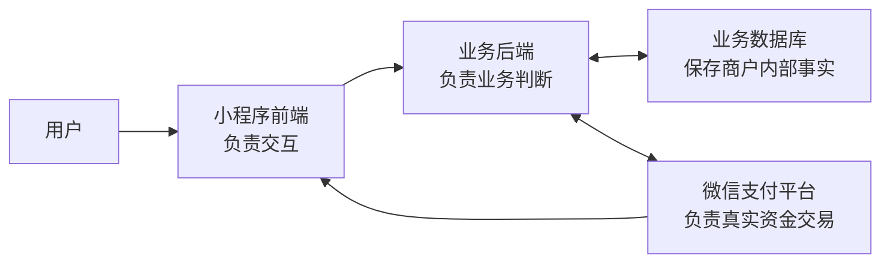
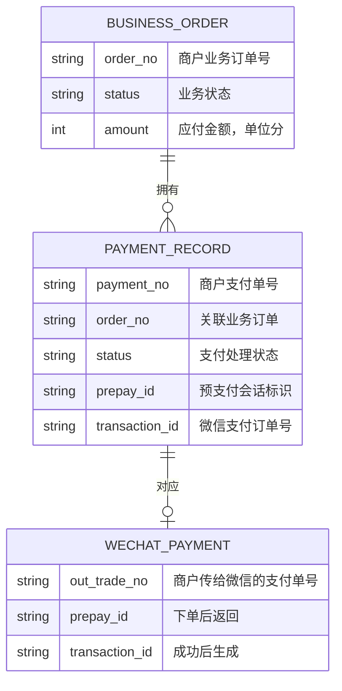
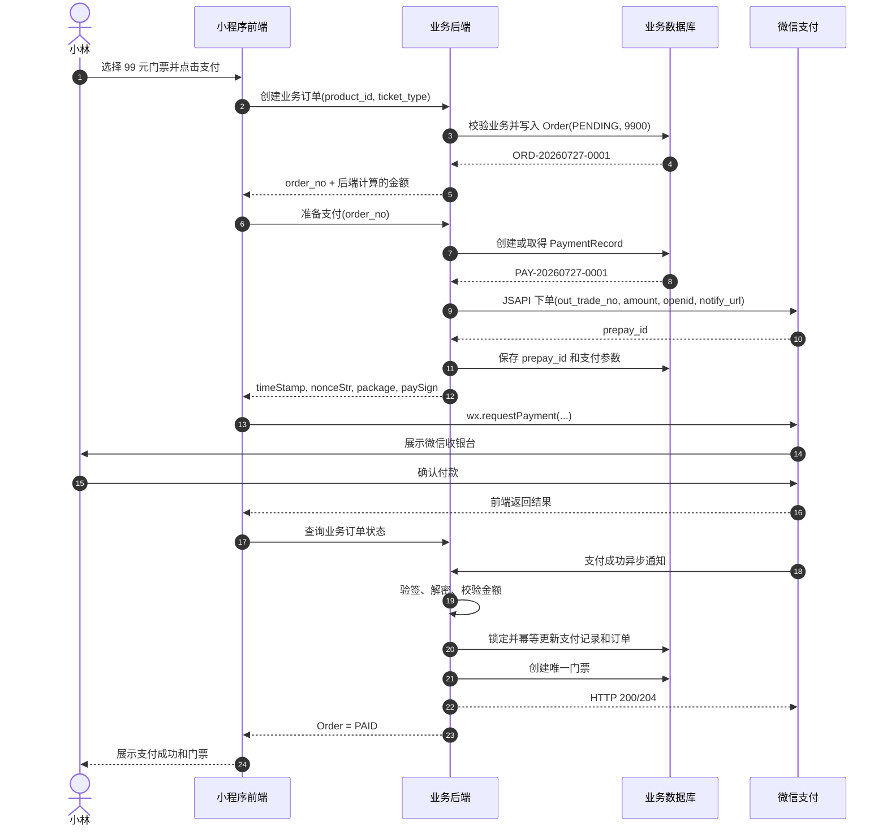

# 支付链路学习导读：以微信小程序购买活动门票为例

> 本文是一份脱敏的支付系统学习材料。它不对应某个具体项目，而是通过“用户在微信小程序购买活动门票”这个例子，讲清前端、业务后端、数据库和微信支付平台之间的数据如何流转，以及支付链路为什么需要幂等和并发控制。

## 先说结论：支付不是前端调用一次 SDK

用户看到的支付流程通常只有几秒钟：

```text
点击支付 → 输入密码 → 看到成功
```

系统真正经历的流程却是：

```text
创建业务订单
→ 后端向微信支付下单
→ 前端调起微信收银台
→ 用户在微信完成付款
→ 微信通知商户后端
→ 后端核实支付结果
→ 更新订单
→ 发放门票或报名资格
```

这里最核心的原则是：

> 前端可以发起支付和展示结果，但只有业务后端能够改变业务订单；业务后端也不能仅凭前端的一句“支付成功”就认定已经到账，而要以经过验证的微信支付结果为准。

## 一、先认识支付系统的四个参与方

假设小林准备在一个活动小程序里购买一张 99 元的活动门票。

整个支付链路里有四个主要参与方：

| 参与方 | 主要职责 | 不应该负责什么 |
| --- | --- | --- |
| 小程序前端 | 展示商品和金额、发起业务请求、调用 `wx.requestPayment`、展示结果 | 不能自行决定订单已经支付 |
| 业务后端 | 计算真实价格、创建订单、调用微信支付、核验支付结果、发放权益 | 不能把客户端上报的金额和成功状态直接当真 |
| 业务数据库 | 保存订单、支付记录、报名资格和处理状态 | 不能代替微信判断用户是否真的完成扣款 |
| 微信支付平台 | 展示收银台、完成扣款、生成支付结果、通知商户 | 不理解商户内部的活动、报名和门票业务 |

可以把它们理解成下面的分工：



微信只知道“某个商户订单支付了 99 元”，并不知道这 99 元对应哪场活动。业务后端知道用户买了哪张票，但不能凭空判断钱是否到账。因此，业务后端是业务世界和支付世界之间的桥梁。

## 二、再认识支付链路里的三类订单

一次支付过程中会出现多个编号。它们不是重复设计，而是分别属于不同系统。

### 1. 业务订单 `Order`

业务订单由商户后端创建，表达用户准备购买什么。

示例：

```json
{
  "order_no": "ORD-20260727-0001",
  "user_id": "USER-1001",
  "product_id": "EVENT-2001",
  "amount": 9900,
  "currency": "CNY",
  "status": "PENDING"
}
```

这里的 `9900` 通常表示 9900 分，也就是 99 元。价格必须由后端根据商品、优惠和业务规则计算，不能相信前端直接传来的金额。

### 2. 商户支付记录 `PaymentRecord`

支付记录也保存在商户数据库中，表达业务后端曾为这个订单发起过一次渠道支付。

示例：

```json
{
  "payment_no": "PAY-20260727-0001",
  "order_no": "ORD-20260727-0001",
  "channel": "WECHAT_PAY",
  "amount": 9900,
  "status": "PREPARING",
  "prepay_id": null,
  "transaction_id": null
}
```

业务订单回答“用户买什么”；支付记录回答“商户怎样向微信收这笔钱”。

一个业务订单有可能保留多条支付记录。例如第一次支付参数过期，系统关闭旧支付单后重新下单；或者业务允许用户更换支付渠道。但无论有多少支付记录，业务订单都只能被成功完成一次。

### 3. 微信支付订单

业务后端调用微信支付下单接口时，会传递商户支付单号 `out_trade_no`。在本例中，可以让它等于：

```text
PAY-20260727-0001
```

微信支付下单成功后，先返回 `prepay_id`。它是用于调起微信收银台的预支付会话标识，并不表示用户已经付款。

用户真正支付成功后，微信支付才会生成 `transaction_id`。它是微信支付侧标识成功交易的订单号，通常从支付成功通知或查单结果中获得。

三类数据的关系如下：



## 三、用一个具体例子走完支付链路

下面完整走一遍“小林购买 99 元活动门票”的流程。

### 第 1 步：前端请求创建业务订单

小林在活动详情页选择一张 99 元的门票，然后点击“去支付”。

前端向业务后端发送的请求可以类似：

```http
POST /api/orders
```

```json
{
  "product_id": "EVENT-2001",
  "ticket_type_id": "TICKET-01",
  "coupon_id": null
}
```

前端没有提交最终应付金额，或者即使提交了金额，后端也不能直接采用。后端需要自己完成：

1. 检查活动和票种是否仍可购买；
2. 检查用户是否有重复报名；
3. 检查库存或活动名额；
4. 计算票价和优惠；
5. 创建状态为 `PENDING` 的业务订单。

后端返回：

```json
{
  "order_no": "ORD-20260727-0001",
  "amount": 9900,
  "currency": "CNY",
  "status": "PENDING"
}
```

此时发生的只是商户内部下单，还没有调用微信支付，也没有产生真实扣款。

### 第 2 步：前端请求后端准备微信支付

前端拿到业务订单号后，请求后端准备支付：

```http
POST /api/payments/prepare
```

```json
{
  "order_no": "ORD-20260727-0001",
  "payment_method": "WECHAT_PAY"
}
```

后端首先读取业务订单，确认：

- 订单属于当前用户；
- 订单仍然是 `PENDING`；
- 金额仍为 9900 分；
- 商品和名额仍满足支付条件；
- 该订单没有已经确认成功的支付。

然后，后端在数据库中创建或取得支付记录：

```json
{
  "payment_no": "PAY-20260727-0001",
  "order_no": "ORD-20260727-0001",
  "amount": 9900,
  "status": "PREPARING"
}
```

这一阶段只是在商户系统里声明：“接下来由这条支付记录负责向微信收款。”

### 第 3 步：业务后端向微信支付预下单

业务后端使用商户私钥完成请求签名，然后调用微信支付的 JSAPI/小程序下单接口：

```http
POST https://api.mch.weixin.qq.com/v3/pay/transactions/jsapi
```

请求中的核心数据可以简化理解为：

```json
{
  "appid": "小程序的 AppID",
  "mchid": "微信支付商户号",
  "description": "活动门票",
  "out_trade_no": "PAY-20260727-0001",
  "notify_url": "https://merchant.example.com/api/payments/wechat/notify",
  "amount": {
    "total": 9900,
    "currency": "CNY"
  },
  "payer": {
    "openid": "当前用户在这个小程序下的 OpenID"
  }
}
```

几个关键字段分别解决不同问题：

| 字段             | 含义                  |
| -------------- | ------------------- |
| `out_trade_no` | 商户支付单号，在同一商户号下应保持唯一 |
| `amount.total` | 微信实际要收取的金额，单位为分     |
| `payer.openid` | 指定这次付款的小程序用户        |
| `notify_url`   | 支付成功后，微信通知业务后端的地址   |

微信接受下单后返回：

```json
{
  "prepay_id": "wx_prepay_example_001"
}
```

后端保存 `prepay_id`，再生成小程序调起支付所需的签名参数：

```json
{
  "timeStamp": "1785146400",
  "nonceStr": "random-string",
  "package": "prepay_id=wx_prepay_example_001",
  "signType": "RSA",
  "paySign": "merchant-generated-signature"
}
```

这些参数通过业务后端返回前端。商户私钥只存在于后端，不能下发给前端。

### 第 4 步：小程序前端调起微信收银台

前端拿到签名参数后调用：

```javascript
wx.requestPayment({
  timeStamp,
  nonceStr,
  package: `prepay_id=${prepayId}`,
  signType: 'RSA',
  paySign,
  success() {
    // 告诉页面可以开始查询后端订单状态
  },
  fail(error) {
    // 展示取消或调起失败，但不要擅自修改后端订单
  }
})
```

随后微信显示收银台。小林核对金额，通过密码或生物识别确认付款。扣款发生在微信支付平台，不发生在商户前端或业务后端。

`wx.requestPayment` 的 `success` 只说明本次前端调起流程返回成功。微信官方也明确提醒，商户不能只依赖前端回调判断订单支付状态。

因此前端成功后的正确动作通常是：

1. 请求业务后端查询订单状态；
2. 后端尚未确认时，页面显示“支付结果确认中”；
3. 短暂轮询，或由后端主动向微信查单；
4. 只有后端订单变成 `PAID`，页面才展示最终业务成功。

### 第 5 步：微信支付异步通知业务后端

微信确认扣款成功后，会向预下单时传入的 `notify_url` 发送 HTTP POST 通知。

通知中会包含或解密得到类似信息：

```json
{
  "out_trade_no": "PAY-20260727-0001",
  "transaction_id": "WX-TRANSACTION-9001",
  "trade_state": "SUCCESS",
  "amount": {
    "total": 9900,
    "currency": "CNY"
  }
}
```

业务后端不能收到 JSON 就直接更新订单，而要依次执行：

1. 使用微信支付平台证书或平台公钥验证回调签名；
2. 解密并读取通知资源；
3. 通过 `out_trade_no` 找到内部支付记录；
4. 校验商户号、AppID、金额和币种；
5. 确认交易状态确实为 `SUCCESS`；
6. 幂等地完成支付记录和业务订单；
7. 向微信返回 HTTP 200 或 204。

如果验签失败，说明无法证明通知来自微信，绝不能更新订单。

### 第 6 步：后端完成订单并发放门票

回调校验通过后，后端开启一个数据库事务：

```text
锁定 PaymentRecord PAY-20260727-0001
→ 锁定 Order ORD-20260727-0001
→ 重新读取两者的最新状态
→ 如果订单已经 PAID，直接按成功处理
→ 如果订单仍为 PENDING，核对金额
→ PaymentRecord 更新为 SUCCESS
→ 保存 transaction_id
→ Order 更新为 PAID
→ 创建唯一的报名或门票记录
→ 提交事务
```

最终数据库可能变成：

```json
{
  "payment_record": {
    "payment_no": "PAY-20260727-0001",
    "status": "SUCCESS",
    "transaction_id": "WX-TRANSACTION-9001"
  },
  "order": {
    "order_no": "ORD-20260727-0001",
    "status": "PAID"
  },
  "ticket": {
    "order_no": "ORD-20260727-0001",
    "owner": "USER-1001",
    "status": "VALID"
  }
}
```

这时才真正完成了“钱、订单、门票”三者的一致：

- 微信确认钱已经付了；
- 商户订单确认交易完成；
- 用户获得且只获得一张门票。

## 四、用一张时序图串起全部数据流



## 五、先分清三种“重复”

支付系统里常说的“防重复”，其实至少有三种不同问题。

| 情况 | 例子 | 要防止的结果 |
| --- | --- | --- |
| 同一个请求重试 | 网络超时后，前端把同一请求又发一次 | 再创建一张支付单 |
| 两个请求同时到达 | 用户连点、多个入口或请求重放，同时请求支付 | 两个请求各自创建一张支付单 |
| 同一个成功结果重复到达 | 微信多次回调，或前端查单与微信回调同时到达 | 重复发门票、重复报名 |

它们看起来都像“重复”，但发生的位置不同：

```text
准备支付时：解决“是否只能创建一张有效支付单”
支付成功时：解决“是否只能完成一次订单、发一张门票”
```

下面先只解决最容易绕的一个问题：两个请求同时为同一个订单准备支付。

## 六、两个请求同时点击支付，到底会发生什么

假设小林已经有一张业务订单：

```text
Order O1
- 买的是：活动门票
- 金额：99 元
- 状态：PENDING（待支付）
```

此时还没有支付记录。

小林连续点了两次“支付”，或者网络层把请求重复发送了。后端会同时收到请求 A 和请求 B。

如果后端只是简单地写：

```text
先查有没有 PaymentRecord
没有就创建一条
```

就可能发生：

```text
请求 A：查 PaymentRecord → 没有
请求 B：查 PaymentRecord → 也没有

请求 A：创建支付记录 P1
请求 B：创建支付记录 P2

请求 A：向微信预下单
请求 B：也向微信预下单
```

结果是：同一张业务订单 O1，出现两张待支付记录 P1、P2，并可能向微信发起两次预下单。

### 为什么 `SELECT ... FOR UPDATE` 在这里挡不住并发

很多人第一反应是：给“查找支付记录”的 SQL 加上 `FOR UPDATE` 不就行了吗？

```sql
SELECT *
FROM payment_records
WHERE order_id = 'O1'
  AND status IN ('PREPARING', 'READY')
FOR UPDATE;
```

`FOR UPDATE` 的真实含义是：

> 如果查到了记录，就把查到的那些记录锁住，其他事务暂时不能同时修改它们。

但首次支付时，数据库里还没有 P1：

```text
请求 A 查询：结果为空
请求 B 查询：结果也为空
```

两次查询都没有返回任何 `payment_records` 行，因此：

```text
请求 A：没有锁到任何行
请求 B：也没有锁到任何行
```

接下来两个请求都可以继续执行：

```sql
INSERT INTO payment_records (...);
```

于是 A 创建 P1，B 创建 P2。

```text
SELECT ... FOR UPDATE
只能锁住“已经存在的记录”，
不能锁住“未来可能被插入的一条记录”。
```

本文以 PostgreSQL 常见的行锁行为为例。不同数据库和隔离级别对空结果范围可能有不同表现，但支付系统不应依赖这种差异来保证正确性。

## 七、正确思路：锁住一定已经存在的 Order

虽然支付记录还不存在，但业务订单 `Order O1` 在用户点击支付前就已经创建了。

所以，首次准备支付时应该锁住订单，而不是先锁不存在的支付记录：

```sql
SELECT *
FROM orders
WHERE order_no = 'O1'
FOR UPDATE;
```

可以把订单理解成一把已经存在的门锁：

```text
Order O1：门锁
PaymentRecord P1：进入这扇门后才创建的支付单
```

处理过程应该是：

```text
请求 A：
1. 锁住 Order O1。
2. 检查订单仍待支付，且没有有效支付记录。
3. 创建 PaymentRecord P1，状态为 PREPARING。
4. 提交数据库事务，释放 O1 的锁。
5. 再去调用微信支付。

请求 B：
1. 尝试锁住 Order O1。
2. 因为 A 正在处理，所以等待。
3. A 创建 P1 并释放锁后，B 才能继续。
4. B 此时重新查询，已经能看到 P1。
5. B 不创建 P2，也不重复调用微信。
```

完整时间线如下：

```text
请求 A                            请求 B

锁住 O1
检查：没有 P1
创建 P1（PREPARING）
提交并释放 O1
                                 拿到 O1 的锁
                                 检查：已经有 P1
                                 不创建 P2
事务外调用微信
```

重点在于：

> 第一个请求负责创建 P1；第二个请求看到 P1 后，只能复用、等待或返回处理中，不能再创建 P2。

数据库唯一约束仍然有价值，但它是最后一道保险：即使未来代码遗漏了判断，数据库也应拒绝同一订单出现多条同时有效的支付记录。发生唯一冲突时，后端不能直接报系统错误，而应读取另一个请求已经创建的记录并返回一致结果。

### 第二个请求看到 P1 后应该怎么办

第二个请求不一定总是返回同一种结果，要看 P1 走到哪一步：

| P1 的状态 | 说明 | 第二个请求怎么处理 |
| --- | --- | --- |
| `PREPARING` | 第一个请求正在向微信申请支付参数 | 返回“支付准备中”，前端稍后查询 |
| `READY` | 已经拿到微信支付参数 | 直接返回已有支付参数，前端继续支付 |
| `SUCCESS` | 订单已经支付成功 | 返回订单已支付，不再调起微信 |
| `FAILED` 或 `CLOSED` | 这张支付单已明确失败或失效 | 按业务规则决定是否可以创建新的支付单 |

因此，支付记录不仅是“留一条日志”，更像一个小型状态机。它告诉系统：这笔支付现在由谁处理、走到了哪里、别人还能不能重新开始。

## 八、为什么调用微信时必须先释放数据库锁

锁的职责很简单：

```text
决定谁有资格创建 P1。
```

微信支付接口的职责也很简单：

```text
为 P1 申请支付参数。
```

这两件事不应该放在同一个长事务里。

错误做法：

```text
锁住 O1
→ 调用微信支付
→ 等微信返回
→ 更新数据库
→ 释放 O1
```

微信是外部服务，可能几十毫秒返回，也可能几秒后超时。持锁等待时，其他请求都会被堵住，数据库连接和事务也会被长期占用。

正确做法是分成三段：

```text
短事务 1：
锁住 O1
→ 创建或取得 P1
→ 提交，释放锁

事务外：
拿着 P1 的商户支付单号调用微信

短事务 2：
保存微信返回的 prepay_id 和支付参数
→ 将 P1 更新为 READY
→ 提交
```

这里最重要的边界是：

> 数据库锁只用于快速决定“谁处理这笔支付”；绝不用于等待微信网络请求。

## 九、如果调用微信超时怎么办

假设业务后端向微信发起预下单，网络在返回前断开：

```text
后端不知道：
微信根本没收到请求？
还是微信已经创建成功，只是响应丢了？
```

这时不能直接再创建 P2，再换一个全新的商户支付单号重新下单。

正确做法是保留 P1 和它稳定的 `out_trade_no`：

```text
P1 的 out_trade_no = PAY-001
```

后续可以：

1. 用 `PAY-001` 向微信查单；
2. 或按微信支付的规则，使用原来的商户支付单号安全重试；
3. 确认微信已受理后，恢复并保存结果；
4. 只有 P1 被明确关闭或失效后，才允许按业务规则创建新的 P2。

`out_trade_no` 的价值就在这里：即使网络出问题，商户后端和微信仍然能够确认自己讨论的是同一笔支付。

### 同一个请求重试时，幂等键做什么

订单锁解决的是“两个请求同时为同一订单创建支付单”。幂等键解决的是另一件事：网络超时后，客户端把同一个请求重新发送。

前端第一次发起准备支付时可以生成 `idempotency_key`；若本次请求重试，必须继续携带相同的值。后端按用户和该值识别“这是同一次请求”，返回第一次对应的 P1 或当前处理状态，而不是再次创建支付单。

```text
订单锁：两个同时到达的人，谁先创建 P1？
幂等键：同一个人把同一句话重复说了两遍，算几次？
```

两者可以配合使用，但不能互相替代。

## 十、支付成功通知为什么也要加锁

支付完成后，微信可能重复发送成功回调；与此同时，前端可能正在查单，后端也可能主动向微信查询。

假设有两个成功处理请求：

```text
C1：微信回调
C2：前端查单确认成功
```

它们都想把订单改为已支付、都想创建门票。

正确处理方式是：

```text
C1：
锁住 P1 和 O1
→ 重新读取最新状态
→ 发现订单仍为 PENDING
→ 将 P1 改为 SUCCESS
→ 将 O1 改为 PAID
→ 创建门票
→ 提交

C2：
等待 C1 释放锁
→ 重新读取 P1 和 O1
→ 发现已经 SUCCESS / PAID
→ 不再创建门票
→ 直接返回成功
```

因此，“锁后重新读取状态”不是多余步骤。

它的意思是：

> 在等待锁的这段时间里，别人可能已经处理完了；所以拿到锁之后，必须重新看一眼最新状态，不能相信等待前读到的旧数据。

最后，门票或报名记录还应对 `order_no` 设置唯一约束。这样即使上层代码未来出现遗漏，数据库仍会拒绝同一个订单生成第二张门票。

## 十一、把并发控制浓缩成一句话

```text
准备支付时：
锁 Order，保证只创建一张有效 PaymentRecord；
释放锁后，再调用微信。

支付成功时：
锁 PaymentRecord 和 Order；
只有仍待支付的订单才能首次变成已支付；
已经成功的重复请求直接返回成功。
```

各层手段分别在做不同的事：

| 手段 | 最简单的理解 |
| --- | --- |
| 前端禁用按钮 | 减少用户手滑连点 |
| 幂等键 / 稳定支付单号 | 同一句请求重复说，也只算一次 |
| 锁 `Order` | 两个请求同时开始时，排队决定谁创建第一张支付单 |
| 锁 `PaymentRecord` 和 `Order` | 两个请求同时确认成功时，排队决定谁首次完成订单 |
| 数据库唯一约束 | 即使代码漏掉判断，数据库仍不允许重复产生关键结果 |

## 十二、支付链路设计检查清单

### 订单与金额

- 业务订单是否由后端创建？
- 最终金额是否由后端计算，并在支付确认时再次核对？
- 业务订单和支付记录是否分开建模？
- 商户支付单号在支付平台要求的范围内是否唯一？

### 准备支付

- 前端是否防止普通重复点击？
- 相同请求因网络超时重试时，是否能识别并返回同一处理结果？
- 首次创建支付记录时，锁住的是不是一定已经存在的 `Order`，而不是可能为空的查询结果？
- 两个请求同时查询不到支付记录时，数据库如何保证最终只留下一个有效处理者？
- 创建或取得支付记录后，是否已经释放数据库锁，再调用第三方支付？
- 第三方调用超时后，能否依靠稳定的商户支付单号查单或安全重试？

### 支付确认

- 是否验证微信支付回调签名并正确解密通知？
- 是否校验商户号、AppID、金额、币种和交易状态？
- 是否在加锁后重新读取订单和支付记录状态？
- 重复回调、前端查单和主动查单是否都走同一套幂等完成逻辑？
- 已完成支付的订单是否只返回成功，而不会重复发放权益？

### 业务收尾

- 订单完成、支付记录成功和核心权益是否在清晰的事务中更新？
- 门票、报名、库存扣减等关键结果是否有唯一约束或幂等保护？
- 支付记录长期停留在 `PREPARING` 时，是否有查单、补偿或人工告警机制？
- 是否有对账、告警和人工排查所需的商户支付单号与微信 `transaction_id`？
## 总结

一条可靠的微信小程序支付链路，可以归纳为：

```text
前端负责发起和展示
业务后端负责业务判断和状态推进
数据库负责保存唯一、可恢复的业务事实
微信支付负责真实资金交易和可信结果
```

系统设计的难点不在于成功调用一次 `wx.requestPayment`，而在于面对重复点击、网络超时、并发请求和重复通知时，仍然保证：

```text
只收一笔该收的钱
只完成一次业务订单
只发放一份对应权益
```

理解“参与方、订单模型、完整数据流、幂等边界和事务边界”，就抓住了支付系统的主干。

## 延伸阅读

- [微信支付：JSAPI/小程序下单](https://pay.wechatpay.cn/doc/v3/merchant/4012791856)
- [微信支付：小程序调起支付](https://pay.wechatpay.cn/doc/v3/merchant/4012791898)
- [微信支付：支付成功回调通知](https://pay.wechatpay.cn/doc/v3/merchant/4012791861)
- [微信支付：JSAPI 支付开发指引](https://pay.wechatpay.cn/doc/v3/merchant/4012791870)
- [微信支付：回调通知注意事项](https://pay.wechatpay.cn/doc/v3/merchant/4012075420)
