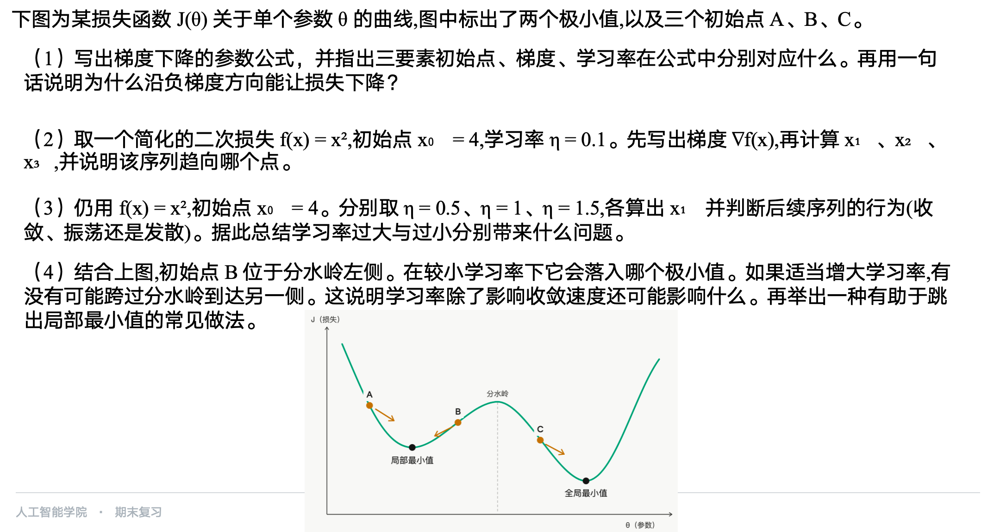
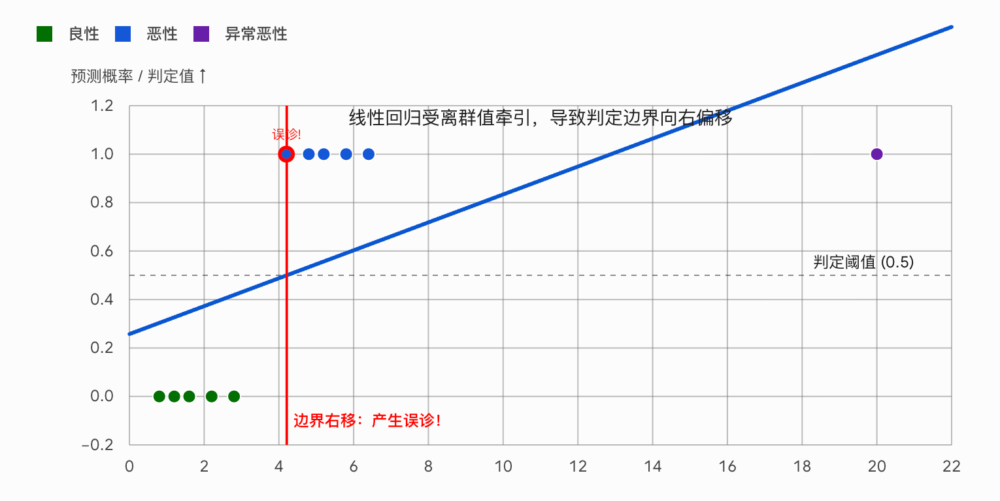
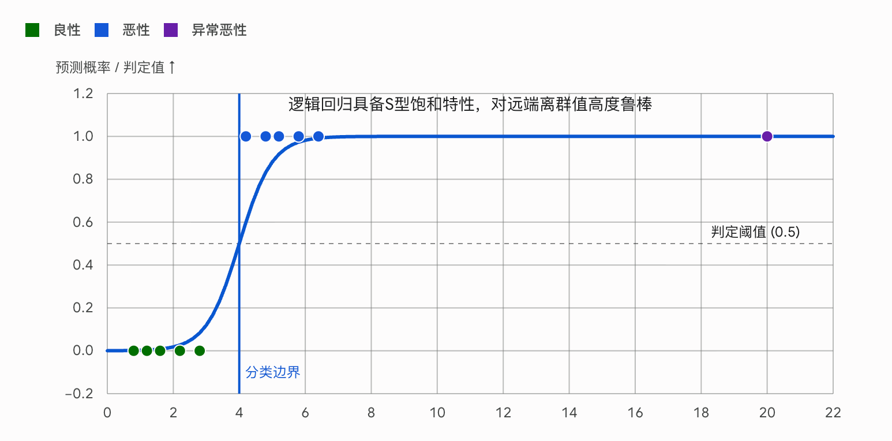
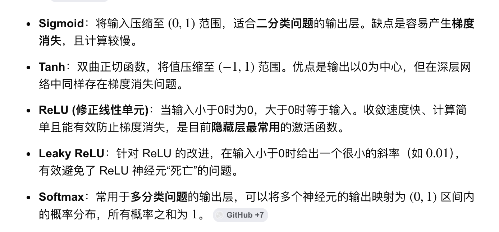
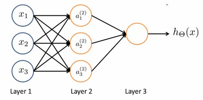
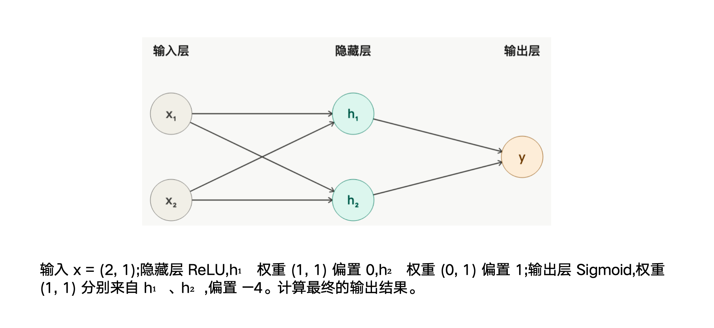
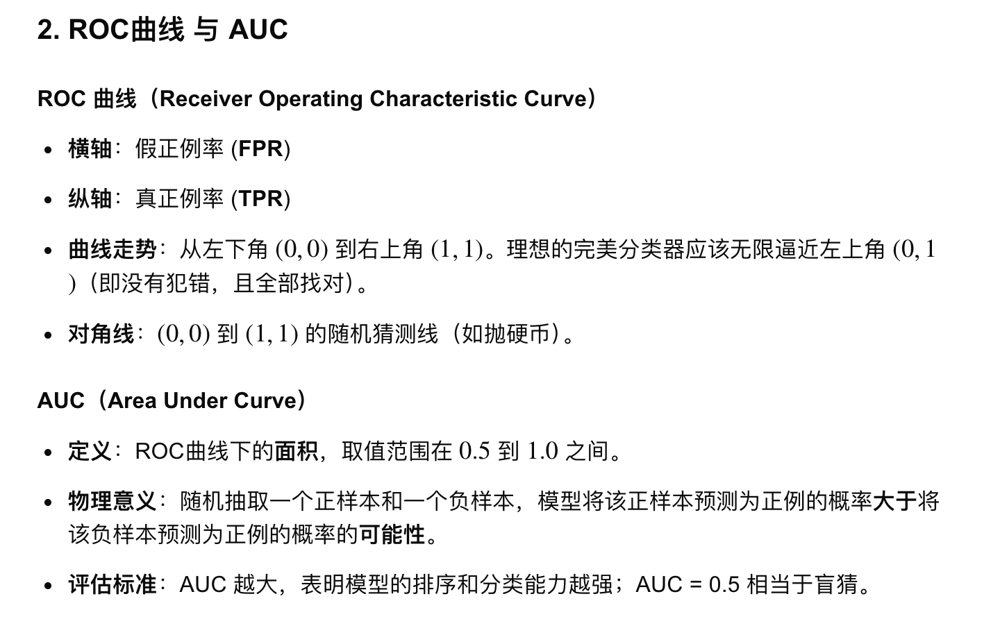
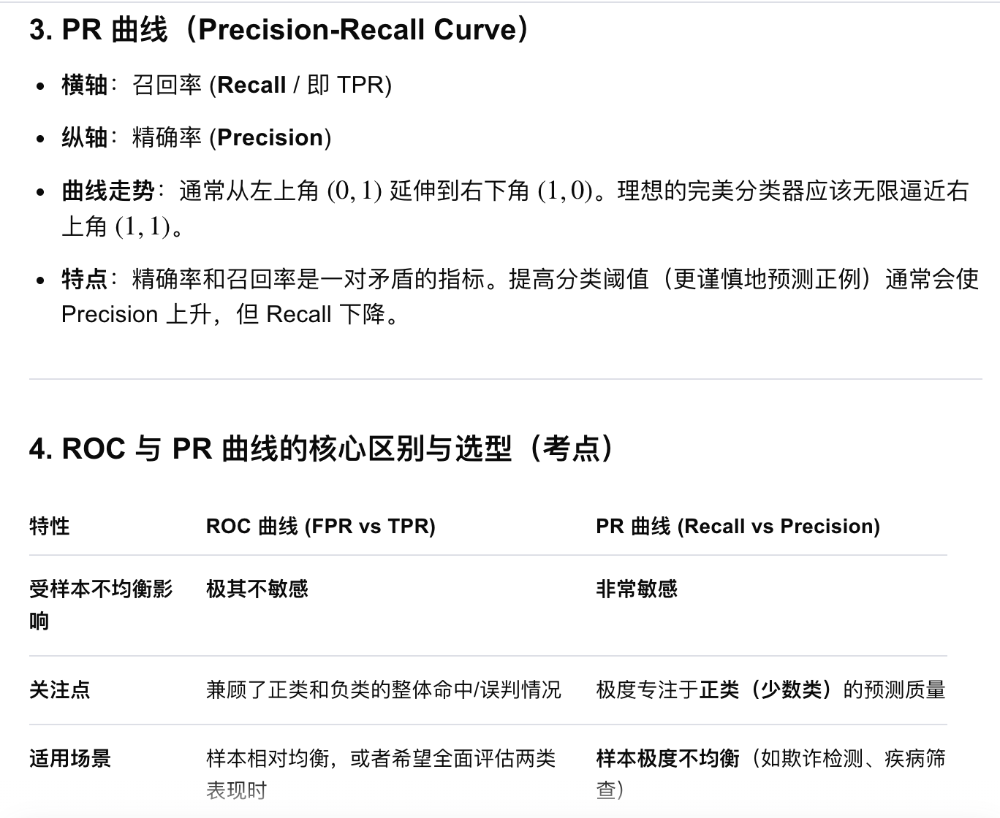

# week1 & week2

## 概念解释

传统的机器学习（不包含深度学习）基本可以分为监督学习和无监督学习两大类，监督学习又可以分为分类和回归两大类，而无监督学习最主要的思路就是聚类。

比如我们有一组二维数据：日期，以及那个日期对应的气温。我们希望找到一个合适的函数，用日期作为输入，输出对应的预测气温。这个函数不一定要穿过每一个数据点，而是要尽可能描述这些数据背后的主要规律，这个过程就叫做“拟合”。

现实中的数据通常并不完美。有些气温记录可能因为测量问题偏高或偏低；也可能是因为我们只用了“日期”这个特征，而没有考虑湿度、气压、地理位置等其他因素，所以数据中会出现一些不规则波动。

> **延伸：数据在底层的三种形态表达**
>
> 1. **特征 (Feature)**：描述事物的单一维度或属性（如上文的“日期”、“湿度”）。
> 2. **特征向量 (Feature Vector)**：将描述同一个事物的所有特征拼凑在一起形成的一维数组（如 `[日期, 湿度, 气压]`）。它描绘了事物的全貌，在数学上代表了高维空间里的一个点。
> 3. **张量 (Tensor)**：多维数据容器，是多维数组的统称。在机器学习领域，张量主要被借用为计算机底层的数据结构概念（而非严格的物理学概念）。0维是标量，1维是向量，2维是矩阵（数据表），3维及以上可装载图像或复杂序列数据。在模型中，所有的数据最终都会被转换为张量供 GPU 计算。_注意_：“1维张量”是底层的数据结构，而“特征向量”是业务上的逻辑概念（容器里装的具体内容，比如房子的面积和价格）。
>
> 维度这个词的歧义也要注意一下：
>
> 1. **计算机视角（存储维度/Tensor Rank）**：看的是数据的嵌套层级。比如数组 `[120, 3, 500]` 只需要一个索引就能遍历，所以它是 **1维张量**，哪怕里面装了十万个数，它依然是 1维的。
> 2. **数学视角（特征空间维度）**：看的是特征的数量。上面的数组包含了面积、卧室数、距离 3 个独立特征，所以它代表了 **3维几何空间** 中的一个坐标点。
>
> 一个长度为 N 的 1维张量，在几何上代表了 N 维特征空间里的 1 个点。

这些无法被当前模型解释的波动部分，可以理解为“噪声”。

如果模型太复杂，它可能会把训练数据里的噪声也当成规律去学习，甚至几乎穿过所有训练数据点。这样它在已有数据上表现很好，但在新的日期上预测反而不准，这叫“过拟合”。

相反，如果模型太简单，比如用一条直线去拟合明显具有季节周期变化的气温数据，它可能连主要趋势都学不到，那么它在训练数据和新数据上都会表现不好，这叫“欠拟合”。

当我们有了一个合适的拟合函数后，就可以输入新的日期，预测对应的气温。因为气温是一个连续数值，所以这类任务叫做“回归”任务。

为了判断模型预测得好不好，我们需要定义一个损失函数。损失函数用来衡量预测值和真实值之间的差距。比如真实气温是 40，模型预测是 50，那么误差就比较大；如果预测是 40.1，那么误差就比较小。损失函数的值越小，通常说明模型预测得越接近真实数据。

因此，训练模型的目标就是调整函数里的参数，让损失函数的值尽可能小。梯度告诉我们损失函数上升最快的方向，所以如果想让损失下降，就要沿着梯度的反方向更新参数。这种方法就叫做“梯度下降”。

前面提到了连续数值的预测任务被叫做“回归”任务，相反的，离散数值的预测任务就叫“分类”任务，比如根据肿瘤大小推测是否是良性肿瘤。

- 训练集: 用于模型学习和拟合的数据集合，相当于学生日常刷题的练习册。
- 测试集: 仅在模型最终评估阶段使用一次的数据集合，用于客观检验模型面对未知数据的真实表现，相当于最终的高考真题卷。
- 验证集: 在训练过程中用于挑选模型配置参数以及决定何时提前停止训练的数据集合，相当于平时的模拟考试卷。
- 训练误差: 模型在训练数据集上运算得出的错误率，该指标过低往往意味着模型出现了死记硬背的现象。
- 测试误差: 模型在测试数据集上运算得出的错误率，通常被作为估算模型实战能力的最核心汇报指标。
- 验证误差: 模型在验证数据集上运算得出的错误率，开发者主要依据该指标来调整算法的内部结构或步伐大小。
- 泛化误差: 模型面对未来所有无限且未知的真实客观数据时所产生的理论错误率，也是整个机器学习所追求的终极优化目标。
- 留出法: 将给定的原始数据集直接按一定比例切割为训练部分和测试部分的简单基础划分方法。
- 分层采样: 配合留出法使用的采样技术，要求在切割数据时，必须严格保证划分出的各个子集中正负类样本的分布比例与原始总比例完全一致。
- 交叉验证法: 将原始数据集平均划分为指定数量的若干等份，每次轮流将其中的一份作为测试使用，其余全部用作训练，最终将多次评估成绩求平均值的方法。
- 留一法: 交叉验证法的极端变种情况，每次只孤立出唯一的一条样本用于测试，剩余全部用于训练，特别适用于原始数据样本极其稀缺的情况。
- 自助法: 采用有放回抽样机制的数据划分方法。从总池中随机摸取一条样本复制进训练集合后依然将其保留在总池中，重复抽取直到次数等同于总容量。在这个过程中，那些始终未被抽中过的冷门样本（数学极限定理证明约占总体三分之一 36.8% 左右）将自动结集成为免费的测试集合。

## 单变量线性回归

最小二乘法是一种通过最小化误差的平方和来寻找数据最佳匹配函数的数学优化方法；均方误差（MSE）则是衡量模型预测值与真实值之间偏差的平均平方和，常作为评估模型精度的指标。两者关系密切：==最小二乘法是求解参数的过程（目标是使平方和最小），而均方误差则是该过程中用到的具体损失函数（关注平均误差）==。
它们的数学公式如下：

- 最小二乘法（残差平方和）：  
    $J = \sum_{i=1}^{n} (y_i - \hat{y}_i)^2$
- 均方误差（MSE）：  
    $MSE = \frac{1}{n} \sum_{i=1}^{n} (y_i - \hat{y}_i)^2$

_(注：式中 $n$ 为样本数量， $y_i$ 为真实值， $\hat{y}_i$ 为模型预测值。)_ 

```python
from __future__ import annotations

from datetime import date, timedelta
from math import sqrt


TrainingPoint = tuple[date, float]


DATA: list[TrainingPoint] = [
    (date(2026, 6, 1), 24.2),
    (date(2026, 6, 2), 24.8),
    (date(2026, 6, 3), 25.1),
    (date(2026, 6, 4), 25.9),
    (date(2026, 6, 5), 26.2),
    (date(2026, 6, 6), 27.0),
    (date(2026, 6, 7), 27.3),
    (date(2026, 6, 8), 35.0),  # A suspiciously high sensor reading.
    (date(2026, 6, 9), 28.2),
    (date(2026, 6, 10), 28.7),
    (date(2026, 6, 11), 29.0),
    (date(2026, 6, 12), 29.8),
    (date(2026, 6, 13), 30.1),
    (date(2026, 6, 14), 30.6),
]


# hθ(x) = θ0 + θ1x
def hypothesis(theta0: float, theta1: float, x: float) -> float:
    return theta0 + theta1 * x


# (hypothesis(theta0, theta1, x) - y) ** 2
# 即均方误差：单个点的 loss 值 = (预测值 - 真实值) 的平方
# 为什么要平方？一是消除正负号方便计算，二是通过平方放大误差值
def loss(theta0: float, theta1: float, xs: list[float], ys: list[float]) -> float:
    m = len(xs)
    squared_errors = [
        (hypothesis(theta0, theta1, x) - y) ** 2 for x, y in zip(xs, ys, strict=True)
    ]

    # 乘一个 1/2 是为了抵消计算偏导数时求导多出来的 2
    return sum(squared_errors) / (2 * m)


def loss_gradients(
    theta0: float,
    theta1: float,
    xs: list[float],
    ys: list[float],
) -> tuple[float, float]:
    m = len(xs)
    d_theta0 = 0.0
    d_theta1 = 0.0

    for x, y in zip(xs, ys, strict=True):
        error = hypothesis(theta0, theta1, x) - y  # 第一步：算误差
        d_theta0 += error  # 第二步：累加 theta0 的梯度
        d_theta1 += error * x  # 第三步：累加 theta1 的梯度

    return d_theta0 / m, d_theta1 / m  # 第四步：求平均坡度


def loss_gradients_descent(
    xs: list[float],
    ys: list[float],
    learning_rate: float,
    iterations: int,
) -> tuple[float, float]:
    theta0 = 0.0
    theta1 = 0.0

    for step in range(iterations + 1):
        if step % 400 == 0:
            print(f"step={step:4d}, loss={loss(theta0, theta1, xs, ys):.4f}")

        d_theta0, d_theta1 = loss(theta0, theta1, xs, ys)
        theta0 -= learning_rate * d_theta0
        theta1 -= learning_rate * d_theta1

    return theta0, theta1


def day_numbers(data: list[TrainingPoint]) -> list[float]:
    first_day = data[0][0]
    return [float((day - first_day).days) for day, _ in data]


def normalize(xs: list[float]) -> tuple[list[float], float, float]:
    mean_x = sum(xs) / len(xs)
    variance = sum((x - mean_x) ** 2 for x in xs) / len(xs)
    std_x = sqrt(variance)
    return [(x - mean_x) / std_x for x in xs], mean_x, std_x


def main() -> None:
    xs = day_numbers(DATA)
    ys = [temperature for _, temperature in DATA]

    normalized_xs, mean_x, std_x = normalize(xs)

    print("Training a date -> temperature model")
    print("h(x) = theta0 + theta1 * x")
    print()

    theta0, theta1 = loss_gradients_descent(
        normalized_xs,
        ys,
        learning_rate=0.1,
        iterations=2_000,
    )

    intercept = theta0 - theta1 * mean_x / std_x
    slope = theta1 / std_x

    print()
    print("Learned model:")
    print(f"temperature = {intercept:.2f} + {slope:.2f} * days_since_2026_06_01")
    print()
    print("Training data predictions:")

    first_day = DATA[0][0]
    for observed_day, actual_temperature in DATA:
        days_since_start = float((observed_day - first_day).days)
        predicted_temperature = intercept + slope * days_since_start
        error = predicted_temperature - actual_temperature
        print(
            f"{observed_day.isoformat()}  actual={actual_temperature:5.1f}  "
            f"predicted={predicted_temperature:5.1f}  error={error:6.2f}"
        )

    next_day = DATA[-1][0] + timedelta(days=1)
    next_day_number = float((next_day - first_day).days)
    next_day_prediction = intercept + slope * next_day_number

    print()
    print(f"Prediction for {next_day.isoformat()}: {next_day_prediction:.1f} C")


if __name__ == "__main__":
    main()

```

一道例题：



(1) 梯度下降公式及三要素

- **参数更新公式**：$\theta_{t+1} = \theta_t - \eta \nabla J(\theta_t)$
    
    _(注：卷面有时也写成 $x_{k+1} = x_k - \eta f'(x_k)$ 或用 $\alpha$ 表示学习率，均满分)_。
    
- **三要素对应关系**：
    
    - **初始点**：对应公式中的 $\theta_t$（当前所在的山坡位置）。
        
    - **梯度**：对应公式中的 $\nabla J(\theta_t)$（当前位置的切线斜率）。
        
    - **学习率**：对应公式中的 $\eta$（决定往下迈步的步长跨度）。
        
- **一句话说明原因**：
    
    在微积分中，**梯度方向是函数值上升最快的方向**；因此，沿梯度的反方向（即负梯度方向，公式中的减号）前进，自然就是函数值下降最快（最陡峭）的下坡方向。
    
(2) 小学习率的推演
已知损失函数 $f(x) = x^2$，初始点 $x_0 = 4$，学习率 $\eta = 0.1$。

- **第一步：求梯度表达式**
    
    $$\nabla f(x) = f'(x) = 2x$$
    
- **第二步：推导迭代通式**
    
    $$x_{k+1} = x_k - \eta f'(x_k) = x_k - 0.1 \times (2x_k) = x_k - 0.2x_k = \mathbf{0.8x_k}$$
        
- **第三步：逐步计算**
    
    - $x_1 = 0.8 \times 4 = \mathbf{3.2}$
        
    - $x_2 = 0.8 \times 3.2 = \mathbf{2.56}$
        
    - $x_3 = 0.8 \times 2.56 = \mathbf{2.048}$
        
- **结论**：
    
    因为每次坐标都乘以 $0.8$，该序列会不断衰减，最终**趋向于点 $x = 0$**（即该二次函数的全局最小值点）。
    

(3) 大尺寸步长的推演

继续使用通式 $x_{k+1} = x_k - \eta(2x_k) = \mathbf{x_k(1 - 2\eta)}$，初始 $x_0 = 4$。

- **取 $\eta = 0.5$ 时**：
    
    $x_1 = 4 \times (1 - 2 \times 0.5) = 4 \times 0 = \mathbf{0}$。
    
    **判断**：一步直接精准踏入谷底，后续永远停留在 $0$。行为表现为**完美收敛**。
    
- **取 $\eta = 1$ 时**：
    
    $x_1 = 4 \times (1 - 2 \times 1) = 4 \times (-1) = \mathbf{-4}$。
    
    _(如果算 $x_2$ 会发现 $x_2 = 4$)_。
    
    **判断**：在峡谷两侧的 $4$ 和 $-4$ 之间来回横跳，永远下不去。行为表现为**振荡**。
    
- **取 $\eta = 1.5$ 时**：
    
    $x_1 = 4 \times (1 - 2 \times 1.5) = 4 \times (-2) = \mathbf{-8}$。
    
    _(如果算 $x_2$ 会发现 $x_2 = 16$)_。
    
    **判断**：步子迈得太大，越跳越高，直接飞出峡谷。行为表现为**发散（梯度爆炸）**。
    

**【总结】**：

- 学习率过小：步子太碎，会导致**收敛速度极慢**，耗费大量计算时间
- 学习率过大：步子迈过头，会导致模型在谷底附近**剧烈振荡**，甚至直接越跳越高导致**发散崩溃**
    
(4) 跳出局部极小值

- **较小学习率的下场**：
    点 B 位于分水岭左侧，如果学习率较小（步子很碎），它只能感受到脚下局部的斜率，顺着坡一直往下走，最终会落入左侧的【局部最小值】坑里出不来。
    
- **增大学习率的可能性**：
    **有可能**。如果学习率适当增大，模型在 B 点迈出的那一步跨度极大，就有可能直接跨过中间那个隆起的“分水岭”，落在右侧的斜坡上，从而一路滚进最深的【全局最小值】。
    
- **得出推论**：
    这说明学习率除了影响收敛速度，**还可能影响模型最终收敛的位置（即是否能跳出局部最小值的陷阱）**。
    
- **跳出局部最小值的常见做法（任写一种即可满分）**：
    1. **引入动量（Momentum 优化算法）**：像推着一颗有惯性的铁球下山，即使遇到局部小坑，靠着之前累积的下坡惯性也能冲出去。
    2. **学习率衰减/退火（Learning Rate Decay）**：前期用大学习率瞎跑跨过分水岭，后期用小学习率精准落入谷底。        
    3. **随机梯度下降（SGD）**：利用随机抽取单一样本带来的“噪声抖动”，把模型从局部坑里“震”出来。

## 多变量线性回归

更多时候特征值不止一个而是多个，比如:

$$h_\theta(x) = \theta_0 + \theta_1 x_1 + \theta_2 x_2 + \dots + \theta_n x_n$$

为了可以充分并行化计算，我们将式子改写为：

$$h_\theta(x) = \theta_0 x_0 + \theta_1 x_1 + \theta_2 x_2 + \dots + \theta_n x_n$$

那么针对两个一维张量，即参数向量 $\theta$: $[\theta_0, \theta_1, \theta_2, \dots, \theta_n]$ 和特征向量 $X$: $[x_0, x_1, x_2, \dots, x_n]$，就可以通过线性代数的知识写为：

$$h_\theta(x) = \theta^T X$$

### 特征缩放

在多变量线性回归中，不同特征的取值范围往往差异巨大。例如，预测房价时，$x_1$（房屋面积）可能在 $100 \sim 200$ 之间，而 $x_2$（卧室数量）在 $1 \sim 5$ 之间。这种数量级的悬殊会导致损失函数的等高线图呈现出极其狭长的椭圆状。当使用梯度下降时，参数在数值大的特征方向上更新极其缓慢，而在数值小的特征方向上极易发生剧烈震荡，导致模型收敛极其困难。

为了消除这种特征尺度差异带来的影响，我们需要进行**特征缩放**。最常用的数学手段是 **Z-score 标准化**，它的目的是将所有特征按比例缩放，强行拉到同一水平线上。

对每一个特征 $x$ 执行以下数学操作：

$$x_{new} = \frac{x - \mu}{\sigma}$$

- $\mu$ 代表该特征在样本集中的平均值（均值平移，将数据中心拉到 0）。
- $\sigma$ 代表该特征在样本集中的标准差（方差缩放，压缩数据的离散程度）。

经过标准化后，原本狭长的等高线会被“捏”成规整的同心圆。此时，不管从哪个初始点出发，梯度的方向都会精准指向谷底，使得梯度下降能够以极快的速度收敛。

### 正规方程

梯度下降是一种需要不断试错、迭代的启发式算法，不仅需要手动设置学习率 $\alpha$，还需要多次循环才能逼近最优解。对于线性回归问题，其损失函数是一个完美的凸函数（碗状）。既然是凸函数，我们是否可以跳过一步步试探的循环，直接通过数学解析的手段，一步到位算出谷底（导数为 0 的点）的绝对坐标？

正规方程就是求解线性回归参数 $\theta$ 的解析解。它利用矩阵运算和微积分，直接求得令代价函数最小化的参数向量 $\theta$。

假设我们有一个包含 $m$ 个样本、$n$ 个特征的数据集。我们将所有特征组合成一个 $m \times (n+1)$ 的设计矩阵 $X$（包含常数项 $x_0 = 1$），并将所有真实结果组合成一个 $m \times 1$ 的向量 $y$。

如果不考虑误差，我们期望的完美线性方程体系可以表示为：

$$X \theta = y$$

为了解出 $\theta$，常规代数思维是等式两边同除以 $X$。但在矩阵运算中，只有方阵（行数等于列数）才可能存在逆矩阵。由于 $X$ 通常是长方形矩阵（样本数 $m$ 远大于特征数 $n$），无法直接求逆。

数学家的解决方案是：在等式两边同时左乘 $X$ 的转置矩阵 $X^T$：

$$X^T X \theta = X^T y$$

此时，$(X^T X)$ 必然是一个 $(n+1) \times (n+1)$ 的方阵。只要该方阵可逆，我们就可以在等式两边同时左乘它的逆矩阵 $(X^T X)^{-1}$：

$$(X^T X)^{-1} X^T X \theta = (X^T X)^{-1} X^T y$$

由于矩阵与其逆矩阵相乘等于单位矩阵 $I$：

$$I \theta = (X^T X)^{-1} X^T y$$

我们得出了一步求解 $\theta$ 的“上帝公式”：

$$\theta = (X^T X)^{-1} X^T y$$

- **优势**：不需要选择学习率 $\alpha$，不需要迭代计算，直接代入矩阵得出全局最优解。
- **局限**：计算矩阵的逆 $(X^T X)^{-1}$ 的时间复杂度大约是 $O(n^3)$。当特征数量 $n$ 非常大（例如 $n > 10000$）时，计算会极其缓慢甚至导致内存溢出。因此，正规方程仅适用于中小规模的机器学习问题；面对海量参数的现代深度学习模型，梯度下降依然是唯一的选择。

**其实现在大模型架构的本质，也是：定义海量参数矩阵 $\theta \rightarrow$ 前向传播算 Loss $\rightarrow$ 反向传播算梯度 $\rightarrow$ 更新参数。后面慢慢学吧**

# week3

## 逻辑回归

首先澄清一下，虽然名字里带回归，但是它其实是用来**做分类的**。为什么线性回归不能做分类呢？现实的分类目标通常是“非黑即白”的离散状态（比如肿瘤的良性 0 或恶性 1），而线性回归的输出是无边无际的连续数值。如果强行用一条无限延伸的直线去拟合，会引发两个灾难：

1. **物理意义的崩塌**：直线算出的预测值可能 $>1$（如 2.5）或 $<0$（如 -1.2），这在概率学上毫无意义。
2. **异常值的“杠杆效应”**：一根笔直的拟合线极易被极端的异常点拉歪。为了迁就远处的一个异常值，整条直线会被向下或向上压平，导致原本正常的样本被分类边界（如 $y=0.5$）错误划分。

### Sigmoid 函数

为了控制预测值不越界，我们需要引入 **Sigmoid 函数（逻辑函数）** 作为“压缩机”。它的作用是把线性回归算出来的从负无穷到正无穷的所有数字，压缩进 $(0, 1)$ 这个绝对安全的概率区间内。

- 输入极大的正数，输出无限接近于 1。
- 输入极小的负数，输出无限接近于 0。
- 输入 0，输出刚好是 0.5。

线性回归：


Sigmoid：


在线性方程的基础上套上一层 Sigmoid 外壳：

- 线性组合部分：$z = \theta^T X$
- Sigmoid 函数：$g(z) = \frac{1}{1 + e^{-z}}$
- 逻辑回归最终预测模型：

$$h_\theta(x) = \frac{1}{1 + e^{-\theta^T X}}$$

算出来的 $h_\theta(x)$ 具有了严格的概率学意义。即在给定特征 $x$ 和参数 $\theta$ 的情况下，目标等于 1 的概率：$h_\theta(x) = P(y=1 | x; \theta)$。

### 交叉墒损失

我们不能再沿用线性回归的“均方误差 (MSE)”。因为把带有指数运算的 Sigmoid 函数塞进均方误差的平方项里，损失函数会扭曲成**非凸函数 (Non-convex Function)**。此时使用梯度下降，极易陷入局部最优解，无法找到全局最低点。

我们引入了信息论中的 **对数损失 (Log Loss)**，也即大模型中常用的 **交叉熵损失 (Cross-Entropy Loss)**。它的核心判罚逻辑是如果预测错得离谱且概率极高，惩罚值会飙升至无穷大。

因为标签 $y$ 只有 1 和 0 两种可能，我们可以将惩罚分段：

- 当 $y = 1$ 时：$Cost = -\log(h_\theta(x))$
- 当 $y = 0$ 时：$Cost = -\log(1 - h_\theta(x))$

利用代数技巧将它们融合为一个**统一的代价函数**：

$$Cost(h_\theta(x), y) = -y \log(h_\theta(x)) - (1 - y) \log(1 - h_\theta(x))$$
_(注：当 $y=1$ 时后半部分消掉，当 $y=0$ 时前半部分消掉，极其优雅)_

更换了极其复杂的对数损失函数后，我们重新得到了一个平滑的“大碗”（凸函数）。利用微积分的链式法则对整体代价函数求偏导后，我们得到了参数 $\theta_j$ 的更新公式：

$$\theta_j = \theta_j - \alpha \frac{1}{m} \sum_{i=1}^{m} (h_\theta(x^{(i)}) - y^{(i)}) x_j^{(i)}$$

这个公式与第一周线性回归的梯度下降公式在形式上完全一模一样，唯一的区别仅仅在于内部的预测函数 $h_\theta(x)$ 从普通的直线变成了一根 $S$ 型曲线。

### Loss 和 Cost

**Loss Function (损失函数)**：定义在**单个样本**上的误差。它衡量的是模型对某一个具体输入预测值与真实值之间的“痛苦指数”。

**Cost Function (代价函数)**：定义在**整个训练集**（或一个 Batch）上的平均误差。它是所有样本 Loss 的宏观平均，是梯度下降算法真正要去最小化的终极目标。

以逻辑回归为例，单个样本的 **Loss Function** 为：
$$\text{Loss}(h_\theta(x^{(i)}), y^{(i)}) = -y^{(i)} \log(h_\theta(x^{(i)})) - (1 - y^{(i)}) \log(1 - h_\theta(x^{(i)}))$$

而整个数据集的 **Cost Function** $J(\theta)$ 则是对所有样本 Loss 取均值：
$$J(\theta) = \frac{1}{m} \sum_{i=1}^{m} \text{Loss}(h_\theta(x^{(i)}), y^{(i)}) = -\frac{1}{m} \sum_{i=1}^{m} \left[ y^{(i)} \log(h_\theta(x^{(i)})) + (1 - y^{(i)}) \log(1 - h_\theta(x^{(i)})) \right]$$

### 一对多

基础的逻辑回归通过 Sigmoid 函数将输出限制在 $(0,1)$，天生只能处理非黑即白的“二元分类”问题。但在实际业务中（如天气预测：晴、雨、阴、雪），目标往往包含 $K$ 个离散类别 ($K > 2$)，无法直接用单根 S 型曲线搞定。

既然模型只会做“二选一”，便采取**分而治之**的策略。将一个多分类任务拆解为 $K$ 个独立的二分类任务。针对每一个类别，都训练一个独立的逻辑回归模型，将“当前类别”设为正例（1），而将“其余所有类别”统一打包看作负例（0）。

设定类别 $i \in \{1, 2, \dots, K\}$，针对每个类别训练出来的模型为：
$$h_\theta^{(i)}(x) = P(y=i \mid x; \theta)$$

当输入一个全新的测试样本 $x$ 时，将其同时喂给这 $K$ 个模型，每个模型都会吐出一个概率值。最终的预测结果，取算出的概率值最大的那个模型所对应的类别：
$$\text{prediction} = \arg\max_{i} h_\theta^{(i)}(x)$$
*(注：这正是现代大语言模型在词表里评估并生成下一个词的最初级分类雏形)*

举个简单的例子，比如：

- 模型 1 负责区分“晴天”和“非晴天”（把雨、阴、雪全当成一类）。
- 模型 2：负责区分“雨天”和“非雨天”。
- 模型 3：负责区分“阴天”和“非阴天”。
- 模型 4：负责区分“雪天”和“非雪天”。

当明天的新数据 $x$ 输入进来时，把这个数据同时喂给这 4 个模型，它们会各自吐出一个概率。模型 1 报告：“是晴天的概率是 15%”；模型 2 报告：“是雨天的概率是 82%”；模型 3 报告：“是阴天的概率是 10%”；模型 4 报告：“是雪天的概率是 2%”。由于模型 2 算出的概率最高（82%），所以明天的预测结果就是“雨天”。

### 正则化 

当特征空间维度极高、参数过多时，模型为了在训练集上拿到满分（使 Cost 降为 0），会不择手段地放大高阶特征（比如 $x^3, x^4$ 这样的特征）的权重参数 $\theta$，画出一条极其扭曲、死记硬背所有数据点的曲线。这导致模型产生**过拟合**，丧失了对未知新数据的泛化能力。

为了防止权重参数 $\theta$ 肆意疯长，在原有的代价函数尾巴上强行加上一个**正则化惩罚项**。不仅要求模型预测得准（减少 loss），还要求所有的权重参数自身越小越好（约束模型复杂度），以此逼迫扭曲的曲线重新变得平滑。

**公式推导 (以线性回归加入 L2 正则化为例)**，引入正则化参数 $\lambda$ (Lambda)，重构后的 **Cost Function** 为：
$$J(\theta) = \frac{1}{2m} \left[ \sum_{i=1}^{m} (h_\theta(x^{(i)}) - y^{(i)})^2 + \lambda \sum_{j=1}^{n} \theta_j^2 \right]$$
*(注：依照工业惯例，常数项/截距 $\theta_0$ 不参与正则化惩罚)*

对这个带有惩罚项的新代价函数求偏导，推导得出其**梯度下降更新公式**：
$$\theta_j := \theta_j - \alpha \left[ \frac{1}{m} \sum_{i=1}^{m} (h_\theta(x^{(i)}) - y^{(i)}) x_j^{(i)} + \frac{\lambda}{m} \theta_j \right]$$

为了看清其物理本质，我们将关于 $\theta_j$ 的项合并同类项，变形为：
$$\theta_j := \theta_j \left( 1 - \alpha \frac{\lambda}{m} \right) - \alpha \frac{1}{m} \sum_{i=1}^{m} (h_\theta(x^{(i)}) - y^{(i)}) x_j^{(i)}$$

**得出结果 (权重衰减 Weight Decay)**：因为 $\alpha, \lambda, m$ 均为正数，括号内的 $\left( 1 - \alpha \frac{\lambda}{m} \right)$ 必然是一个略小于 1 的数字（例如 0.99）。这意味着，**在每一轮迭代更新、向谷底迈步之前，模型都会强制让当前的权重 $\theta_j$ 乘以 0.99 自动“缩水”一部分**。这种在数学上自然推导出的机制，在工业界被称为**权重衰减 (Weight Decay)**，是现代各大深度学习优化器（如 AdamW）抗过拟合、稳定训练的绝对底层基石。

### Lasso 回归/ 岭回归

在真实的工业界数据中，单纯使用最小二乘法（OLS）极易因特征维度过高或存在多重共线性而导致模型过度拟合（权重参数 $w$ 的绝对值趋于无穷大）。为此，引入正则化项（惩罚项）来限制假设空间的复杂度。
#### 一、 L1 范数与 L2 范数的数学定义
在向量空间中，范数用于度量向量的“长度”或“大小”。设权重向量 $w = (w_1, w_2, \dots, w_n)$：
1. **L1 范数 ($||w||_1$)**：向量中各个元素绝对值之和（曼哈顿距离）。
   $$||w||_1 = \sum_{i=1}^{n} |w_i|$$
2. **L2 范数 ($||w||_2$)**：向量中各个元素平方和的平方根（欧几里得距离）。
   $$||w||_2 = \sqrt{\sum_{i=1}^{n} w_i^2}$$

---

#### 二、 岭回归 (L2 正则化)
* **目标函数**：在均方误差 (MSE) 的基础上增加 L2 范数的平方作为惩罚项。
  $$J(w) = \text{MSE} + \lambda \sum_{i=1}^{n} w_i^2$$
  *(其中 $\lambda > 0$ 为正则化系数 / 超参数)*
* **数学与工程特性**：
  * **平滑缩水**：L2 惩罚项是可导的凸函数。它会将所有的权重参数按比例向 $0$ 的方向压缩，但**几乎不会将参数精确压缩至 $0$**。
  * **解决共线性**：在矩阵计算解析解 $w = (X^T X + \lambda I)^{-1} X^T y$ 时，对角线上的 $\lambda I$ 强行解决了 $X^T X$ 矩阵不可逆（满秩）的问题，极大提升了模型稳定性。

---

#### 三、 Lasso 回归 (L1 正则化)
* **目标函数**：在均方误差 (MSE) 的基础上增加 L1 范数作为惩罚项。
  $$J(w) = \text{MSE} + \lambda \sum_{i=1}^{n} |w_i|$$
* **数学与工程特性**：
  * **稀疏性**：由于绝对值函数的特性，Lasso 回归在优化过程中，会将对目标变量贡献极小（或高度相关）的冗余特征权重**精确压缩为 $0$**。
  * **内建特征选择**：在超高维数据（如基因测序、文本词袋）中，Lasso 能够自动输出一个稀疏权重矩阵，直接实现了降维与特征筛选。

---

#### 四、 【高频考点】几何视角解析：为什么 L1 产生稀疏性，而 L2 不会？
在二维权重空间 $(w_1, w_2)$ 中，将正则化问题等价转化为**带约束的最优化问题**：

1. **约束边界 (栅栏形状)**：
   * L2 的约束条件为 $w_1^2 + w_2^2 \le C$，在几何上表现为一个**平滑的圆形**。
   * L1 的约束条件为 $|w_1| + |w_2| \le C$，在几何上表现为一个**带尖角的菱形（正方形）**。
2. **等高线相交行为**：
   * 最小二乘法的损失函数等高线（同心椭圆）从最优解中心向外扩张。
   * 极值点出现在**椭圆等高线首次与约束边界相交的位置**。
   * **L2 结论**：椭圆大概率与圆形的圆弧相切，切点的 $w_1$ 和 $w_2$ 均不为 $0$。
   * **L1 结论**：由于菱形边界在坐标轴上具有极其突出的“尖角”，扩大的椭圆**极大概率会直接与尖角相交**。而尖角的物理坐标必定位于某一个坐标轴上（例如 $w_1 = 0, w_2 = C$），从而导致该维度参数绝对归零，产生数学上的稀疏性。

---

#### 五、 算法选型对照矩阵

| 维度         | 岭回归 (Ridge / L2) | Lasso 回归 (L1)      | 弹性网络 (Elastic Net) |
| :--------- | :--------------- | :----------------- | :----------------- |
| **正则化项**   | 平方和惩罚            | 绝对值惩罚              | L1 + L2 组合惩罚       |
| **权重极值**   | 趋近于 $0$ 但非 $0$   | 精确为 $0$            | 部分精确为 $0$          |
| **核心工程价值** | 提升模型鲁棒性，抑制过拟合    | 自动特征选择，构建稀疏模型      | 兼具平滑缩水与特征筛选        |
| **最优化求解**  | 有闭式解析解，易于求导求解    | $w=0$ 处不可导，需用坐标下降法 | 需使用高级数值优化方法        |
# week4

## 神经网络的表征

常见激活函数：


在实际工程中，面对高度复杂的非线性分类问题（例如计算机视觉中的图像识别），传统的逻辑回归模型会遭遇严重的**算力瓶颈**与**维度灾难**。假设我们需要识别一张仅为 $50 \times 50$ 像素的灰度图像。

- 其基础输入特征（像素点）数量为 $n = 2500$。
- 若要使用逻辑回归拟合复杂的非线性决策边界，必须引入高阶多项式特征（如像素间的交叉乘积 $x_i x_j$）。
- 仅仅包含所有二次项特征，特征总数将达到 $\mathcal{O}(n^2)$，即 $\frac{2500 \times 2500}{2} \approx 300\text{万}$ 个特征。

将数百万个特征输入单个逻辑回归模型，不仅会导致计算资源迅速耗尽（OOM），且极其容易引发严重的**过拟合**。人类工程师也无法通过手工方式去有效地排列组合这些海量的非线性特征。

为了突破单层模型的表征极限，神经网络引入了**隐藏层**的架构。其核心思想不再是将所有特征交由单一的逻辑回归模型处理，而是利用网络拓扑结构进行**层级特征提取**。这可以类比于分布式计算中的思想。神经网络将庞大且复杂的特征解析任务，拆解并分配给隐藏层中的多个独立计算单元（神经元）。

- **神经元本质**：隐藏层中的每一个神经元，本质上就是一个带有非线性激活函数（如 Sigmoid）的逻辑回归单元。
- **并发与聚合**：同一层内的多个神经元同时接收上一层的全量输出，但由于各自被随机初始化的**权重矩阵 ($\Theta$)** 不同，它们会并发地在不同的维度上提取不同的特征信息。随后，这些信息将被汇总并传递给下一层进行更高级别的抽象。

---

以“判断一张图片是否为汽车”的二元分类任务为例，我们可以清晰地观测到神经网络是如何通过隐藏层的层层递进，将底层的“无序数据”转化为高层的“语义特征”的：

* **输入层 (Input Layer, $L_1$)**：接收原始的 $2500$ 个像素光暗值。此时数据是杂乱无章的矩阵。
* **隐藏层 1 (Hidden Layer 1, $L_2$ - 低级特征层)**：该层的神经元独立扫描全量像素，各自负责识别极其基础的局部特征，例如**不同方向的边缘、线条、颜色梯度边界**。
* **隐藏层 2 (Hidden Layer 2, $L_3$ - 中级特征层)**：接收 $L_2$ 传递来的“线条”信号。该层神经元将这些线条组合，判定并提取出基础的**几何形状（如圆形、矩形、锐角）**。
* **隐藏层 3 (Hidden Layer 3, $L_4$ - 高级特征层)**：接收 $L_3$ 传递来的“形状”信号。该层神经元进行更高维度的语义聚合，判定特定的物理部件，例如**车轮、车窗、金属外壳轮廓**。
* **输出层 (Output Layer, $L_5$)**：最终的输出神经元（顶层逻辑回归单元）不再需要处理底层的 2500 个像素，而是直接接收 $L_4$ 递交的“高级部件存在概率”。它通过简单的线性加权，输出最终的预测概率（例如：$P(y=1) = 0.95$，即判定为汽车）。

通过这种层层递进的抽象管线，神经网络成功将极其复杂的图像识别任务，拆解成了每一层都可以轻松处理的基础微操作。

## 前向传播

在数学层面上，上述特征的流动与提纯过程，完全依赖于**矩阵乘法**与**非线性激活**的交替执行。这一从输入端到输出端的计算全流程，称为**前向传播**。

* $a_i^{(j)}$：表示第 $j$ 层的第 $i$ 个神经元的**激活值**。
* $\Theta^{(j)}$：表示从第 $j$ 层映射到第 $j+1$ 层的**权重矩阵**。若第 $j$ 层有 $s_j$ 个神经元，第 $j+1$ 层有 $s_{j+1}$ 个神经元，则 $\Theta^{(j)}$ 的维度为 $s_{j+1} \times (s_j + 1)$（加 1 是为了引入偏置项）。

**推导过程（以三层网络为例）：**
假设网络包含输入层 $x$（即 $a^{(1)}$），一个隐藏层 $a^{(2)}$，以及输出层 $a^{(3)}$。

**Step 1: 从输入层到隐藏层**
首先，为输入层添加一个恒为 1 的偏置单元：$a_0^{(1)} = 1$。
接着，计算隐藏层接收到的线性加权和 $z^{(2)}$：
$$z^{(2)} = \Theta^{(1)} a^{(1)}$$
随后，将线性结果输入激活函数 $g(\cdot)$ 中，完成非线性映射，得到隐藏层的实际输出：
$$a^{(2)} = g(z^{(2)})$$

**Step 2: 从隐藏层到输出层**
同理，为隐藏层添加偏置单元：$a_0^{(2)} = 1$。
计算输出层接收到的线性加权和 $z^{(3)}$：
$$z^{(3)} = \Theta^{(2)} a^{(2)}$$
最后，经过输出层的激活函数，得到最终的假设预测值 $h_\Theta(x)$：
$$h_\Theta(x) = a^{(3)} = g(z^{(3)})$$

**通用泛化公式：**
对于网络中的任意第 $j$ 层，其向第 $j+1$ 层的传播严格遵循以下向量化方程：
$$z^{(j+1)} = \Theta^{(j)} a^{(j)}$$
$$a^{(j+1)} = g(z^{(j+1)})$$

从代数视角来看，神经网络本质上是一个**深层嵌套的复合函数**。如果我们将其前向传播过程一步写完，它呈现如下形态：
$$h_\Theta(x) = g\left( \Theta^{(3)} \cdot g\left( \Theta^{(2)} \cdot g\left( \Theta^{(1)} x \right) \right) \right)$$



在上述“汽车图像分类”的案例中，各层神经元的职责划分（找线条 $\rightarrow$ 找形状 $\rightarrow$ 找车轮）**并非硬编码指定的**。在模型初始化时，所有的 $\Theta$ 矩阵皆为随机噪声。这种完美且严密的层级特征提取机制，是模型在海量数据输入与代价函数误差的约束下，为了最小化损失值，通过微积分运算**自动演化、涌现**出来的底层物理规律。至于网络是如何通过反向追溯误差来自动调整这成千上万个 $\Theta$ 权重的，这属于下一周**反向传播算法**的研究范畴。

# week5

### 神经网络的训练

在前向传播构建完成后，神经网络面临的核心挑战在于如何根据预测误差更新网络中数以万计的权重参数 $\Theta$。在线性回归或逻辑回归等单层模型中，代价函数直接与最终权重关联，求导路径直接。然而在多层神经网络中，求导路径遭遇了**责任分配问题**。

**深度网络的计算痛点：**
- **非直连误差**：输出层的最终误差不仅由输出层自身的权重 $\Theta^{(L-1)}$ 决定，还受到前面所有隐藏层激活值 $a^{(l)}$ 以及更早层权重 $\Theta^{(l-1)}$ 的累积影响。
- **解析求导极其复杂**：若使用常规微积分对输入层的权重求导，链式法则会产生极其深层的嵌套复合函数，导致公式在代数上变得极其繁琐。
- **计算冗余**：如果独立对每个参数单独执行解析求导，网络后半部分的导数项会在前半部分参数的求导过程中被反复计算，导致时间复杂度呈现指数级增长。


为了高效解决上述痛点，数学家引入了**反向传播算法**。从计算科学的视角来看，反向传播本质上是一种针对计算图的**动态规划** 算法。它通过从后向前传递误差信号，缓存中间计算结果，完美消灭了重复求导的算力冗余。

**核心机制：误差项 $\delta$ 的引入**
算法为网络中的每一个神经元定义了一个中间状态变量——**误差项 $\delta_i^{(l)}$**。$\delta_i^{(l)}$ 严格定义为代价函数 $J(\Theta)$ 对第 $l$ 层第 $i$ 个神经元的输入加权和 $z_i^{(l)}$ 的偏导数：
$$\delta_i^{(l)} = \frac{\partial J(\Theta)}{\partial z_i^{(l)}}$$
它定量表征了该神经元对最终系统总误差应当承担的“宏观责任份额”。
反向传播改变了计算方向。首先直接计算输出层与真实标签之间的残差，随后将该残差作为“惩罚信号”沿原路逆流而上。上一层的神经元通过前向传播时建立的权重矩阵，按比例分摊并吸收来自后一层的误差流，从而逐层逆向计算出所有隐藏层神经元的 $\delta$ 值。

### 反向传播

反向传播的最终目标是求出代价函数 $J(\Theta)$ 对任意权重 $\Theta_{ij}^{(l)}$ 的偏导数 $\frac{\partial J(\Theta)}{\partial \Theta_{ij}^{(l)}}$。以下为严格的向量化推导流程：

**Step 1: 计算输出层误差 $\delta^{(L)}$：**
假设网络总共有 $L$ 层。输出层（第 $L$ 层）各神经元的中间误差直接由预测值与真实标签 One-hot 向量之差决定：
$$\delta^{(L)} = a^{(L)} - y$$

**Step 2: 误差项的逆向层级传递：**
对于任意隐藏层 $l$（从 $L-1$ 层向后倒推至第 2 层），其误差项 $\delta^{(l)}$ 由后一层（$l+1$ 层）的误差项 $\delta^{(l+1)}$ 结合两层间的权重矩阵 $\Theta^{(l)}$ 以及当前层的激活函数导数共同决定：
$$\delta^{(l)} = \left( (\Theta^{(l)})^T \delta^{(l+1)} \right) \odot g'(z^{(l)})$$

**公式中的关键代数算子解析：**
1. **$(\Theta^{(l)})^T \delta^{(l+1)}$**：将后一层的误差向量左乘当前权重矩阵的转置。这一步在几何上实现了误差信号沿前向传播路径的**逆向投影和权重加权分摊**。
2. **$\odot$ 哈达玛积**：代表矩阵或向量的**按元素相乘**。
3. **$g'(z^{(l)})$**：当前层激活函数的导数项。由于本课程采用 Sigmoid 函数 $g(z) = \frac{1}{1 + e^{-z}}$，其导数具有极其优雅的代数化简形态：
$$g'(z^{(l)}) = a^{(l)} \odot (1 - a^{(l)})$$
因此，隐藏层误差传递公式在工程实现中通常直接写为：
$$\delta^{(l)} = \left( (\Theta^{(l)})^T \delta^{(l+1)} \right) \odot a^{(l)} \odot (1 - a^{(l)})$$

**Step 3: 梯度（偏导数）矩阵的最终构建：**
利用链式法则，代价函数对特定权重的偏导数，可以极其完美地拆解为**后一层的责任项 $\delta$** 与 **前一层的输入信号 $a$** 的乘积：
$$\frac{\partial J(\Theta)}{\partial \Theta_{ij}^{(l)}} = a_j^{(l)} \delta_i^{(l+1)}$$

将其转化为适用于全网络并行计算的**向量化矩阵乘法形式**，即得到当前层整个权重矩阵的梯度 $\Delta^{(l)}$：
$$\Delta^{(l)} = \frac{\partial J(\Theta)}{\partial \Theta^{(l)}} = \delta^{(l+1)} (a^{(l)})^T$$

**维度检查：**
- 设 $l$ 层有 $s_l$ 个神经元（含偏置则为 $s_l+1$），$l+1$ 层有 $s_{l+1}$ 个神经元。
- $\delta^{(l+1)}$ 维度为 $s_{l+1} \times 1$。
- $(a^{(l)})^T$ 维度为 $1 \times (s_l + 1)$。
- 矩阵相乘结果 $\Delta^{(l)}$ 维度为 $s_{l+1} \times (s_l + 1)$，与权重矩阵 $\Theta^{(l)}$ 的物理维度完全一致，验证正确。

*(注：若开启正则化约束，最终用于梯度下降的梯度项需加上权重衰减项：对于 $j \ge 1$，$\Delta^{(l)} := \Delta^{(l)} + \frac{\lambda}{m}\Theta^{(l)}$)*

### 例题



**【已知条件】**
* 输入向量：$x = (x_1, x_2) = (2, 1)$
* 隐藏层神经元：$h_1, h_2$，激活函数为 ReLU，即 $f(z) = \max(0, z)$
  * 连接至 $h_1$ 的权重：$w_{11}=1, w_{21}=1$，偏置 $b_1=0$
  * 连接至 $h_2$ 的权重：$w_{12}=0, w_{22}=1$，偏置 $b_2=1$
* 输出层神经元：$y$，激活函数为 Sigmoid，即 $\sigma(z) = \frac{1}{1 + e^{-z}}$
  * 连接至 $y$ 的权重：$w_{h1}=1, w_{h2}=1$，偏置 $b_y=-4$

**【求解过程】**
**Step 1：计算隐藏层输出**
隐藏层接收输入并进行线性组合及非线性激活：
$$z_1 = x_1 w_{11} + x_2 w_{21} + b_1 = 2(1) + 1(1) + 0 = 3$$
$$h_1 = \text{ReLU}(z_1) = \max(0, 3) = 3$$

$$z_2 = x_1 w_{12} + x_2 w_{22} + b_2 = 2(0) + 1(1) + 1 = 2$$
$$h_2 = \text{ReLU}(z_2) = \max(0, 2) = 2$$
隐藏层输出向量为 $h = (3, 2)$。

**Step 2：计算输出层预测值**
输出层接收隐藏层输出并计算最终结果：
$$z_y = h_1 w_{h1} + h_2 w_{h2} + b_y = 3(1) + 2(1) - 4 = 1$$
$$y = \sigma(z_y) = \frac{1}{1 + e^{-1}} \approx 0.731$$

**答：** 神经网络的最终输出结果为 $y \approx 0.731$。

---

**【扩展题目设定设计一道反向传播例题】**
承接上题前向传播结果（$h_1=3, z_1=3, y=0.731, z_y=1$）。
已知该样本的真实标签 $T = 1$，采用均方误差损失函数 $E = \frac{1}{2}(y - T)^2$，学习率 $\eta = 0.1$。
**求解：** 试推导并计算反向传播一次后，权重 $w_{h1}$ 与 $w_{11}$ 的更新值（保留三位小数）。

**【求解过程】**
**Step 1：计算输出层局部误差梯度**
根据链式求导法则，损失函数对输出层净输入 $z_y$ 的导数 $\delta_y$ 为：
$$\delta_y = \frac{\partial E}{\partial z_y} = \frac{\partial E}{\partial y} \cdot \frac{\partial y}{\partial z_y}$$
其中：
$$\frac{\partial E}{\partial y} = (y - T) = 0.731 - 1 = -0.269$$
Sigmoid 激活函数的导数为 $\sigma'(z) = y(1-y)$：
$$\frac{\partial y}{\partial z_y} = 0.731 \times (1 - 0.731) \approx 0.197$$
代入得输出层局部误差：
$$\delta_y = -0.269 \times 0.197 \approx -0.053$$

**Step 2：更新输出层权重 $w_{h1}$**
损失函数对 $w_{h1}$ 的偏导数为：
$$\frac{\partial E}{\partial w_{h1}} = \delta_y \cdot \frac{\partial z_y}{\partial w_{h1}} = \delta_y \cdot h_1$$
$$\frac{\partial E}{\partial w_{h1}} = -0.053 \times 3 = -0.159$$
执行梯度下降参数更新：
$$w_{h1}^{(t+1)} = w_{h1}^{(t)} - \eta \frac{\partial E}{\partial w_{h1}} = 1 - 0.1 \times (-0.159) = 1 + 0.0159 \approx 1.016$$

**Step 3：计算隐藏层局部误差梯度并更新 $w_{11}$**
误差反向传播至隐藏层神经元 $h_1$，其局部误差 $\delta_{h1}$ 为：
$$\delta_{h1} = \frac{\partial E}{\partial z_1} = \delta_y \cdot w_{h1}^{(t)} \cdot \text{ReLU}'(z_1)$$
已知当 $z_1 > 0$ 时，$\text{ReLU}'(z_1) = 1$：
$$\delta_{h1} = -0.053 \times 1 \times 1 = -0.053$$
损失函数对隐藏层权重 $w_{11}$ 的偏导数为：
$$\frac{\partial E}{\partial w_{11}} = \delta_{h1} \cdot \frac{\partial z_1}{\partial w_{11}} = \delta_{h1} \cdot x_1$$
$$\frac{\partial E}{\partial w_{11}} = -0.053 \times 2 = -0.106$$
执行梯度下降参数更新：
$$w_{11}^{(t+1)} = w_{11}^{(t)} - \eta \frac{\partial E}{\partial w_{11}} = 1 - 0.1 \times (-0.106) = 1 + 0.0106 \approx 1.011$$

**答：** 经过一次反向传播更新，权重 $w_{h1}$ 的新值为 1.016，权重 $w_{11}$ 的新值为 1.011。

# week6

### 机器学习系统设计与评估

#### 偏差与方差

在模型训练完成后，面对较高的预测误差，盲目增加数据或特征是工程大忌。必须通过绘制**学习曲线**，比较训练集误差 $J_{train}$ 和交叉验证集误差 $J_{cv}$，来诊断模型问题。

**高偏差 (欠拟合)：**$J_{train}$ 很高，且 $J_{cv} \approx J_{train}$。模型在训练集上都无法拟合数据，表现出极差的
拟合能力。此时可以：
  1. 增加模型复杂度（引入多项式特征或增加神经网络层数）。
  2. 减少正则化参数 $\lambda$。
此时获取更多的训练数据**毫无意义**，因为模型连现有数据的规律都学不会。

**高方差 (过拟合)：**$J_{train}$ 极低，但 $J_{cv} \gg J_{train}$。模型死记硬背了训练集中的噪声，导致泛化能力彻底崩塌。此时可以：
  1. 增加更多的训练数据（迫使模型寻找普遍规律而非死记硬背）。
  2. 减少特征数量。
  3. 增大正则化参数 $\lambda$。

#### 偏斜类的评估指标与混淆矩阵

在实际业务中，正负样本的比例往往极度不平衡（例如癌症预测、残次品检测）。此时，传统的“准确率（Accuracy）”会失效。必须引入混淆矩阵与 F1 综合指标。

**混淆矩阵的核心定义：**
以二元分类为例，根据真实标签（实际）与模型预测结果的组合，数据被划分为四个象限：
* **TP (真正例)**：实际为正，预测为正（预测对的正样本）。
* **TN (真反例)**：实际为负，预测为负（预测对的负样本）。
* **FP (假正例)**：实际为负，预测为正（误报，把假的当成真的）。
* **FN (假反例)**：实际为正，预测为负（漏报，把真的给漏掉了）。

**四大评估指标公式：**
1. **准确率 (Accuracy)**：模型整体猜对的比例。
   $$Accuracy = \frac{TP + TN}{TP + FP + FN + TN}$$
2. **查准率 (Precision, $P$)**：在模型挑出来的所有“正样本”中，到底有多少是真的。
   $$P = \frac{TP}{TP + FP}$$
3. **查全率 / 召回率 (Recall, $R$)**：在客观存在的所有“正样本”中，模型成功找出来了多少。
   $$R = \frac{TP}{TP + FN}$$
4. **F1 值 (F1-Score)**：查准率与查全率的调和平均数。
   $$F_1 = 2 \frac{P \cdot R}{P + R}$$



#### 经典考试题型

**题目背景：**
现有 20 个西瓜待分类，正样本定义为“好瓜”，负样本定义为“坏瓜”。
已知客观真实情况：其中有 4 个好瓜，16 个坏瓜。（典型的偏斜类数据集）
经过模型预测：模型给出了 3 个好瓜的预测，其余 17 个预测为坏瓜。
在模型预测的 3 个好瓜中，经核实有 2 个确实是好瓜，1 个是坏瓜。

**求解任务 1：构建混淆矩阵并提取核心参数**
- **TP (真正例)**：预测为好瓜且实际为好瓜。题目已知为 $2$。
- **FP (假正例)**：预测为好瓜但实际为坏瓜。题目已知为 $1$。
- **FN (假反例)**：实际为好瓜，但模型没挑出来（被预测为坏瓜）。已知好瓜共 4 个，模型挑出了 2 个，漏掉了 2 个。因此为 $2$。
- **TN (真反例)**：实际为坏瓜，且模型也认为是坏瓜。已知坏瓜共 16 个，其中 1 个被误判为好瓜（FP），剩余的 15 个被正确识别。因此为 $15$。

| | 预测：好瓜 (正例) | 预测：坏瓜 (反例) |
| :--- | :---: | :---: |
| **实际：好瓜 (正例)** | TP = 2 | FN = 2 |
| **实际：坏瓜 (反例)** | FP = 1 | TN = 15 |

*(验证校验和：TP + FP + FN + TN = 2 + 1 + 2 + 15 = 20，总数无误。)*

**求解任务 2：计算各项指标**
- **查准率 ($P$)**：$$P = \frac{2}{2 + 1} \approx 0.667 \ (66.7\%)$$
- **查全率 ($R$)**：$$R = \frac{2}{2 + 2} = 0.5 \ (50\%)$$
- **准确率 (Accuracy)**：$$Accuracy = \frac{2 + 15}{20} = \frac{17}{20} = 0.85 \ (85\%)$$
- **F1 值 (F1-Score)**：$$F_1 = 2 \times \frac{\frac{2}{3} \times \frac{1}{2}}{\frac{2}{3} + \frac{1}{2}} = 2 \times \frac{\frac{1}{3}}{\frac{7}{6}} = \frac{4}{7} \approx 0.571 \ (57.1\%)$$

**求解任务 3：指标对比与结论判定**
- **现象分析**：该模型的准确率高达 85%，从表面上看是一个性能极其优越的模型。但 F1 值仅为 57.1%。
- **深度结论**：由于数据集中坏瓜占据绝对多数（80%），模型即便采取极其消极的策略（全部预测为坏瓜），依然能轻易斩获 80% 的准确率。因此，**在数据极度不平衡的场景下，准确率是一个具有欺骗性的冗余指标**。
- F1 综合考量了模型“不误报（查准）”和“不漏报（查全）”的能力，真实反映了模型在少数关键类别（好瓜）上的分辨能力较弱。因此，在此类任务中，必须以 **F1-Score** 作为最终模型优劣的核心评判标准。

# week7

### 支持向量机

在处理线性可分数据时，逻辑回归的优化目标仅仅是找到一条能够区分正负样本的决策边界。这种“得过且过”的策略往往会产生一条极其贴近某些样本点的脆弱边界。在真实的工程生产环境中，一旦新输入的数据产生微小的特征偏移，极易越过这条紧绷的边界，导致模型容错率极低。

支持向量机彻底推翻了这一策略。它不仅要求将数据正确切分，更施加了极其严苛的几何约束：必须在两类样本之间寻找一条**最宽的隔离带**。**决策边界**位于隔离带绝对中轴线上的超平面。距离决策边界最近的、恰好触碰并“顶住”隔离带边缘的关键样本点就是**支持向量**。整个隔离带的极限宽度，乃至整个模型的参数，仅仅由这几个极其少数的支撑点决定，其他远离边界的普通样本对模型毫无影响。

### 数学推导

为了在数学底层逼迫模型撑宽隔离带，支持向量机对代价函数进行了深度改造。

**第一步：引入合页损失函数**
逻辑回归只要 $\theta^T x > 0$ 即可判定为正类。而支持向量机采用了硬截断的合页损失函数，强制征用了一段几何缓冲带：
* 若为正类样本，强制要求 $\theta^T x \ge 1$。
* 若为负类样本，强制要求 $\theta^T x \le -1$。
介于 $-1$ 到 $1$ 之间的区域即为数学上强制制造的绝对隔离带。

**第二步：损失函数的极简转化**
包含惩罚参数 $C$ 的损失函数为：
$$\min_{\theta} \left[ C \sum_{i=1}^{m} \text{Cost}(h_\theta(x^{(i)}), y^{(i)}) + \frac{1}{2} \sum_{j=1}^{n} \theta_j^2 \right]$$
假设在参数 $C$ 极大的严苛模式下，模型会拼死使得第一项的数据误差降为零（即所有样本满足上述 $\ge 1$ 或 $\le -1$ 的底线约束）。此时，整个庞大的目标函数退化为仅需极小化正则项：
$$\min_{\theta} \frac{1}{2} \|\theta\|^2$$

**第三步：向量内积与距离最大化**
根据线性代数定律，代数式 $\theta^T x^{(i)}$ 等价于样本点向量在参数向量 $\theta$ 上的投影长度 $p^{(i)}$ 与 $\|\theta\|$ 的乘积。
即：$p^{(i)} \cdot \|\theta\| \ge 1$。
这里的投影长度 $p^{(i)}$ 在几何上恰好等于样本点到决策边界的直线垂直距离。
当模型为了达成优化目标而**极力缩小参数向量的长度 $\|\theta\|$** 时，为了维持乘积始终大于等于 $1$ 的约束，唯一的数学出路就是**拼命放大投影长度 $p^{(i)}$**。这在几何上的宏观表现，就是将离边界最近的样本点不断向外推，最终形成一条最宽的隔离带。

在面对混入异常值的非完美数据集时，参数 $C$ 充当了平衡“隔离带宽度”与“分类准确率”的最高指挥官。在数学等效性上，参数 $C$ 相当于逻辑回归中正则化参数的倒数。

* **严苛模式（参数 C 取值极大）**：模型对任何分类错误或落入隔离带的样本抱有零容忍态度。为了强行拟合极其个别的异常样本，模型宁愿牺牲大局，将宽阔的隔离带极度压缩甚至扭曲成狭窄的缝隙。模型表现为**低偏差、高方差**，极易陷入过拟合。
* **宽容模式（参数 C 取值极小）**：模型以维持隔离带的绝对宽度为最高准则。它允许少量极端异常样本越界或被错误分类。模型表现为**高偏差、低方差**，但对业务系统中的异常噪声展现出极强的鲁棒性。

### 核函数

当低维空间内的数据呈现极度纠缠的非线性状态（如同心圆包围）时，任何直线都无法完成切割。常规工程思路是将其映射至高维特征空间，但这会引发特征数量的指数级爆炸，导致严重的内存溢出与算力瘫痪。为了引入高维映射而不引发算力崩溃，必须消灭对边界参数 $\theta$ 的显式依赖。支持向量机通过引入拉格朗日对偶性，实现了这一关键的代数转变。

**第一步：引入对偶因子（发言权权重）**
对偶变换不再直接从正面求解高维的边界参数 $\theta$，而是从反面去研究每一个训练样本点对这根边界的挤压和支撑力量。算法给每个样本分配一个对偶因子 $\alpha_i$：
- 远离边界的普通样本点，其 $\alpha_i = 0$，对边界没有任何决定权。
- 刚好卡在隔离带边缘的支持向量，其 $\alpha_i > 0$，拥有决定边界位置的绝对发言权。

数学证明确立了边界参数 $\theta$ 的身世公式，它完全可以用所有支持向量的线性组合来等价表达：
$$\theta = \sum_{i=1}^{m} \alpha_i y^{(i)} x^{(i)}$$

**第二步：代数嵌入与参数消除**
在原始模型中，预测一个新样本 $x$ 的结果依赖于原公式：$z = \theta^T x + b$。将上述 $\theta$ 的表达式强行代入该预测公式中：
$$z = \left( \sum_{i=1}^{m} \alpha_i y^{(i)} x^{(i)} \right)^T x + b$$

根据矩阵转置与乘法的分配律，调整相乘顺序后得到最终的预测形态：
$$z = \sum_{i=1}^{m} \alpha_i y^{(i)} \left( (x^{(i)})^T x \right) + b$$

**第三步：内积依赖的重大工程意义**
审视化简后的公式可以发现，参数 $\theta$ 已经彻底从式子中消失，取而代之的是特征向量的内积形式：$(x^{(i)})^T x$。这意味着，支持向量机在预测新样本时，不需要在内存中维护高维的权重向量，而是将新输入的样本逐一与训练集里拥有发言权的支持向量发生内积（点乘）运算。这一底层计算流程对内积的绝对依赖，为核函数的无缝嵌套提供了完美的寄生接口。


由于**支持向量机的底层计算流程永远只依赖于两个特征向量的内积结果**。核函数的核心意义在于：它是一套精妙的代数捷径，允许算法直接在极其廉价的低维空间内，精准计算出两个样本被映射到十亿维甚至无限维空间后的内积数值。
$$K(x, x^{{(i)}}) = \phi(x)^T \phi(x^{{(i)}})$$
$$z = \sum_{i=1}^{m} \alpha_i y^{(i)} K(x^{(i)}, x) + b$$

# week 7.5


## K 近邻算法（KNN）

**核心思想：懒惰学习与距离度量**
K近邻算法不具备显式的模型训练过程。在预测阶段，算法直接计算新输入样本与训练集中所有历史样本的空间距离，提取出距离最近的 $K$ 个邻居，并通过“多数表决”机制决定新样本的类别。

**数学机理：闵可夫斯基距离**
空间距离的度量通常采用闵可夫斯基距离公式：
$$L_p(x_i, x_j) = \left( \sum_{l=1}^{n} |x_{i}^{(l)} - x_{j}^{(l)}|^p \right)^{\frac{1}{p}}$$
- 当 $p=1$ 时，退化为曼哈顿距离（常用于网格状路径计算）。
- 当 $p=2$ 时，退化为最常用的欧几里得距离。

选择合适的 $K$ 值是该算法唯一的调优核心：
- **$K$ 值极小（如 $K=1$）**：模型极度敏感，会强行拟合训练集中的每一次微小波动或噪声，决策边界极其崎岖。模型呈现高方差，极易发生过拟合。
- **$K$ 值极大（如 $K=N$）**：模型变得极其迟钝，新样本的预测结果将永远是训练集中数量最多的那个类别，决策边界完全消失。模型呈现高偏差，严重欠拟合。

---
## 朴素贝叶斯

朴素贝叶斯的理论基石是贝叶斯定理。在面对分类任务时，其核心目标是比较新样本 $x = (x_1, x_2, \dots, x_d)$ 归属于各个类别 $c_k$ 的**后验概率**：
$$P(Y=c_k | x_1, x_2, \dots, x_d) = \frac{P(x_1, x_2, \dots, x_d | Y=c_k) P(Y=c_k)}{P(x_1, x_2, \dots, x_d)}$$

**考场第一铁律：分母直接抹除**
由于对于同一个输入样本 $x$，无论计算它属于正类还是负类，分母的“证据因子” $P(x_1, x_2, \dots, x_d)$ 永远是完全相同的常数。因此，考场上**绝对不计分母，仅对比分子的大小**：
$$\text{目标函数} = \arg\max_{c_k} \left[ P(Y=c_k) \prod_{j=1}^{d} P(x_j | Y=c_k) \right]$$

**简答题核心考点：为什么叫“朴素”？**
直接计算联合概率 $P(x_1, x_2, \dots, x_d | Y=c_k)$ 面临着样本组合数呈指数级爆炸的死局。该算法强行引入了“特征条件独立性假设”——即假设在类别确定的前提下，所有特征之间绝对互不影响。这一粗暴假设将高维空间的联合概率统计，顺滑地降维拆解成了单一特征概率的连乘积。

拿到试卷的第一秒，必须审视题干给出的特征数据类型：

1. **若特征为“离散型数据”**（如：外观 = {磨损, 全新}）：采用**多项式计数法**。
2. **若特征为“连续型数据”**（如：CPU温度 = 72.4℃）：**绝对禁止计数！** 默认该特征服从高斯分布 $N(\mu_{k,j}, \sigma_{k,j}^2)$。
   必须先在草稿纸上算出该类别下该特征的均值 $\mu$ 与方差 $\sigma^2$，再代入概率密度公式硬算概率：
   $$P(x_j | Y=c_k) = \frac{1}{\sqrt{2\pi}\sigma_{k,j}} \exp\left( -\frac{(x_j - \mu_{k,j})^2}{2\sigma_{k,j}^2} \right)$$


**痛点背景**：由于概率采用连乘机制，若测试集中出现了一个在训练集某类别中从未见过的特征值，其单项条件概率将计为 $0$，从而一票否决使得整个连乘积瞬间归零。
**标准解法**：强制引入拉普拉斯平滑（令平滑系数 $\lambda = 1$）。

- **平滑先验概率公式**：
  $$P(Y=c_k) = \frac{|D_k| + 1}{|D| + K}$$
  *(说明：$|D|$ 为总样本数；$|D_k|$ 为该类别样本数；**$K$ 为全卷总共可能的类别种类数**)*。

- **平滑条件概率公式（全卷极易错点）**：
  $$P(x_j | Y=c_k) = \frac{|D_{k, x_j}| + 1}{|D_k| + S_j}$$
  *(说明：$|D_{k, x_j}|$ 为该阵营下符合该特征的人头数；**$S_j$ 为第 $j$ 个特征在全宇宙中总共有多少种不同的取值可能**)*。

### 经典考题

**【题干背景】**
已知某电商用户购买历史数据集 $D$（共计 $|D|=6$ 条样本）：
- $Y=\text{是}$（买）阵营共 3 人：样本1(白领, 高), 样本2(学生, 高), 样本3(白领, 中)。
- $Y=\text{否}$（不买）阵营共 3 人：样本4(学生, 中), 样本5(工人, 低), 样本6(学生, 低)。
*(已知全表维度属性：职业 $S_1=3$ 种；收入 $S_2=3$ 种；类别 $K=2$ 种)*。

现输入新客：**$x_{\text{new}} = (\text{职业}=\text{白领}, \text{收入}=\text{低})$**，请使用拉普拉斯平滑手算预测其购买行为。

**第一步：解构“买（是）”阵营的后验概率分子**
1. 平滑先验概率 $P(Y=\text{是})$：
   $$P(Y=\text{是}) = \frac{3 + 1}{6 + 2} = \frac{4}{8} = \frac{1}{2}$$
2. 条件概率一 $P(\text{白领} | Y=\text{是})$（该阵营下白领共2人）：
   $$P(\text{白领} | Y=\text{是}) = \frac{2 + 1}{3 + 3} = \frac{3}{6} = \frac{1}{2}$$
3. 条件概率二 $P(\text{低} | Y=\text{是})$（该阵营下低收入共0人）：
   $$P(\text{低} | Y=\text{是}) = \frac{0 + 1}{3 + 3} = \frac{1}{6}$$
4. 连乘得出正类得分：
   $$\text{Score}_{\text{是}} = \frac{1}{2} \times \frac{1}{2} \times \frac{1}{6} = \mathbf{\frac{1}{24}}$$

**第二步：解构“不买（否）”阵营的后验概率分子**
1. 平滑先验概率 $P(Y=\text{否})$：
   $$P(Y=\text{否}) = \frac{3 + 1}{6 + 2} = \frac{4}{8} = \frac{1}{2}$$
2. 条件概率一 $P(\text{白领} | Y=\text{否})$（该阵营下白领共0人）：
   $$P(\text{白领} | Y=\text{否}) = \frac{0 + 1}{3 + 3} = \frac{1}{6}$$
3. 条件概率二 $P(\text{低} | Y=\text{否})$（该阵营下低收入共2人）：
   $$P(\text{低} | Y=\text{否}) = \frac{2 + 1}{3 + 3} = \frac{3}{6} = \frac{1}{2}$$
4. 连乘得出负类得分：
   $$\text{Score}_{\text{否}} = \frac{1}{2} \times \frac{1}{6} \times \frac{1}{2} = \mathbf{\frac{1}{24}}$$

---

## 决策树

**核心思想：纯度提升与节点分裂**
决策树基于信息论原理，通过不断寻找最能区分数据的特征来对数据集进行切分，目标是让每一次切分后的子数据集变得越来越“纯”（即同一类别的数据聚集在一起）。

**数学机理：三大分裂准则**
系统混乱程度的底层度量标准是信息熵：
$$H(D) = - \sum_{k=1}^{K} p_k \log_2 p_k$$
基于此，衍生出三种最常考的建树算法：
1. **ID3算法**：采用**信息增益**作为分裂标准。其致命缺陷是天生偏好取值极其丰富的特征（如主键ID），容易导致无意义的强行记忆。
2. **C4.5算法**：引入了**信息增益率**，通过增加惩罚项成功克服了ID3算法的缺陷，是主流的分类树算法。
3. **CART算法**：采用**基尼指数** $p \times (1-p)$ 代替了包含对数运算的信息熵，大幅提升了计算速度，且同时支持分类与回归任务。

若不对决策树加以限制，它会为了拟合最后一个噪声点而无限生长，导致极其严重的高方差（过拟合）。必须引入剪枝机制：
- **预剪枝**：在树的生长过程中提前设卡（如限制最大深度、限制叶子节点最少样本数），拒绝不满足条件的节点分裂。
- **后剪枝**：允许决策树自由生长至极限状态，随后自底向上评估，若剪除某个末端分支能提升交叉验证集的准确率，则执行剪除。

### 例题

第一张试卷上的例题标准解法：

**题目：** 根据给定西瓜数据集，计算并选择特征属性“脐部”的信息增益。

**第一步：计算根节点（全量数据集 $D$）的信息熵 $Ent(D)$**

由题意可知，总样本数 $|D| = 17$。其中正例（好瓜=是）有 8 个，负例（好瓜=否）有 9 个。

根据信息熵公式：

$$Ent(D) = -\sum_{k=1}^{2} p_k \log_2 p_k$$

代入数据得：

$$Ent(D) = -\left( \frac{8}{17} \log_2 \frac{8}{17} + \frac{9}{17} \log_2 \frac{9}{17} \right)$$

代入已知对数近似值：

$$Ent(D) = -\left( \frac{8}{17} \times (-1.0875) + \frac{9}{17} \times (-0.9175) \right) = \frac{8.7000 + 8.2575}{17} = \frac{16.9575}{17} \approx 0.9975$$

**第二步：计算属性“脐部”划分后的各个子节点信息熵**

属性“脐部”共有 3 个可能的取值分支：$V = \{\text{凹陷}, \text{稍凹}, \text{平坦}\}$。

1. **分支一：$D^1$（脐部 = 凹陷）**
    
    该分支包含样本共 $|D^1| = 7$ 个，其中正例 5 个，负例 2 个。
    
    $$Ent(D^1) = -\left( \frac{5}{7} \log_2 \frac{5}{7} + \frac{2}{7} \log_2 \frac{2}{7} \right)$$
    
    代入对数近似值：
    
    $$Ent(D^1) = -\left( \frac{5}{7} \times (-0.4854) + \frac{2}{7} \times (-1.8074) \right) = \frac{2.4270 + 3.6148}{7} = \frac{6.0418}{7} \approx 0.8631$$
    
2. **分支二：$D^2$（脐部 = 稍凹）**
    
    该分支包含样本共 $|D^2| = 6$ 个，其中正例 3 个，负例 3 个。
    
    由于正负类别比例为 $1:1$，该节点达到最大混乱度，其信息熵直接定义为：
    
    $$Ent(D^2) = 1.0000$$
    
3. **分支三：$D^3$（脐部 = 平坦）**
    
    该分支包含样本共 $|D^3| = 4$ 个，其中正例 0 个，负例 4 个。
    
    由于该节点内样本属于同一类别，纯度为 100%，其信息熵直接定义为：
    
    $$Ent(D^3) = 0.0000$$
    

**第三步：计算特征“脐部”的信息增益 $Gain(D, \text{脐部})$**

根据信息增益公式：

$$Gain(D, \text{脐部}) = Ent(D) - \sum_{v=1}^{3} \frac{|D^v|}{|D|} Ent(D^v)$$

代入上述计算结果与权重项：

$$Gain(D, \text{脐部}) = 0.9975 - \left( \frac{7}{17} \times 0.8631 + \frac{6}{17} \times 1.0000 + \frac{4}{17} \times 0.0000 \right)$$

$$Gain(D, \text{脐部}) = 0.9975 - \left( \frac{6.0417 + 6.0000 + 0}{17} \right) = 0.9975 - \frac{12.0417}{17}$$

$$Gain(D, \text{脐部}) = 0.9975 - 0.7083 = \mathbf{0.2892}$$

**答：** 属性“脐部”的信息增益计算结果保留两位小数约为 **0.29**。

---

## 集成学习

集成学习的核心逻辑是：通过构建并结合多个**基学习器 (Base Learners)** 的预测结果，来改善单一学习器的泛化能力与稳定性。其理论基石是二项分布推导下的**多数表决界限**。

单一模型在面对复杂任务时存在两种病态极限：
* **欠拟合（高偏差 High Bias）**：表征能力不足（如深度为1的决策树桩）。
* **过拟合（高方差 High Variance）**：对训练样本的局部扰动极其敏感（如完整生长的深层决策树）。

集成学习的三大范式，本质上就是针对这两种病态的**定向代数消解**。

### Bagging

* **驱动逻辑**：并行式集成。通过引入输入样本的随机扰动，**平抑基学习器的方差 (Variance)**。
* **执行路径**：
  1. **自助法抽样：对容量为 $m$ 的数据集进行 $m$ 次有放回抽样。严格推导可知，始终有 $\lim_{m\to\infty}(1 - \frac{1}{m})^m \approx 36.8\%$ 的样本从未被抽中。
  2. **并行建树**：利用抽出的样本独立训练 $T$ 个基学习器。
  3. **结合策略**：分类任务采用**简单投票法**，回归任务采用**简单平均法**。
* **特异性进阶代表作：随机森林 (Random Forest, RF)**
  * 在 Bagging 样本扰动的基础上，进一步引入了**特征子空间的随机扰动**。
  * **节点分裂规则**：在当前节点的 $d$ 个属性中，随机抽取一个包含 $k$ 个属性的子集（推荐 $k = \log_2 d$），仅从该子集中挑选最优切分属性。

### Boosting

* **驱动逻辑**：串行式接力集成。通过逐轮重点关注前一轮犯错的样本，**不断逼近真实的表征函数，降低基学习器的偏差 (Bias)**。
* **演进路径**：

  #### (1) AdaBoost (Adaptive Boosting)
  * **机制**：通过**动态调整训练样本的权重分布**来实现。
  * **迭代规则**：前一轮被分错的样本，在下一轮中权重被放大；分对的样本权重被缩小。最终按各基学习器的错误率 $\epsilon_t$ 分配表决权重 $\alpha_t = \frac{1}{2}\ln(\frac{1-\epsilon_t}{\epsilon_t})$。

  #### (2) GBDT (Gradient Boosting Decision Tree)
  * **基学习器约束**：严格限定为 **CART 回归树**（绝对不能用分类树，因为要计算残差）。
  * **机制**：不改变样本权重，而是让每一轮的新回归树去拟合上一轮模型预测的**负梯度**。在平方损失函数下，负梯度在代数上严格等价于**残差 (Residual = $y - \hat{y}$)**。

  #### (3) XGBoost (Extreme Gradient Boosting / 工业级二代重构)
  * **工程与算法革命**：
    1. **二阶泰勒展开**：GBDT 只用到了一阶导数，XGBoost 在目标函数中显式展开到二阶（同时利用了一阶导数 $g_i$ 和二阶导数 $h_i$），逼近收敛速度极快。
    2. **显式正则化**：在损失函数中加入了树的复杂度惩罚项 $\Omega(f) = \gamma T + \frac{1}{2}\lambda \sum w_j^2$（$T$为叶子节点数，$w$为叶子节点输出值），严格防范 Boosting 过拟合。

### Stacking

* **驱动逻辑**：分层异质集成。用于突破同质模型家族固有的表征瓶颈。
* **拓扑架构**：
  * **初级层 (Base Learners)**：并行放置多个截然不同的算法（如 SVM + RF + XGBoost + Logistic Regression），通过 $k$ 折交叉验证输出预测值矩阵。
  * **次级层 (Meta Learner)**：将初级层的输出矩阵作为**全新的特征输入**，训练一个元学习器。
* **工程规范**：次级分类器通常强烈建议选用**简单且带有强正则化的线性模型（如逻辑回归）**，若次级继续堆叠复杂树模型，极易发生不可逆的严重过拟合。

| 维度 | Bagging (含随机森林) | Boosting (AdaBoost/GBDT/XGB) | Stacking |
| :--- | :--- | :--- | :--- |
| **拓扑结构** | 并行 (Parallel) | 串行 (Sequential) | 树状分层 (Hierarchical) |
| **优化核心** | 降低 **方差 (Variance)** | 降低 **偏差 (Bias)** | 拔高整体泛化上限 |
| **基模型偏好** | **强且容易过拟合的模型** (如未经剪枝的深层树) | **弱且极其简单的模型** (如受限的浅层树墩子) | **异质多门派组合** (强调算法视角的正交性) |
| **样本采样** | 有放回的 Bootstrap 抽样 | 全量样本 (但逐轮动态改权重/算残差) | 全量样本 ($K$折交叉验证输出) |
| **异常值抗性** | **强** (少数异常树会被表决稀释) | **极弱** (后继树会为了拟合异常点死磕发疯) | 视次级元学习器而定 |

---

## 隐马尔可夫模型（HMM）

**核心思想：表象与隐藏状态的概率推演**
专门用于处理时间序列数据的古典概率模型。模型假设世界由两条平行的链条组成：一条是客观存在但不可见的隐藏状态序列，另一条是由隐藏状态生成的、人类可见的观测序列。

**核心考点一：两个绝对假设与三大要素**
- **齐次马尔可夫假设**：当前时刻的隐藏状态仅依赖于前一个时刻的隐藏状态，跨时刻无影响。
- **观测独立性假设**：当前时刻的观测值仅由当前时刻的隐藏状态决定。
- **模型三要素**：初始状态概率向量、状态转移概率矩阵、观测概率矩阵。

**核心考点二：三大基本问题及其算法**
1. **概率计算问题**：已知模型参数，求解某段特定观测序列出现的概率（前向-后向算法）。
2. **学习问题**：仅有海量观测数据，反向推导并训练出模型的三个要素矩阵（鲍姆-韦尔奇算法）。
3. **解码问题**：已知模型参数和一串观测序列，要求推演出背后最有可能的隐藏状态序列（维特比算法，其底层为极其经典的动态规划）。

---

## 三种距离的计算方法

L1、L2、L3 距离（度量）的计算公式如下：

假设有两个 $n$ 维向量 $X = (x_1, x_2, ..., x_n)$ 和 $Y = (y_1, y_2, ..., y_n)$：

- L1 距离（曼哈顿距离 / 绝对值距离）
    
    - 核心：各坐标轴差值的绝对值总和。
    - 公式：$L1 = \sum_{i=1}^{n} \vert{}x_i - y_i\vert{}$
    
- L2 距离（欧氏距离 / 直线距离）
    
    - 核心：两点之间的直线距离（平方和再开方）。
    - 公式：$L2 = \sqrt{\sum_{i=1}^{n} (x_i - y_i)^2}$
    
- L3 距离（闵可夫斯基距离当 $p=3$ 时）
    
    - 核心：立方差的绝对值之和，再开三次方根。
    - 公式：$L3 = \sqrt[3]{\sum_{i=1}^{n} \vert{}x_i - y_i\vert{}^3}$

设二维空间中两点 $X = (1, 2)$， $Y = (4, 6)$：

- L1 计算：$\vert{}1-4\vert{} + \vert{}2-6\vert{} = 3 + 4 = 7$
- L2 计算：$\sqrt{(1-4)^2 + (2-6)^2} = \sqrt{9 + 16} = \sqrt{25} = 5$
- L3 计算：$\sqrt[3]{\vert{}1-4\vert{}^3 + \vert{}2-6\vert{}^3} = \sqrt[3]{27 + 64} = \sqrt[3]{91} \approx 4.5$

- L1 距离：只能沿网格线（横平竖直）走，常用于城市路网导航或鲁棒性要求高的机器学习算法中。
- L2 距离：两点间直接连线，对大差异（离群点）非常敏感。
- Lp 距离（广义）：随着 $p$ 值（1、2、3...）增大，距离的计算会越来越偏向于放大并突出“两点间跨度最大的那一个单项维度差”。

---
# week8

### K-均值聚类

在无监督学习中，数据集仅包含特征向量，没有任何真实标签作为监督信号。K-均值聚类的核心目标是将数据划分为 $K$ 个紧密聚集的簇。

**算法的绝对核心是一个被称为“期望最大化”的两步走死循环：**
1. **随机初始化**：在数据空间中随机丢下 $K$ 个聚类中心点。
2. **分配簇**：遍历每一个数据点，计算它与所有中心点的距离，并将其强行分配给距离最近的那个中心点。此时数据点染上了各自中心点的颜色。
3. **移动中心**：对于每一个簇，计算其内部所有数据点的几何平均值（重心），然后将聚类中心点直接平移到这个重心的位置。
4. 重复执行步骤 2 和 3，直到聚类中心点不再发生移动，此时模型达到收敛。

#### 数学推导

算法为什么一定能收敛？它在底层究竟优化的是什么？这是考试中最爱考的数学论述题。K-均值聚类拥有一个极其严密的代价函数，被称为**畸变函数**：
$$J(c^{(1)}, \dots, c^{(m)}, \mu_1, \dots, \mu_K) = \frac{1}{m} \sum_{i=1}^m \|x^{(i)} - \mu_{c^{(i)}}\|^2$$

**公式符号拆解：**
- $x^{(i)}$：第 $i$ 个数据点。
- $c^{(i)}$：第 $i$ 个数据点当前被分配到了哪一个簇（记录的是主子的编号）。
- $\mu_k$：第 $k$ 个簇的聚类中心的实际坐标。
- $\mu_{c^{(i)}}$：第 $i$ 个数据点所归属的那个聚类中心的坐标。

**两大循环步骤的数学本质：**
这个函数计算的是**所有数据点到它们各自聚类中心的距离平方和**。
- 当我们在执行“分配簇”时，实际上是在固定所有的聚类中心 $\mu$，而去疯狂调整每个数据点的归属变量 $c^{(i)}$，使得总距离最小。
- 当我们在执行“移动中心”时，实际上是在固定所有数据点的归属 $c^{(i)}$，利用微积分求导令导数为零，强行把聚类中心 $\mu_k$ 移动到能让平方和最小的几何中心。

由于算法的每一步都在严格且单调地让畸变函数下降，因此畸变代价函数**绝对不可能增加**。当它下降到谷底无法再降时，算法必然收敛。

#### 算法缺陷

K-均值聚类虽然极其简单优美，但在实际工程和考试中，有两个极其致命的天坑：

**考点一：局部最优解灾难**
- **痛点**：由于最初的 $K$ 个中心点是完全随机投掷的。如果运气极差，两个中心点被投掷到了同一个极其密集的数据团里，算法可能会把一个原本完整的簇强行劈成两半，从而陷入极其糟糕的局部最优解。
- **解法（必考标准答案）**：多次随机初始化。在工程中，通常会使用一个循环，将整个算法独立运行 50 到 100 次（每次都使用全新的随机初始点）。最终，比较这 100 次运行结果的畸变代价函数，强制挑选出代价函数最小的那一次作为最终模型。

**考点二：如何选择 K 值（肘部法则）**
- **痛点**：在无监督学习中，我们根本不知道数据到底应该分成几类。
- **解法**：尝试将 $K$ 值从 1 逐渐增大（例如从 1 测试到 10）。分别计算每个 $K$ 值收敛后的畸变代价函数。
  将结果绘制成一张折线图（横坐标为 $K$，纵坐标为代价函数）。通常图形会呈现出一个类似人类手臂的形状：前期代价函数急速下降，到达某个点后，下降速度突然变得极其平缓。这个拐点（类似于手臂的肘部关节处）所对应的数字，往往就是最合理的 $K$ 值。

### 主成分分析降维

在处理极其高维的数据时（如图像的成千上万个像素），特征之间往往存在极大的相关性与数据冗余。这不仅会导致极高的存储和计算成本，还会引发维度灾难。

主成分分析的核心目标是**数据压缩**。它试图寻找一个维度更低的平面（或超平面），将原始高维数据垂直投影到该平面上，从而实现降维。犹如在黑暗中用手电筒照射一个二维平面上的点群，试图寻找一个一维的幕布（直线）来承接点群的影子。最好的幕布摆放角度，应该使得幕布上的影子（投影点）尽可能地分散开来，而不是重叠挤压在一起。

主成分分析在数学推导上极其优美，它包含两个完全等价的优化目标，这也是期末考试简答题的核心考点：

1. **最小化投影误差**：寻找一个低维投影面，使得所有原始数据点到该平面的垂直距离的平方和达到最小。
2. **最大化投影方差**：寻找一个低维投影面，使得所有数据点在投影上去之后，其投影点的分布最为分散（即方差最大），从而最大限度地保留原始数据的特征差异信息。

#### 降维与线性回归的区别

两者在几何图形上极度相似（都是画一条线），但在代价函数和物理意义上有本质区别，极易混淆：

- **线性回归**：是有监督学习。其优化的误差是数据点到拟合直线的**垂直于坐标轴的距离（纵向距离）**。它试图用特征去预测一个确定的目标值。
- **主成分分析**：是无监督学习。其优化的误差是数据点到投影面的**正交垂直距离（最短几何距离）**。它没有目标值，仅仅是为了寻找数据本身的内部空间结构。

---

主成分分析的底层依赖于高等代数中的矩阵特征值分解（或奇异值分解）。其实际推演流程极其固定：

**前置强制操作：特征缩放（均值归一化）**
这是考试必设的陷阱！在执行主成分分析前，**必须**对所有特征进行特征缩放和均值归一化，确保所有特征的数据尺度一致。如果不做此操作，数值极其庞大的特征（如房屋价格）将彻底统治方差计算，导致降维结果彻底失效。

**降维维度的选取公式（保留差异率）**
在实际工程中，我们如何决定把 $1000$ 维降到多少维最合适？
我们引入“保留方差比率”的概念。通常要求降维后的数据必须保留原始数据 $99\%$（或 $95\%$）的方差信息。
其数学判定标准为，选取最小的维度 $k$，使得下式成立：
$$\frac{\frac{1}{m} \sum_{i=1}^m \|x^{(i)} - x_{approx}^{(i)}\|^2}{\frac{1}{m} \sum_{i=1}^m \|x^{(i)}\|^2} \le 0.01$$
分子为投影误差的平均值，分母为原始数据到原点的距离平方平均值。该比值小于等于 $0.01$，即代表保留了 $99\%$ 的核心信息。

**极其容易丢分的判断题：能用主成分分析来解决过拟合吗？**

**答案：绝对不能。**
虽然降维确实减少了特征数量（看似能降低模型复杂度），但主成分分析在压缩数据时是**无监督的**，它根本不看真实标签。这意味着在抛弃某些方差较小的特征向量时，极有可能连带着把对分类极其关键的决策信息一并扔掉了。
- 解决过拟合的唯一正统方法：**使用正则化机制**。
- 主成分分析的唯一正统用途：**加速模型训练时间、压缩存储空间、以及将数据降至二或三维以进行可视化展示**。