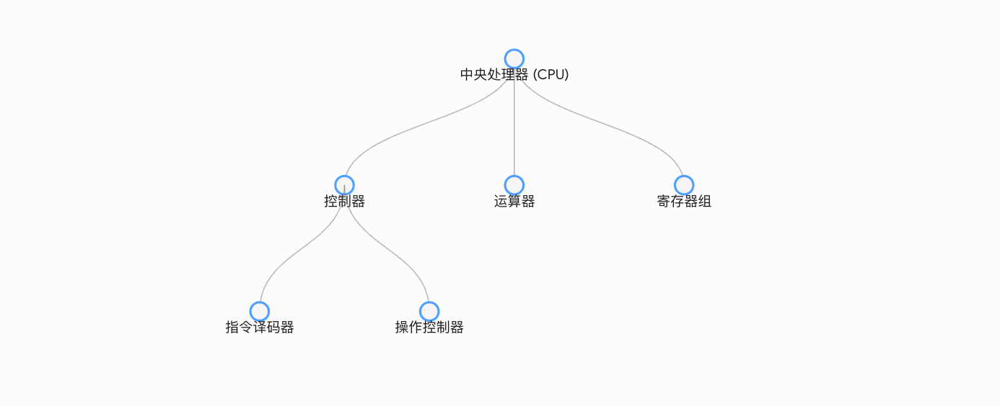
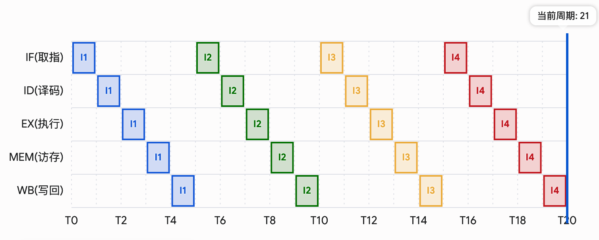
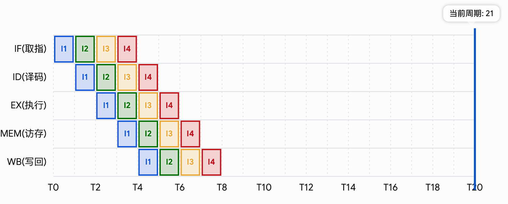

大部分都是 AIGC 用于快速学懂考试范围内的内容，不过有些知识还是能通用的。
# 数据的编码和表示

## 进制转换

### 十进制转换为二进制

面对一个带有小数的十进制数，必须将其以小数点为界拆分为“纯整数”和“纯小数”两部分分别计算，最终将计算结果拼接起来。

#### 1. 整数部分：除二取余法
* **核心口诀**：逆序排列，从下往上。
* **运算法则**：将十进制整数不断除以 2，记录每次相除得到的余数（0 或 1），直至商为 0。
* **读数规则**：最终书写二进制结果时，必须**从最后一次计算的余数开始，自下而上逆序**读取。
* **实战案例（十进制整数 13 转换为二进制）**：
  * 13 除以 2 商 6，余 **1** （此为二进制的最低位）
  * 6 除以 2 商 3，余 **0**
  * 3 除以 2 商 1，余 **1**
  * 1 除以 2 商 0，余 **1** （此为二进制的最高位，计算结束）
  * **逆序拼接结果**：`1101`

#### 2. 小数部分：乘二取整法
* **核心口诀**：顺序排列，从上往下。
* **运算法则**：将十进制小数不断乘以 2，每次相乘后剥离并记录结果的整数部分（0 或 1）。随后拿剩下的小数部分继续乘以 2，直至小数部分完全清零，或达到题目要求的特定位数。
* **读数规则**：最终书写二进制结果时，必须**从第一次计算剥离的整数开始，自上而下顺次**读取。
* **实战案例（十进制小数 0.375 转换为二进制）**：
  * 0.375 乘以 2 得到 0.75，剥离整数部分 **0** （此为紧邻小数点后的最高位）
  * 0.75 乘以 2 得到 1.50，剥离整数部分 **1** （此时剩余小数部分为 0.5）
  * 0.50 乘以 2 得到 1.00，剥离整数部分 **1** （此时剩余小数部分为 0，计算结束）
  * **顺序拼接结果**：`.011`

#### 3. 最终拼接与延伸考点
* **最终结果**：将上述两部分拼接，十进制数 13.375 对应的二进制表示为 `1101.011`。
* **精度丢失隐患**：在实际应用中，绝大多数十进制小数（例如 0.1）通过乘二取整法计算时，会陷入无限循环，无法精准转换为二进制。由于计算机存储字长有限，这类数字在底层会被强行截断，这正是浮点数运算产生舍入误差的物理根源。

---

### 二进制转换为十进制

二进制转换为十进制无需区分复杂的读数方向，其核心在于准确识别每一个二进制位对应的**位权（即以 2 为底的指数次幂）**。

#### 1. 位权排布规则
* **小数点往左（整数部分）**：位权从 0 次方开始向左依次递增（对应位权依次为 $2^0, 2^1, 2^2, 2^3 \dots$）。
* **小数点往右（小数部分）**：位权从 -1 次方开始向右依次递减（对应位权依次为 $2^{-1}, 2^{-2}, 2^{-3} \dots$）。

#### 2. 实战案例（二进制数 101.101 转换为十进制）
* **第一步：标定各位权值**
  * 整数部分 `101` 从右往左依次为：$1 \times 2^0$, $0 \times 2^1$, $1 \times 2^2$
  * 小数部分 `.101` 从左往右依次为：$1 \times 2^{-1}$, $0 \times 2^{-2}$, $1 \times 2^{-3}$
* **第二步：按权展开列式**
  $$\text{十进制数值} = (1 \times 2^2) + (0 \times 2^1) + (1 \times 2^0) + (1 \times 2^{-1}) + (0 \times 2^{-2}) + (1 \times 2^{-3})$$
* **第三步：求和化简**
  $$\text{十进制数值} = 4 + 0 + 1 + 0.5 + 0 + 0.125 = 5.625$$
* **转换结果**：二进制数 101.101 对应的十进制真值为 `5.625`。

---

### 二进制转换为十六进制

二进制与十六进制之间存在严格的底数次幂映射关系（即 $16 = 2^4$）。因此，转换的核心逻辑是“四位合一”，即每四个二进制位可以直接等价替换为一个十六进制字符，整个过程无需经过十进制的中间计算。

#### 1. 核心映射规则（查表转换）
在进行分组合并前，必须熟练掌握四位二进制数与十六进制字符的一一对应关系：
* **数字符号**：二进制的 `0000` 至 `1001`，直接对应十六进制的 `0` 至 `9`。
* **字母符号**：二进制的 `1010` 至 `1111`，分别对应十六进制的 `A` 至 `F`（代表十进制的 10 至 15）。

#### 2. 分组对齐法则（以小数点为基准）
在实际转换时，必须严格以小数点为中心锚点，向两边分别进行“四位一组”的划分。如果在边界处不足四位，则需要通过补零来凑齐。

* **整数部分**：
  * **划界方向**：以小数点为起点，**由右向左**，每四位分为一组。
  * **补零规则**：若最左侧的最高位分组不足四位，则在最左端（高位）补 `0` 直至满四位。高位补零不会改变整数的实际大小。
* **小数部分**：
  * **划界方向**：以小数点为起点，**由左向右**，每四位分为一组。
  * **补零规则**：若最右侧的最低位分组不足四位，则在最右端（低位）补 `0` 直至满四位。低位补零不会改变小数的实际大小。

#### 3. 实战案例（二进制数 1101011.011101 转换为十六进制）

* **第一步：以小数点为中心，向两边分组并补零**
  * 原始整数部分：`1101011`
    * 由右向左分组：`110` 和 `1011`
    * 高位补零：`0110` 和 `1011`
  * 原始小数部分：`.011101`
    * 由左向右分组：`0111` 和 `01`
    * 低位补零：`0111` 和 `0100`

* **第二步：分组查表映射**
  * `0110` 映射为 `6`
  * `1011` 映射为 `B` （十进制的 11）
  * `0111` 映射为 `7`
  * `0100` 映射为 `4`

* **最终拼接结果**：
  将映射后的字符按原顺序拼接，二进制数 `1101011.011101` 对应的十六进制真值为 `6B.74`。

---

## 带小数整数转 IEEE 754 标准浮点数

### 一、 核心题型与标准格式

**典型考题**：将十进制数 $-11.25$ 转换为 IEEE 754 单精度（32位）浮点数的机器代码。

**格式总览（32位划分为三个字段）**：
* **符号位**：1 位（第 31 位）
* **阶码**：8 位（第 30 至 23 位），采用移码表示。
* **尾数**：23 位（第 22 至 0 位），采用原码表示，且隐藏最高位。

### 二、 标准解题流水线

#### 第一步：判定符号位
* **判定法则**：正数记为 $0$，负数记为 $1$。
* **本题实操**：由于真值为 $-11.25$，属负数，因此**符号位为 $1$**。

#### 第二步：十进制绝对值转换为纯二进制
* **转换法则**：以小数点为界，整数部分“除二取余逆序”，小数部分“乘二取整顺序”。
* **本题实操**：
  * 整数部分 $11$：转换为二进制为 `1011`。
  * 小数部分 $0.25$：转换为二进制为 `.01`。
  * **拼接结果**：绝对值的二进制真值为 `1011.01`。

#### 第三步：规格化处理（二进制科学记数法）
* **处理法则**：移动小数点，使数值部分具备 $1.xxxx$ 的形式，并记录小数点移动的位数以确定真实指数。
* **本题实操**：
  * 将 `1011.01` 的小数点向左移动 3 位。
  * 得到规格化结果：$1.01101 \times 2^3$。
  * 由此提取出**真实指数 $e = 3$**。

#### 第四步：计算阶码（套用移码偏置公式）
* **计算法则**：**IEEE 754 单精度标准的阶码偏置常量为 $127$。计算公式为：阶码 $E =$ 真实指数 $e + 127$**。
* **本题实操**：
  * 计算阶码的十进制值：$E = 3 + 127 = 130$。
  * 将十进制 $130$ 转换为 8 位二进制：`10000010`。
  * **阶码字段结果**：`10000010`。

#### 第五步：提取尾数并补齐位数
* **提取法则**：舍弃规格化结果中整数部分的“1”（隐藏位），仅保留小数点后的有效数字，若不足 23 位则在末尾统一补 $0$。
* **本题实操**：
  * 规格化数值为 $1.01101$，舍去隐藏位“1.”，提取有效尾数 `01101`。
  * 填充至 23 位：在末尾追加 18 个 $0$。
  * **尾数字段结果**：`01101000000000000000000`。

### 三、 最终拼装结果

将上述三步求得的字段按顺序直接拼接，即为最终答案。为便于阅卷老师查阅，建议在草稿和答题卡上使用空格将三个字段隔开。

**最终 32 位机器代码**：
`1 10000010 01101000000000000000000`

（若题目要求以十六进制作答，则将每 4 位二进制合并为 1 位十六进制：`1100 0001 0011 0100 0000 0000 0000 0000`，即十六进制代码为 **C1340000**）。

---

## 非数值数据的表示与上下文解析机制

### 一、 字符的表示方法：ASCII 码

在计算机底层，不仅需要表示数值，还需要表示文字、符号等非数值数据。计算机通过建立“编码表（字典）”来实现字符与二进制代码的一一映射。

#### 1. 编码与存储规则
* **存储单位**：在计算机中，**一个字符的 ASCII 码通常占用一个字节（8位）的存储空间。**
* **有效编码位**：ASCII 码实际仅使用了一个字节中的**低 7 位**进行编码，因此总共可以表示 $2^7 = 128$ 个不同的字符（包括大小写英文字母、数字、标点符号以及控制字符）。
* **最高位的用途**：一个字节中空闲的最高位（第 8 位）在数据传输或存储时，通常被用作**奇偶校验位**，用于检测数据在传输过程中是否发生了某一位代码由 0 变 1 或由 1 变 0 的硬件错误。

#### 2. 期末常用核心常量（建议熟记）
* 字符 `'0'` 对应的十进制数值为 `48`
* 字符 `'A'` 对应的十进制数值为 `65`
* 字符 `'a'` 对应的十进制数值为 `97`

---

### 二、 全球化字符表示：Unicode 与 UTF

随着计算机的全球化普及，仅能表示 128 个字符的 ASCII 码已无法满足多语言环境（如中文、日文、特殊符号）的需求。为此，业界引入了字符集与编码规则分离的现代解决方案。

#### 1. Unicode（统一字符集）
* **核心定位**：Unicode 是一个庞大的数学映射表（字符集），其唯一功能是为世界上每一种语言的每一个字符分配一个唯一的、不重复的数字编号，该编号称为**码点（Code Point）**。
* **表示规范**：码点通常采用十六进制书写，并以 `U+` 作为前缀。例如，英文字母 `'A'` 的码点为 `U+0041`，汉字 `'中'` 的码点为 `U+4E2D`。
* **局限性**：Unicode 仅定义了字符的逻辑映射，并未规定这些码点在计算机物理内存中应占用多少字节以及如何进行二进制序列化。

#### 2. UTF（Unicode 转换格式）
UTF（Unicode Transformation Format）是针对 Unicode 码点的具体二进制编码实现方案。它规定了如何将逻辑上的码点转化为物理内存中的 0 和 1。

##### 核心实现：UTF-8 编码
UTF-8 是目前互联网应用最广泛的编码方式，其核心优势在于**变长编码机制**与**对 ASCII 码的完全向下兼容**。
* **变长机制**：UTF-8 能够根据字符码点的实际数值大小，动态分配 1 至 4 个字节的存储空间。
  * **英文字符（1 字节）**：与 ASCII 码完全等效。最高位固定为 `0`，后 7 位存储有效数据（如 `0xxxxxxx`）。
  * **中文字符（通常 3 字节）**：采用多字节组合。首字节以 `1110` 开头，后续两个字节均以 `10` 开头，以标识这是一个连续的三字节字符（如 `1110xxxx 10xxxxxx 10xxxxxx`）。
  * **特殊符号与 Emoji（通常 4 字节）**：首字节以 `11110` 开头，后续三个字节均以 `10` 开头。
* **防冲突设计（前缀控制位）**：多字节编码中，所有后续字节均以 `10` 起始，这与单字节 ASCII 码（以 `0` 起始）以及多字节首字（以 `11` 起始）形成了严格的二进制模式隔离，从而确保了计算机在读取数据流时绝不会发生边界解析错误。

---

### 三、 多字节数据的存储模式：大端与小端

当一个数据占用的存储空间超过一个字节（例如一个 32 位的双字数据）时，该数据会被拆分为多个字节并存放在连续的内存地址中。如何排列这些字节的先后顺序，决定了系统的存储模式。

#### 1. 大端模式
* **核心规则**：数据的**低位字节**保存在内存的**高地址**中，而**高位字节**保存在内存的**低地址**中。
* **机制特点**：这种排列顺序**顺应人类的阅读习惯**。
* **存储示例**：将十六进制数 `0x12345678` 存入以 `0x00` 开始的连续地址中：
  * 地址 `0x00` 存放 `12`（高位字节）
  * 地址 `0x01` 存放 `34`
  * 地址 `0x02` 存放 `56`
  * 地址 `0x03` 存放 `78`（低位字节）

#### 2. 小端模式
* **核心规则**：数据的**低位字节**保存在内存的**低地址**中，而**高位字节**保存在内存的**高地址**中（即“低对低，高对高”）。
* **机制特点**：这种排列顺序**顺应机器的处理逻辑**。由于算术运算通常从低位开始，小端模式有利于硬件电路更高效地提取和处理数据。常见的 x86 架构处理器底层均采用小端模式。
* **存储示例**：将十六进制数 `0x12345678` 存入以 `0x00` 开始的连续地址中：
  * 地址 `0x00` 存放 `78`（低位字节）
  * 地址 `0x01` 存放 `56`
  * 地址 `0x02` 存放 `34`
  * 地址 `0x03` 存放 `12`（高位字节）

---

### 四、 二进制代码的上下文解析机制（不冲突机制）

既然字符 `'0'` 的机器代码在底层表现为 `00110000`（ASCII 编码），而十进制数 `48` 的二进制表示同样是 `00110000`，两者的底层物理形态完全一致，计算机如何确保在运行中不发生冲突？

计算机内存只是一个纯粹的数据物理仓库，它只负责存储二进制位，本身并不具备识别数据属性的能力。**决定一串二进制代码究竟代表字符还是数值的，是调用该数据的机器指令（即上下文环境）。**

* **依据一：冯·诺依曼架构的本征属性**
  冯·诺依曼架构规定：**指令和数据以同等地位不加区别地混合存储在同一个存储器中**。赋予这些二进制代码具体含义的，是 CPU 当前执行的操作序列。
  * 如果 CPU 执行的是**算术运算指令**（如加法指令），该二进制串 `00110000` 就会被送入算术逻辑单元（运算器），作为数值 `48` 参与运算。
  * 如果 CPU 执行的是**输入输出控制指令**（如字符打印指令），该二进制串 `00110000` 就会被送往显示控制器的缓冲区，被驱动程序识别为 ASCII 码，并调用字库将字符 `'0'` 的图形点阵渲染在屏幕上。

* **依据二：高级语言的数据类型标签**
  在编写高级编程语言代码时，通过定义 `char` 或 `int` 等高级数据类型，程序员在软件层面对数据进行了属性标注。编译器在将高级语言翻译为底层机器码时，会根据这些数据类型标签，自动生成不同的机器指令去操作同一段二进制数据。

---

## 数据校验码

### 海明校验码

海明校验码（Hamming Code）是一种具有纠错能力的多重奇偶校验码。其核心机制是通过在有效信息中插入多个校验位，增大合法编码的码距，从而实现一位错误的精准定位与自动纠正。

#### 1. 核心计算公式：确定校验位数量
* **公式定义**：设有效数据位数为 $n$，需要插入的校验位数为 $k$，则必须满足不等式：
  $$2^k \ge n + k + 1$$
* **公式推导原理**：$k$ 个校验位能够产生 $2^k$ 种不同的状态。这些状态必须能够覆盖 $1$ 种“无错误”的正常状态，以及 $n + k$ 种“某一位发生错误”的异常状态。

#### 2. 构建规则：校验位的位置排布
* **插入法则**：校验位不能随意放置，必须插入在整体编码（海明位号从 1 开始编号）中索引为 **$2$ 的整数次幂**的位置上。
* **位置分布**：即放置在第 $1, 2, 4, 8, 16 \dots$ 位。剩余的空位按顺序依次填入有效数据位。

#### 3. 分组计算法则：求解校验位数值
每一个校验位并非独立工作，而是分别负责监控特定的一组数据位。分组的依据基于每个位置编号的二进制拆分机制。
* **监控范围划分**：
  * **$P_1$ (第 1 位)**：监控所有位号二进制表示中，最低位为 `1` 的位置（即第 $1, 3, 5, 7, 9 \dots$ 位）。
  * **$P_2$ (第 2 位)**：监控所有位号二进制表示中，倒数第二位为 `1` 的位置（即第 $2, 3, 6, 7, 10, 11 \dots$ 位）。
  * **$P_3$ (第 4 位)**：监控所有位号二进制表示中，倒数第三位为 `1` 的位置（即第 $4, 5, 6, 7, 12, 13, 14, 15 \dots$ 位）。
* **计算方法**：将被监控位置上的所有有效数据位进行**异或运算**（即模 2 加法，**先做加法，然后把结果除以 2 取余数**）。若题目要求偶校验，则设定校验位的值，使得该组内所有数字异或的结果为 0；若要求奇校验，则结果为 1。

#### 4. 实战推演：求有效数据 1011 的偶校验海明码
* **第一步：求校验位数 $k$**。已知 $n = 4$，代入公式 $2^k \ge 4 + k + 1$，解得最小的 $k = 3$。总位数为 7 位。
* **第二步：排列位置**。设置 7 个空位，第 1、2、4 位留给 $P_1, P_2, P_3$，其余位按序填入 `1 0 1 1`。得到初步序列：`[P1] [P2] [1] [P3] [0] [1] [1]`。
* **第三步：分组计算**。
  * $P_1 \oplus D_1(3) \oplus D_2(5) \oplus D_4(7) = P_1 \oplus 1 \oplus 0 \oplus 1 = 0$，解得 $P_1 = 0$。
  * $P_2 \oplus D_1(3) \oplus D_3(6) \oplus D_4(7) = P_2 \oplus 1 \oplus 1 \oplus 1 = 0$，解得 $P_2 = 1$。
  * $P_3 \oplus D_2(5) \oplus D_3(6) \oplus D_4(7) = P_3 \oplus 0 \oplus 1 \oplus 1 = 0$，解得 $P_3 = 0$。
* **第四步：拼接最终结果**。将 $P_1, P_2, P_3$ 填回原位，最终得到海明码序列：`0110011`。

### 循环冗余校验码（CRC）

CRC 校验码主要用于网络通信和存储介质中的批量数据查错。它的核心思想是通过一种特定的数学运算（模 2 除法），使得加上校验码后的完整数据，能够被一个系统约定的特定的“生成多项式”整除。

#### 1. 核心概念：生成多项式与模 2 除法
* **生成多项式 $G(x)$**：发送方和接收方事先约定好的除数。通常以多项式形式给出（如 $G(x) = x^3 + x^2 + 1$）。转换二进制时，提取各次幂的系数，该多项式对应的二进制代码为 `1101`。**除数的位数为 $R + 1$（$R$ 为多项式的最高次幂）**。
* **模 2 除法**：在进行加减法运算时不考虑进位和借位，本质上是按位异或（XOR）运算（相同为 0，不同为 1）。
  * 上商法则：部分被除数的最高位为 1，则商上 1；最高位为 0，则商上 0。

#### 2. 发送端生成 CRC 的流水线（三步法）
设原始有效数据为 $M$，生成多项式最高次幂为 $R$（即需要生成的 CRC 校验码位数）。
* **第一步：移位补零**。在原始数据 $M$ 的末尾追加 $R$ 个 0，形成扩展数据（相当于数学上的 $M \cdot 2^R$）。
* **第二步：模 2 相除求余**。将扩展数据“模 2 除以”生成多项式对应的二进制串。除法进行到最后得到的**余数**，即为 $R$ 位的 CRC 校验码（若余数不足 $R$ 位，则高位补 0）。
* **第三步：拼接发送**。将求得的 CRC 校验码替换掉第一步追加的 $R$ 个 0，形成最终发送的数据帧（即原始数据 + CRC 校验码）。

#### 3. 接收端校验机制
接收端提取收到的一整串数据帧，直接使用相同的生成多项式进行模 2 除法：
* 若**余数为 0**：判定数据在传输过程中未发生错误，接收该数据。
* 若**余数不为 0**：判定数据出错，通常采取丢弃并请求重传的策略。

---

# 机器数的运算

## 一、 补码加减法运算

**原码**是数字最直观的二进制表示（首位为符号位）；**反码**是原码符号位不变、其余位取反的过渡产物；**补码**则是计算机实际存储和运算负数的形式，通过“取反加一”将减法转换成了加法。在计算机底层，为了简化硬件电路设计、提高运算器效率，现代计算机一律采用**补码**来表示和存储有符号整数。其核心优势在于**将符号位与数值位统一处理**，从而能够利用同一套“加法电路”硬吃下所有的加法与减法运算。

### 1. 补码加法运算
* **运算规则**：两个有符号整数相加时，直接将其补码的对应位相加。符号位作为最高有效位，同数值位一起参与运算。若最高位产生进位，则在字长限制下直接将该进位丢弃。
* **计算公式**：
  $$[A + B]_{\text{补}} = [A]_{\text{补}} + [B]_{\text{补}}$$

### 2. 减法向加法的转化（求补运算）
* **运算规则**：计算机内部没有单独的减法器。当面临减法运算 $A - B$ 时，硬件会自动将其转化为加法形式 $A + (-B)$。
* **计算公式**：
  $$[A - B]_{\text{补}} = [A]_{\text{补}} + [-B]_{\text{补}}$$
* **核心口诀（求补/变补码）**：已知 $[B]_{\text{补}}$ 求 $[-B]_{\text{补}}$ 的规则为：**连同符号位在内，全部数值位逐位取反，末位加一**。通过此操作，减数瞬间转化为其对应相反数的补码，随后直接送入加法器进行计算。

---

## 二、 补码运算的溢出风险

由于计算机的存储字长（即硬件寄存器的位数）是固定的，其所能表示的数值范围必然存在上限与下限。当运算结果超出了当前字长所能容纳的合法范围时，就会发生**溢出**。

### 1. 溢出的物理本质
溢出并不是指“计算本身出错了”，而是由于运算结果的量级太大，导致数据向高位推挤，进而**强行冲毁并篡改了最左侧的“符号位”**，使得计算结果的正负性发生颠倒。

### 2. 发生溢出的基本规律
* **同号相加极具风险**：
  * **正数 + 正数**：如果结果超出了正数上限，符号位会被强行挤成 `1`，发生**向上溢出（正加正变负）**。
  * **负数 + 负数**：如果结果超出了负数下限，符号位会被强行挤成 `0`，发生**向下溢出（负加负变正）**。
* **异号相加绝对安全**：
  * 一个正数与一个负数相加（或者正数减去正数、负数减去负数），其结果的绝对值必然小于其中任何一个操作数，因此**绝对不可能发生溢出**。

---

## 三、 补码运算的溢出检测硬件逻辑

在中央处理器（CPU）的算术逻辑单元（ALU）中，必须依靠物理硬件电路来实时监测补码运算是否发生溢出。

**变形补码法（双符号位法）**：
* **核心机制**：在运算器中，人为地分配两个相同的位来共同表示该操作数的符号。
* **表示规则**：
  * 正数的双符号位设定为 `00`。
  * 负数的双符号位设定为 `11`。
  * 符号位与数值位一并进入加法器参与常规加法运算。
* **判别准则（仅观察运算结果的最高两位）**：
  * **`00`**：运算结果为正数，未发生溢出。
  * **`11`**：运算结果为负数，未发生溢出。
  * **`01`**：发生**正溢出（向上溢出）**。表明两个正数相加的结果过大，导致数值位向高位进位，冲毁了双符号位中较低的那一位。
  * **`10`**：发生**负溢出（向下溢出）**。表明两个负数相加产生溢出，导致符号位计算后发生非正常翻转。
  **期末易错考点预警（绝对重点）**：
  在计算机系统中，双符号位仅仅是数据被调入 ALU 内部的寄存器参与运算时，由硬件临时复制扩展而成的运算形态。**在主存储器（内存）中存储时，出于对存储空间的绝对节省，任何有符号整数永远只占用 1 个符号位。**

---

## 四、 定点数乘法运算：原码一位乘法

在计算机内部，为了节省硬件芯片面积，乘法运算并没有采用庞大的多位数直接相乘电路，而是将其核心逻辑拆解为 **“多轮加法 + 逻辑右移”** 的循环过程。原码一位乘法的根本特点是**符号位与数值位彻底分离，数值位完全转化成无符号绝对值进行计算**。

### 1. 运算基本规则
* **符号位处理**：乘积的符号位不参与数值运算，而是由被乘数的符号位 $X_s$ 与乘数的符号位 $Y_s$ 进行独立的异或（$\oplus$）运算决定。即同号得正（0），异号得负（1）。
* **数值位处理**：取被乘数和乘数的绝对值（无符号数）进行乘法累加。若数值位长度为 $n$ 位，则硬件需要严格执行 **$n$ 次“判断加法”与 $n$ 次“逻辑右移”**。

### 2. 硬件架构与“双倍字长拼接（拼桌）”机制
在算术逻辑单元（ALU）中，实现原码一位乘法需要三个固定字长（设为 $n$ 位）的寄存器协同工作：
* **X 寄存器（被乘数寄存器）**：存放被乘数的无符号绝对值 $|X|$，在整个运算循环中保持数值不变。
* **ACC 寄存器（累加器/部分积寄存器）**：初始清零（全 `0`），用于动态累加每一步产生的**部分积**。
* **MQ 寄存器（乘数寄存器）**：初始存放乘数的无符号绝对值 $|Y|$。其最低位（最右侧一位）充当整个运算流水线的“指挥官”。

> **核心物理图像：** $n$ 位数与 $n$ 位数相乘，其乘积最大可达 $2n$ 位。为了避免制造高成本的双倍字长寄存器，硬件设计让 **ACC 与 MQ 拼桌组合**。在移位过程中，MQ 中用过的乘数位被依次赶出右边界丢弃，而 ACC 中溢出的低位乘积则顺势向右滑入 MQ 空出来的高位。最终运算结束时，**ACC 存放乘积的高 $n$ 位，MQ 存放乘积的低 $n$ 位**。

### 3. 标准执行流水线（$n$ 次循环）
对于 $n$ 位数值位的乘法，机器会严格重复以下三步曲：
1. **检查 MQ 最低位**：
   * 若 MQ 的当前最低位为 **`1`**：令部分积加上被乘数，即 `ACC ＝ ACC + |X|`。
   * 若 MQ 的当前最低位为 **`0`**：令部分积加上 0，即 `ACC ＝ ACC + 0`。
1. **逻辑右移**：
   * 将 ACC 和 MQ 看作一个整体，统一**向右移动一位**。
   * **移位规则**：由于是无符号数运算，右移时 **ACC 的最高位铁定补 `0`**（逻辑右移）；ACC 的最低位移入 MQ 的最高位；MQ 的最低位被挤出并丢弃。
3. **计数器递减**：循环计数器减 1。直到完成 $n$ 次循环，停止移位。

### 4. 最终结果拼装
终止状态下，将最终的符号位 $P_s$ 贴在最前面，后面顺次拼接 ACC 里的高位乘积与 MQ 里的低位乘积，即为最终的原码乘法机器数。

---

## 五、 定点数乘法运算：补码一位乘法（Booth 算法）

补码一位乘法（Booth 算法）的核心优势在于：**突破了原码乘法必须分离符号位的限制，允许带有符号位的补码直接参与乘法运算。** 其数学本质是通过“掐头去尾”的逻辑，将连续的加法转化为一次减法和一次加法，从而提升运算效率。比如换成十进制的例子，我们要算 456 x 999，就可以转换为 456 x （1000 - 1）去简化计算。

### 1. 硬件架构与初始状态
在进行 Booth 算法推演时，必须严格遵守以下寄存器配置规则：
* **双符号位防溢出**：为了防止中间运算过程出现溢出导致符号错误，**被乘数 $[X]_{\text{补}}$ 和部分积 ACC 必须采用双符号位**。
* **附加位机制**：在乘数寄存器 MQ 的最低位（最右侧）人为增加一位**附加位 $Y_{-1}$**，并且其**初始值必须清零（设为 `0`）**。
* **初始状态装填**：
  * **ACC**：初始化为全 `0`（包含双符号位，例如 `00.0000`）。
  * **X 寄存器**：存放双符号位的被乘数补码 $[X]_{\text{补}}$。提前计算并写出双符号位的 $[-X]_{\text{补}}$ 备用。
  * **MQ 寄存器**：存放单符号位的乘数补码 $[Y]_{\text{补}}$。

### 2. 核心操作动作表（看最后两位）
每一次循环，算术逻辑单元（ALU）都会同时检查 MQ 最低位（设为 $Y_i$）与附加位（设为 $Y_{i-1}$）的状态差，来决定对 ACC 执行什么操作：
* **`1 0`**：遇到连续 `1` 的起点 $\rightarrow$ **ACC 加上 $[-X]_{\text{补}}$**（即做减法）。
* **`0 1`**：遇到连续 `1` 的终点 $\rightarrow$ **ACC 加上 $[X]_{\text{补}}$**（即做加法）。
* **`0 0`** 或 **`1 1`**：在连续的 `0` 或 `1` 内部 $\rightarrow$ **ACC 加上 0**（不做任何加减，直接进入移位）。

### 3. 移位规律
* 每次执行完加减法后，ACC 和 MQ 作为一个整体进行**算术右移一位**。
* **算术右移的铁律（带着符号跑）**：
  1. ACC 的双符号位**保持不变**（即最高位原地复制一份补上空缺）。
  2. ACC 的最低位移入 MQ 的最高位。
  3. MQ 的最低位移入附加位 $Y_{-1}$。

### 4. 循环控制与终止条件
设乘数（不含附加位）的总位数为 $n+1$ 位（即 $1$ 位符号位 + $n$ 位数值位）。
* **加减法次数**：一共需要进行 **$n+1$ 次**判断与加减法。
* **移位次数**：一共只进行 **$n$ 次**算术右移。
* **最后一步的特权**：在执行完第 $n+1$ 次加减法后，**绝对不移位！** 运算直接结束。此时 ACC 与 MQ（舍弃附加位）拼接而成的结果，即为最终乘积的补码。

---

## 六、 加法器与定点运算器的底层硬件结构

在计算机体系结构中，算术逻辑单元（ALU）及其内部的加法器电路是实现所有数值和逻辑运算的物理基石。

### 1. 基础位加法单元
* **半加器 (Half Adder)**：最基础的加法逻辑器件，其功能是将两个一位二进制数相加。它具有两个输入（加数 A 和加数 B）以及两个输出（本位和 Sum、向高位的进位 Carry）。由于缺乏接收低位进位的输入端，半加器只能被放置在运算的最右侧（最低位）。
* **全加器 (Full Adder)**：在半加器的基础上进行了升级，能够将两个一位二进制数相加，并根据接收到的低位进位信号，输出和以及进位输出。全加器具备三个完整的输入信号（两个加数 A、B 和低位进位 C_in），是构成多位算术运算电路的核心基本元件。

### 2. 多位加法器架构（串行延迟和并行提速）
为了实现多位二进制数的加法，需要将多个全加器进行组合。考试中常考以下两种典型架构的对比：
* **行波进位加法器**：将 n 个一位的全加器级联，即可连成一个 n 位的行波进位加法器。其本质上是一种串行加法器（串行进位），高位全加器必须等待低位的进位信号像波浪一样依次传递过来后才能进行计算。其最大缺点是运算时间较长，时间延迟太大。
* **超前进位加法器**：为了克服行波进位的延迟缺陷，该架构引入了特殊的先行进位生成逻辑。它能够在输入操作数的同时，直接形成各位进位（先行/并行进位），从而打破了串行传递的依赖，实现快速加法。其代价是硬件逻辑电路复杂度显著增加。

### 3. 算术逻辑单元 (ALU) 的核心设计思想
ALU 不仅负责算术加减法，还需要处理非（求反）、或（逻辑加）、与（逻辑乘）、异或（按位加）等各类逻辑运算。
* **操作重组机制**：ALU 的基本思想是先不将输入 Ai、Bi 和下一位的进位数 Ci 直接进行全加，而是将 Ai 和 Bi 先组合成由参数 S0、S1、S2、S3 控制的函数 Xi 和 Yi。然后再将变换后的 Xi、Yi 和下一位进位数通过全加器进行全加。
* **多功能复用**：通过输入不同的控制参数，可以得到不同的组合函数，因而能够利用同一套全加器底层电路，灵活实现多种不同的算术与逻辑运算。

### 4. 定点运算器的总线结构
ALU 与计算机其他部件（如寄存器堆）之间的数据传输通道称为总线（Bus）。定点运算器的基本结构主要分为单总线、双总线、三总线结构。
* **单总线结构**：所有部件共享一条数据通路。操作数必须分时串行输入，运算结果也必须等待总线空闲后串行输出。硬件连线最简单，但运算效率极低。
* **双总线/三总线结构**：通过增加独立的数据传输通路，允许两个操作数同时输入 ALU（双总线），甚至允许结果在独立总线上同时输出（三总线）。这大幅减少了数据传输的等待时间，是现代高速运算器的标准配置。

---
## 七、 浮点数加减运算流水线

浮点数的加减法无法像定点数那样直接相加，必须经历严格的五步流水线操作。

### 第一步：0 操作数检查
在运算开始前，硬件会先检查两个操作数。如果发现其中一个操作数为 $0$，则直接输出另一个操作数作为结果，后续的步骤全部省略，以此来提高 CPU 的运算效率。

### 第二步：比较阶码大小并完成对阶
* **核心逻辑**：浮点数相加减的前提是量级（阶码）必须统一，要求**小阶向大阶对齐**。
* **具体操作**：
  1. 求出两数的阶差 $\Delta E = E_A - E_B$。
  2. 将阶码较小的数的尾数**向右移位**，每右移 1 位，其阶码加 1。
  3. 重复移位，直到两数的阶码完全相等为止。

### 第三步：尾数加减运算
完成对阶后，两个浮点数已经处于同一量级。此时，直接将对阶后的两个尾数送入 ALU 中的定点加法器，按照标准的定点补码加减法规则进行计算。

### 第四步：结果规格化
* **核心逻辑**：尾数运算的结果可能不符合浮点数的标准格式（补码规范要求：正数必须是 `0.1xxx`，负数必须是 `1.0xxx`），此时必须进行位置调整。
* **左规（数值太小）**：当尾数结果的符号位与最高数值位同值时（例如出现 `0.001` 或 `1.110`），需要将尾数整体**左移**。每左移 1 位，阶码减 1，直到符号位与最高数值位不同为止。
* **右规（尾数假溢出）**：当尾数相加产生进位，导致双符号位变为 `01` 或 `10` 时。注意，这在浮点数中**并非真正的死刑（称为假溢出）**。只需将尾数整体**右移 1 位**，双符号位即可恢复正常，同时让阶码加 1 即可挽救。

### 第五步：舍入处理与溢出判断
* **舍入处理**：在“对阶”和“右规”过程中，尾数右移会导致低位被挤出。为保证精度，常见舍入规则有：
  1. **0 舍 1 入**：类似十进制的四舍五入。被挤出的最高位如果是 1，则给保留的末位加 1；如果是 0 则直接丢弃。
  2. **简单截尾（朝 0 舍入）**：极其暴力，直接丢弃所有移出的低位数据，不做任何补偿。
  3. **朝 +∞ 舍入 / 朝 -∞ 舍入**：根据特定的数值边界强制向上或向下进位。
* **溢出判断（真正的死刑）**：在浮点数体系中，**真正的溢出只看阶码**。
  * **阶码上溢**：如果规格化或对阶时阶码不断增加，超过了阶码所能表示的最大正数。这是真正的硬件级溢出，CPU 会触发中断报错。
  * **阶码下溢**：如果左规时阶码不断减小，超过了能表示的最小负数。此时数值已经极其微小，计算机通常直接将其当做 $0$ 来处理（称为“机器零”），程序不会崩溃，继续往下执行。

# 存储系统

## 一、 存储介质：SRAM, DRAM 和 ROM

在现代计算机体系结构中，CPU 外部的存储介质主要由两种半导体存储器构成，它们在物理机制、性能与成本上存在显著差异，分别被用于构建 Cache 和主存。

### 1. SRAM（静态随机存取存储器）
利用包含六个晶体管的双稳态触发器来锁存 1 位二进制信息。主要用于制造靠近 CPU 的 **Cache（高速缓存）**

优势：
* **静态保持**：只要系统不掉电，触发器状态就不会改变，信息可永久保存（体现“静态”特性）。
* **极速访问**：状态切换极其迅速，且完全不需要刷新操作。
劣势：
* 每个存储单元需要多个晶体管，导致芯片集成度低、功耗大、制造成本高昂。

### 2. DRAM（动态随机存取存储器）
利用 MOS 电路中的栅极电容来保存二进制信息。主要用于构建计算机的**大容量系统主存**。此外

==针对 DRAM 芯片来说，一块内存芯片中由多个**存储单元**组成，每个存储单元是 8 个极其微小的**电容**，电容充满电荷表示 `1`，没有电荷表示 `0`。即每个存储单元存储的是 1 Byte 大小的数据。而地址本质上就是用来定位到具体的存储单元的，每个地址也是一个二进制数字，比如我们有一个只有 16 个存储单元的微型内存，我们只需要 4 位二进制（从 `0000` 到 `1111`）就能给所有的存储单元编上号。==

优势：结构极其简单，因此芯片集成度极高、制造成本低、功耗低，适合大规模制造。
核心劣势与必须机制：
* **动态漏电**：由于电容存在物理放电现象，电荷一般只能维持 1~2ms。如果不加干预，存储的数据 `1` 会随时间流失变成 `0`。
* **必须刷新**：为了保住数据，硬件电路必须在电荷漏完之前，对存储单元进行定期的**刷新**操作（即重新充满电荷）。

### 3. DRAM 的地址复用技术
DRAM 通常作为系统主存，容量极大，所需的地址线数目相当多，比如假设我们有一块容量为 4GB 的存储芯片。要能在 4GB 的茫茫数据海中精准定位到一个字节,我们需要足足 32 根地址线(因为 $2^{32} = 4\text{G}$)。为了减少芯片物理引脚的数量、缩小芯片体积并降低成本，采用了地址复用技术。
* **工作原理**：将原本较长的完整主存地址一分为二，拆分为等长的两部分：**行地址**和**列地址**。
* **分时传送机制**：利用同一组物理引脚，在时间上分两次先后传送地址。第一次先传送行地址，并将其保存在芯片内部的“行地址锁存器”中；第二次再通过同一组引脚传送列地址，保存在“列地址锁存器”中。
通过“以时间换空间”的策略，使得存储芯片所需的地址引脚数量直接减半。

### 4. ROM（只读存储器）与 Flash Memory
与 RAM 断电即丢失数据的“易失性”不同，ROM 的核心特性是**非易失性（断电不丢失）**，主要用于存放计算机底层不可更改的系统程序（如 BIOS）和固定数据。

* **发展演进与常见分类**：
  * **掩模式 ROM**：出厂时数据已物理固化，绝对无法更改。
  * **一次编程 ROM (PROM)**：允许用户自行写入一次数据，写入后即被固化，不可逆转。
  * **多次编程 ROM (EPROM/EEPROM)**：允许用户通过特定设备（紫外线或电信号）多次擦除并重新编程。

* **闪速存储器 (Flash Memory)**：
  * 一种高密度、非易失性的读/写半导体存储器（典型应用如 U 盘、固态硬盘）。它结合了 ROM 的非易失性和 RAM 的易擦写性，是现代计算机极其重要的存储介质。

* **在主存系统扩展中的应用原则（考试画图重点）**：
  * **地址空间划分**：在规划主存地址空间时，==**系统程序区**必须选用 ROM 芯片，**用户程序区**选用 RAM 芯片。==
  * **硬件连线特权**：在进行存储芯片扩展与 CPU 的连线设计时，==**ROM 芯片不连接读写控制线（!WE / !WR）**，因为它仅支持读出操作。==

### 5. 计算机程序的物理层级与分类存储

在计算机体系结构中，程序根据其与底层物理硬件的距离、运行特权级以及生命周期，可严格划分为三个核心层级。这种逻辑分层直接决定了它们被部署和存储在何种物理介质中。

#### 第一层：固件 (Firmware) —— 底层硬件级系统程序
* **核心定义**：固化在硬件内部、直接操控底层裸机电路的最底层系统程序。它负责物理硬件的加电自检（POST）、初始化以及最基础的设备唤醒。
* **物理归宿**：部署在主板或对应硬件扩展卡自带的 **ROM / Flash Memory（只读/闪存存储器）** 中，具有非易失性，断电不丢失。
* **典型案例**：主板的 BIOS / UEFI 代码、显卡自带的 vBIOS、网卡的底层引导程序。
* **运行机制**：在开机加电的瞬间由 CPU 直接从 ROM 中读取并执行，并在完成硬件检测后，寻址找到辅存中的操作系统引导引导程序（Bootloader），完成控制权的交接。

#### 第二层：操作系统 (Operating System) —— 核心管理级系统软件
* **核心定义**：位于底层固件与上层应用之间的大型核心系统软件。负责全局管理和调度硬件资源（CPU、主存、外设），并向上层屏蔽硬件的复杂性，提供统一的系统调用接口（API）。
* **物理归宿**：完整镜像存放在辅存（硬盘/SSD）中；开机引导时，其核心内核（Kernel）被动态加载到主存（DRAM）中驻留运行。
* **典型案例**：Ubuntu (Linux发行版)、Windows、macOS，以及挂载在操作系统内核层面的软硬件驱动（如 `nvidia-driver`）。
* **运行机制**：运行在系统的最高特权级（内核态），拥有分配内存空间、调度进程时间片的绝对控制权。

#### 第三层：用户应用程序 (Application Software) —— 上层业务级软件
* **核心定义**：运行在操作系统之上，专门为满足用户特定业务需求、生产力要求或计算逻辑而编写的程序集合。
* **物理归宿**：二进制可执行文件静态存放在辅存（硬盘/SSD）中；当用户或系统触发执行指令时，由操作系统分配独立空间并加载至主存（DRAM）中运行，进程结束后资源被回收。
* **典型案例**：开发者编写的 Gin 后端项目代码及可执行程序、Docker 容器应用、Web 浏览器、办公软件等。
* **运行机制**：受限于受保护的权限级别（用户态），此类程序绝对无法直接寻址操作物理硬件介质，一切涉及物理存储、网络通信的操作均需向操作系统发起系统调用（System Call）来代为执行。

---

## 二、 DRAM 的刷新机制与存储器性能指标

### 1. 存储器的核心时间指标
* **存取时间**：从发出读/写命令，到完成数据传输并真正得到结果所花费的实际时间。
* **存取周期**：连续启动两次独立的读写操作之间，所必须间隔的最短时间。
  * **核心公式**：`存取周期 = 存取时间 + 恢复时间`
  * **底层原理**：由于 DRAM 的读取往往是“破坏性读取”，读出数据后会导致电容电荷流失，因此硬件必须花费额外的“恢复时间”将状态复原（重新充电），这和我们下面要讲到的刷新策略有关。因此，==存取周期永远大于（或等于）存取时间。==
* **存储器带宽**：单位时间内存储器能够存取的信息量，是衡量数据传输速率的核心指标，受存取周期长短的直接制约。

### 2. DRAM 的三种刷新策略
DRAM 的存储基石是极微小的栅极电容，电荷通常只能维持 1~2ms，因此必须定期进行“充电（刷新）”以防数据丢失。刷新按“行”进行，且刷新期间当前行绝对禁止读写。

* **集中式刷新**
  * **机制**：在一个完整的刷新周期内，利用末尾一段固定的连续时间，依次对存储矩阵的所有行逐一进行集中刷新。
  * **考点/缺点**：在这段集中的刷新时间内，内存完全拒绝访问，形成严重的**死区时间**，容易导致 CPU 遭遇突发性的阻塞停顿。

* **分散式刷新**
  * **机制**：将每一个系统工作周期强行对半劈开。前半部分用于 DRAM 正常的读/写/保持，后半部分强制用于刷新存储器的一行。相当于“做一休一”。
  * **考点/缺点**：彻底消灭了集中的死区时间，但代价是**系统存取时间被延长了一倍**，导致整体系统运行速度显著变慢，存在极大的性能浪费。

* **异步式刷新**
  * **机制**：现代计算机的主流方案。通过精密的计算，在一个刷新周期内，分散地、均匀地去刷新存储器的所有行（例如每隔几微秒只抽空刷新一行）。
  * **考点/优势**：完美的“见缝插针”。既不会产生明显的读写停顿（避免了长死区），也不会像分散式那样盲目延长总体存取周期。

---

## 三、 主存储器容量的扩充

单个存储芯片的容量（这里，==单个芯片容量 = 存储单元个数 x 每单元存储字长==）和数据位宽往往无法直接满足系统的需求，必须将多个存储芯片组合起来，形成更大容量或更宽数据线的主存系统。考试常考以下两种核心扩展模式：

### 1. 位扩展（字长不够，并排扩展）
* **应用场景**：芯片的存储字数（容量）满足要求，但每个字的位数（数据位宽）小于 CPU 的数据线宽度。比如 CPU 每次必须一次性处理 8 位（8 bit）的数据（这叫系统数据线有 8 根）。但是只有“$8K \times 4\text{位}$”的芯片（容量是 8K，但每次只能吐出 4 位数据）。
* **连接原则**：
  * **地址线**：CPU 的地址线与所有芯片的地址引脚**完全并联**。
  * **片选线 (!CS) 和 读写线 (!WE)**：**完全并联**。所有参与位扩展的芯片必须同时被选中、同时读写。
  * **数据线**：**分别连接（拼接）**。各个芯片的数据线分别连接到 CPU 数据总线的不同位段上（例如芯片 A 连 D0~D3，芯片 B 连 D4~D7）。

### 2. 字扩展（容量不够，上下扩展）
* **应用场景**：芯片的数据位宽满足要求，但存储字数（总容量）小于 CPU 的寻址范围。需要利用多块芯片组合出更大的连续地址空间。
* **核心地址划分**：
  **主存地址格式 = 片选地址（高位） + 片内地址（低位）**
* **连接原则**：
  * **数据线、读写线 (!WE)**：**完全并联**。
  * **片内地址线**：CPU 的低位地址线与所有芯片的地址引脚并联，用于选中芯片内部的具体存储单元。
  * **片选地址线（核心重点）**：CPU 的**高位地址线绝对不能直接连给芯片**！必须将其接入**译码器（如 2-4 译码器、3-8 译码器）**。译码器根据高位地址的不同组合，输出独立的信号，分别连接到各个芯片的**片选端 (!CS)**，从而保证在任何时刻，永远只有一个芯片被选中工作。
  * *(注：如果使用 ROM 芯片扩展，ROM 是只读存储器，因此不需要连接读写控制线 !WE。)*

### 3. CPU 与主存连接的核心系统总线 (Bus)

在存储器的扩展与连接中，CPU 与存储芯片之间主要通过以下四类外部信号线进行物理连接与协同：

* **地址线 (Address Bus)**
  * **作用**：用于 CPU 指定要访问的存储单元的绝对物理地址（找哪个房间）。
  * **特性**：单向传输（CPU 发送给存储器）。地址线的位数直接决定了 CPU 的最大寻址空间（如 16 根地址线可寻址 64K 个单元，即 2 的 16 次方范围）。
* **数据线 (Data Bus)**
  * **作用**：用于在 CPU 和存储器之间实际传输二进制数据（运送货物）。
  * **特性**：双向传输。数据线的位数（总线宽度）通常与 CPU 的字长或存储芯片的数据位宽相等。
* **读写控制线 (Read/Write Control, !WE)**
  * **作用**：用于 CPU 告知存储器当前进行的是读取操作还是写入操作（拿出来还是放进去）。
  * **特性**：单向传输。通常低电平有效表示写操作，高电平有效表示读操作。*(注：只读存储器 ROM 不需要连接此线)*。
* **片选线 (Chip Select, !CS / !CE)**
  * **作用**：用于选中特定的存储芯片，使其参与当前的总线操作。
  * **特性**：由 CPU 输出的高位地址线经过译码器（如 2-4 译码器、3-8 译码器）解码后生成。只有收到有效片选信号的芯片，其数据引脚才会与数据总线连通，从而避免多个芯片同时发送数据导致总线冲突。

---

## 四、 Cache 核心原理与性能指标

为了缓解 CPU 与主存（DRAM）之间日益扩大的速度鸿沟，现代计算机在 CPU 与主存之间引入了基于高速 SRAM 介质的 Cache 结构。

### 1. 运行依据：局部性原理
* **时间局部性**：最近被访问过的数据/指令，在不久的将来极有可能被再次访问（如循环体内的局部变量）。
* **空间局部性**：最近被访问过的数据/指令，其相邻物理地址处的信息在不久的将来极有可能被访问（如顺序执行的代码段、连续访问的数组）。
* **核心机制**：利用局部性原理，主存中将要被访问的数据块会被提前预调入 Cache 中。CPU 访存时优先检索 Cache，命中则直接高速读取，未命中则触发主存调度。

### 2. 核心传输单位
* **字**：CPU 与 Cache 或主存之间进行单次数据读写交互的最小单位，方向是 CPU -> 主存/Cache。比如现在的 64 位 CPU，就代表该 CPU 一次性可以接收并处理 $1 \text{ 字} = 32 \text{ Bits} = 4 \text{ Bytes}$ 大小的数据。
* **块**：Cache 与主存之间进行批量数据调度和信息交换的物理单位，方向是主存/Cache -> CPU。一个块通常包含多个字，以此充分利用空间局部性。

### 3. 平均存储系统访问时间 (AMAT) 计算
系统的全局访存性能由 Cache 命中率 $h$、Cache 访问时间 $t_c$ 和主存访问时间 $t_m$ 共同决定。期末计算大题常考以下两种硬件方案的期望计算：

**同时访问方案（Cache 与主存同时接收地址）**
$$AMAT = h \cdot t_c + (1 - h) \cdot t_m$$
**串行访问方案（先访问 Cache，未命中再访问主存）**
$$AMAT = t_c + (1 - h) \cdot t_m$$
其中 $(1 - h) \cdot t_m$ 部分被称为 **Cache 缺失代价**。当命中率 $h$ 极高（如 95% 以上）时，缺失代价被极大稀释，使 AMAT 逼近 $t_c$ 的极速水平。

### 4. Cache 的三种地址映射机制和淘汰策略

地址映射解决的核心问题是：主存中的任意一个块被调入 Cache 时，应该存放在 Cache 的什么确切位置。考试常考三种映射方式的逻辑及其主存地址的划分格式。

#### 一、 全相联映射
* **映射逻辑**：主存中的任意一个字块，可以调入 Cache 中的**任意一行**。
* **主存地址格式**：`[主存字块标记 Tag] + [块内地址]`
* **核心优缺点**：
  * **优点**：灵活性极高，Cache 块的冲突概率极低，空间利用率最高。
  * **缺点**：成本极其高昂。CPU 寻址时必须将主存标记与 Cache 中所有行的标记进行**并行对比**，导致比较器的硬件实现复杂，检索速度相对较慢。

#### 二、 直接映射
* **映射逻辑**：主存中的每一块数据，**只能**调入 Cache 中的一个**固定死的位置**。
  * *映射公式：Cache 行号 = 主存块号 mod Cache 总行数*
* **主存地址格式**：`[主存字块标记 Tag] + [Cache 行号 Index] + [块内地址]`
* **核心优缺点**：
  * **优点**：映射函数极其简单，硬件实现成本低，查找速度极快（直接按索引找，无需全局对比）。
  * **缺点**：极其死板。块冲突概率极高（不同主存块争夺同一 Cache 行），极其容易发生“抖动”，空间利用率极差。

#### 三、 组相联映射
* **映射逻辑**：将 Cache 的行等分为若干个“组”。主存中的一块只能映射到 Cache 的**特定组**中，但可以调入该组内的**任意一行**。
  * *映射公式：Cache 组号 = 主存块号 mod Cache 总组数*
  * *特性总结*：**组间采用直接映射，组内采用全相联映射**。当一组包含 $v$ 行时，称为 $v$ 路组相联。
* **主存地址格式**：`[主存字块标记 Tag] + [Cache 组号 Set Index] + [块内地址]`
* **核心优缺点**：
  * 是前两种方式的完美折中方案。比直接映射灵活，大幅减少了冲突；同时又比全相联映射减少了硬件比较器的数量（检索时只需与对应组内的几个标记进行对比）。

#### 四、 淘汰策略

1. 最不经常使用 LFU 算法：将一段时间内被访问次数最少的那行数据替换出去
2. 近期最少使用 LRU 算法：将近期内长久未被访问过的行替换出去
3. 随机替换算法：从特定的行位置中随机地选取一行换出

### 5. Cache 的写策略

由于读操作不改变数据内容，而写操作会导致 Cache 与主存中的数据出现不一致，因此必须设计严格的写策略来维护数据的一致性。

#### 一、 写命中时 (Write Hit)
当 CPU 欲写入的地址已在 Cache 中时：

1. **全写法 (Write Through / 写直通)**
   * **机制**：CPU 执行写操作时，将数据同时写入 Cache 和主存。
   * **特点**：保证了 Cache 与主存的数据始终绝对一致。无需设置“脏位”。但每次写操作都要访问主存，严重拖慢了系统速度，导致写操作无法真正享受 Cache 的提速。
2. **写回法 (Write Back)**
   * **机制**：CPU 只将数据写入 Cache，而不立即同步到主存。必须为 Cache 的每一行配置一个**修改位/脏位 (Dirty Bit)**。当数据被修改时，该位置 `1`。
   * **同步时机**：只有当该 Cache 行被替换算法（如 LRU）选中并即将被换出时，如果脏位为 `1`，才将其内容写回主存；若为 `0` 则直接丢弃。
   * **特点**：大幅减少了访问主存的次数，写操作极快。但增加了数据不一致的隐患。

#### 二、 写未命中时 (Write Miss)
当 CPU 欲写入的地址不在 Cache 中时：

1. **写分配法 (Write-Allocate)**
   * **机制**：先从主存中将该块调入 Cache，然后在 Cache 中对其进行修改。
   * **特点**：试图充分利用程序的空间局部性。通常与**写回法**搭配使用。
2. **非写分配法 (Not-Write-Allocate)**
   * **机制**：直接将数据写入主存中对应的单元，不将被修改的块调入 Cache。
   * **特点**：通常与**全写法**搭配使用。

#### 三、 写一次法 (Write Once)
结合了全写法和写回法的妥协方案。第一次写命中时，采用全写法同时写入主存（方便多核处理器总线监听，维护多 Cache 一致性）；后续对该块的写命中则采用写回法，仅修改 Cache 并标记脏位。

### 6. 改进型 Cache 与多级架构

随着处理器性能的飞速攀升，传统的单体 Cache 已无法满足需求。现代计算机通过分离功能和增加层级来进一步压榨存储系统性能。

#### 一、 分离的指令 Cache 和数据 Cache
* **设计动机**：消除 CPU 流水线在同时抓取指令和存取数据时产生的资源冲突（结构冒险），支持并发访问。
* **物理位置**：指令 Cache 和数据 Cache 的分离一般部署在最靠近 CPU 的 **L1 级 Cache**。

#### 二、 多级 Cache 系统
* **层次划分**：通常设计为 3 级，按离 CPU 的远近依次命名为 L1 Cache、L2 Cache、L3 Cache。
* **性能规律**：**离 CPU 越远，访问速度越慢，但存储容量越大**。以此构建出速度与容量完美过渡的存储金字塔。

#### 三、 跨层级写策略的最佳实践（核心考点）
为了在“数据一致性”与“系统性能”之间取得极致平衡，不同层级间采用不同的写策略组合：
1. **Cache 与 Cache 之间（如 L1 与 L2 间）**：
   * 采用 **全写法 (Write Through) + 非写分配法 (Not-write-allocate)**。
   * *核心目的*：高速介质间同步成本低，优先保证多级 Cache 之间的数据实时一致性，方便多核架构下的状态监听。
2. **末级 Cache 与 主存 之间（如 L3 与 DRAM 间）**：
   * 采用 **写回法 (Write Back) + 写分配法 (Write-allocate)**。
   * *核心目的*：极其严格地限制对慢速主存的物理写操作次数，最大限度发挥 Cache 的缓冲提速作用。

# 指令系统

### 一、 指令系统的基本概念
* **指令**：使计算机执行某种操作的命令。
* **机器指令**：可完成一个独立的算术或逻辑运算的底层命令。
* **微指令**：微程序级的命令，属于硬件控制层面。
* **宏指令**：由若干条机器指令组成的指令集合，属于软件层面。
* **指令系统**：一台计算机中所有机器指令的集合。
* **指令系统体系结构**：计算机的抽象模型，是机器语言程序员所能看到的计算机属性，它定义了中央处理器如何被软件控制。其内容包含寄存器组织、存储器的组织和寻址方式、输入输出系统结构、数据类型及其表示、指令系统等。

### 二、 指令的基本格式与分类
一条指令通常由**操作码 OP** 和**地址码 A** 两部分构成。
* **操作码**：表示该指令应进行何种性质的操作。
  * **定长操作码**：指令字的高位部分分配固定的若干位用于表示操作码。若部分指令的地址码较少，会导致编码空间的浪费。
  * **扩展操作码**：全部指令的操作码字段位数不固定。此设计既能充分利用指令字的各个字段，又能在不增加总体指令长度的情况下扩展操作码的长度。
* **地址码**：指定参与操作的操作数的所在地址。
* **指令分类**：根据操作数的物理来源与去向，指令可分为：
  * 存储器到存储器型指令
  * 寄存器到寄存器型指令
  * 寄存器到存储器型指令

### 三、 寻址方式
寻址方式分为寻找下一条将执行指令地址的“指令寻址”，以及寻找当前指令操作数有效地址的“数据寻址”。

#### 1. 指令寻址
* **顺序寻址**：通过程序计数器 PC 做顺序加一的操作，自动形成下一条指令的地址。
* **跳跃寻址**：通过转移类指令直接或间接给出下一条指令的地址，从而改变程序的顺序执行流程。

#### 2. 数据寻址
将指令中的形式地址 A 变换成操作数有效地址 EA 的过程。
* **隐含寻址**：操作数地址不明显给出，而是隐含在指令定义中。此方式使指令字中少了一个地址字段，可缩短指令字长。
* **立即寻址**：指令中的形式地址就是操作数本身，而非操作数的地址。
  * *特点*：指令执行阶段不需要访问存储器，执行速度快。但形式地址字段的位数严格限制了立即数的取值范围。
* **直接寻址**：有效地址由形式地址字段直接给出(EA = A)。
  * *特点*：执行阶段仅需访问一次存储器。操作数的地址不易修改，且形式地址的位数决定了该指令操作数的寻址范围。
* **间接寻址**：有效地址由形式地址字段间接提供(EA = (A))。
  * *特点*：可显著扩大寻址范围。寻址时可根据需要进行多次间接寻址。通常利用指令中的特征字段来区分直接寻址和间接寻址方式。
* **寄存器寻址**：形式地址字段为寄存器编号，有效地址即为该寄存器(EA = Ri)。
  * *特点*：执行阶段不访问存储器，只访问中央处理器内部寄存器，执行速度极快。由于寄存器个数有限，该方式可大幅缩短指令字长。
* **寄存器间接寻址**：形式地址字段用于指出存放操作数有效地址的寄存器编号(EA = (Ri))。
  * *特点*：执行阶段需要访问存储器。相比于存储器间接寻址，其速度更快，且非常便于编制循环程序。
* **偏移寻址**：==直接寻址和寄存器间接寻址==方式的结合，主要包含以下三种：
  * **相对寻址**：有效地址等于程序计数器的内容加上形式地址。常用于程序中的指令转移操作(EA = (PC) + A)。
  * **基址寻址**：有效地址等于基址寄存器的内容加上形式地址。主要面向操作系统，用于多道程序分配存储空间。
  * **变址寻址**：有效地址等于变址寄存器的内容加上形式地址。主要面向用户，适合处理数组问题及编制循环程序。
* **堆栈寻址**：从硬件或软件规定的堆栈结构中取出操作数。

### 四、 复杂指令系统与精简指令系统

* **复杂指令系统计算机**
  * *设计理念*：采用复杂的指令系统，通过优化单条指令的功能涵盖面，来减少中央处理器的总执行时间。
  * *特点*：指令数目庞大、字长不固定、寻址方式繁多、内部寄存器数量较少、一般采用微程序控制结构。
  * *代表产品*：Intel x86 系列。

* **精简指令系统计算机**
  * *设计理念*：从简化指令系统和优化硬件设计的角度出发，通过优化指令执行周期数，来减少中央处理器的总执行时间。
  * *特点*：指令数目精简、字长固定、寻址方式较少、内部寄存器数量丰富、一般采用组合逻辑控制结构。
  * *代表产品*：ARM、MIPS、RISC-V、LoongArch。

# CPU

CPU 里面各个部件的层级关系是这样的：

- **中央处理器 (CPU)**：是计算机的核心大脑，负责执行所有指令和处理数据。它包含控制器、运算器和寄存器。
- **控制器 (Control Unit - CU)**：是 CPU 的指挥中心，负责协调和管理计算机的所有操作，包括解码指令、生成时序和控制信号。指令译码器和操作控制器都属于控制器内部。(注意：一些特定用途的寄存器如 PC、IR 往往也由控制器直接管理或紧密耦合)
    - **指令译码器 (Instruction Decoder - ID)**：属于控制器内部，负责解析当前指令的操作码，确定要执行何种操作。
    - **操作控制器 (Operation Controller - OC)**：属于控制器内部，根据译码后的指令和时序信号，生成具体的控制信号序列，驱动 CPU 其它部件执行指令。(时序产生器通常也属于此类功能)
- **运算器 (Arithmetic Logic Unit - ALU)**：负责所有的算术运算（加、减、乘、除）和逻辑运算（与、或、非）。(可能包含特定的内部临时寄存器)
- **寄存器 (Registers)**：是 CPU 内部极其快速的临时存储单元，用于存储当前处理的数据、地址和指令。(包含 PC、IR、MAR、MDR 以及通用寄存器等)

## 寄存器

这一节直接看 PDF 吧

## 时间系统

计算机里面的时间是离散的而不是连续的，最小的时间度量单位由计算机主板上的晶体振荡器确定（发送的一个节拍脉冲），这一个时间单位被称作**时钟周期**，然后因为时钟周期太小了，单独说一个时钟周期没有意义，在一个时钟周期内计算器干不了任何事，所以我们规定多个（比如 4 个）时钟周期组成一个**机器周期**，一个机器周期内 CPU 可以控制计算机完成一个最基本的操作（比如后面会提到的取指操作），而**指令周期**代表了一个指令从加载到执行完毕的全过程，通常逻辑上有多个阶段，物理上由多个机器周期组成，从逻辑上来看分为了**取指，间址（可选），执行，中断（可选）** 四个阶段，并且规定一条指令的第一个机器周期内做的事一定是取指，所以也被称为**取指周期**。

## 操作控制器

操作控制器的核心作用是根据指令操作码和系统时序信号，产生并发送各种操作控制信号，从而在中央处理器内部建立正确的数据通路，完成指令的执行。其物理实现方式主要分为硬布线控制器与微程序控制器两大类。

### 1. 硬布线控制器
* **物理构成**：由复杂的组合逻辑门电路和部分触发器构成。
* **工作原理**：通过纯硬件电路的布尔逻辑运算，直接产生并给出所需的控制电平信号。
* **核心特征**：
  * **优点**：控制信号直接由门电路产生，无需访存，执行速度极快。
  * **缺点**：系统结构庞杂，设计完成后逻辑功能即被物理固定，难以修改和扩展。通常应用于精简指令系统 (RISC)。

### 2. 微程序控制器
* **核心思想**：采用“存储逻辑”机制，将每条机器指令的执行过程设计成一段微程序，预先存储在处理器内部的控制存储器中。执行时通过读取微指令来给出控制信号，实现了用软件工程的思想来设计硬件控制逻辑。

* **层级关系与基本概念**
  * **机器指令**：处理器的最基本执行单位。每一条机器指令在底层都严格对应着一段微程序。
  * **微程序**：实现一条机器指令功能的微指令序列集合。
  * **微指令**：一次能够定义并执行多个并行微命令的代码字。它通常由“操作控制字段”（用于发出物理控制信号）和“下地址/顺序控制字段”（用于产生下一条微指令地址）构成。
  * **微命令**：构成微指令的最基本元素，直接对应于数据通路中的物理控制信号。

* **核心组成部件**
  1. **控制存储器 (Control Memory, CM)**：微程序控制器的核心，通常为只读存储器 (ROM)，用于存放整机的所有微程序。
  2. **微地址形成部件**：负责将当前机器指令的操作码，映射并转换为对应微程序在控制存储器中的首地址。
  3. **微地址寄存器 (CMAR / μMAR)**：存放下一条将要从控制存储器中读取的微指令的物理地址。
  4. **微指令寄存器 (CMDR / μIR)**：用于暂存当前从控制存储器中读出的那条微指令，其输出直接连接到处理器的各个物理控制点。

* **微命令的编码表示法（操作控制字段设计）**
  设计的核心目标是在保证微程序执行速度的前提下，尽可能缩短微指令字长，以减少控制存储器的空间占用。
  1. **直接表示法**：
     * *机制*：操作控制字段中的每一位 (Bit) 独立代表一个特定的微命令。
     * *特点*：简单直观，输出直接用于硬件控制，执行速度最快。但微指令字长较长，导致控制存储器容量开销大。
  2. **编码表示法 (字段直接编码法)**：
     * *机制*：将操作控制字段划分为若干个子字段。划分原则是：**将互斥的微命令划分在同一个字段中，将相容的微命令划分在不同的字段中**。
     * *特点*：通过引入硬件译码器，能够大幅缩短微指令的整体字长。缺点是增加了一级微命令译码过程，导致微程序的执行速度略有折损。

* **微指令的格式分类**
  1. **水平型微指令**：一次能定义并执行多个高度并行的操作微命令。其字长较长，但执行效率高（上述的直接表示法与编码表示法均属于此类）。
  2. **垂直型微指令**：内部设置专门的微操作码字段，结构类似于普通机器指令。每次只能规定一到两个微操作，字长较短，但执行一条机器指令所需的微指令条数多，整体执行效率低。

### 指令执行过程模拟

以一条经典的加法指令为例进行模拟：`ADD R0, [0x0060]`。

这条指令的含义是：将通用寄存器 R0 中的数值，与外部存储器 0x0060 单元中的数值进行加法运算，结果保存回 R0 中。

假设当前程序计数器 PC 的值为 `0x0010`，外部存储器的 `0x0010` 单元存放着这条指令的机器码，`0x0060` 单元存放着操作数 `12`，寄存器 R0 的初始值为 `5`。整个执行过程在时序上严格分为以下三个阶段：

#### 1. 取指阶段（控制器 $\leftrightarrow$ 外部存储器）

主板上的晶体振荡器驱动时钟节拍，控制器开始发出控制信号，打通 CPU 到外部存储器的通道：

- **节拍 1**：控制器发出控制电平，打开 PC 的输出门和 MAR 的输入门，PC 中的指令地址（`0x0010`）通过内部总线打入**地址寄存器 MAR**。
    
- **节拍 2**：MAR 将地址送上地址总线，同时控制器向外部存储器发出**读控制信号**。外部存储器根据地址定位到 `0x0010` 单元，将该处的指令机器码通过数据总线送回 CPU，打入**数据缓冲寄存器 MDR**。与此同时，控制器逻辑令 **PC 自动加 1**，指向下一条指令地址。
    
- **节拍 3**：控制器打开 MDR 的输出门和 IR 的输入门，将指令机器码从 MDR 传送到**指令寄存器 IR**。至此，指令成功从外部存储器加载到 CPU 内部。
    
#### 2. 译码阶段（控制器内部协同）

- **节拍 4**：IR 中的操作码部分物理连接到**指令译码器**。译码器对操作码进行识别，判定这是一条需要读取外部存储器的加法指令。译码结果输入到**操作控制器**，操作控制器结合当前的时序节拍，开始准备下一阶段所需的物理控制信号（电平序列）。   

#### 3. 执行阶段（控制器 $\rightarrow$ 外部存储器 $\rightarrow$ 运算器）

此时，指令中包含的地址码和操作数需要真刀真枪地流动起来，串联起所有核心部件：

- **节拍 5（取源操作数）**：操作控制器识别出需要访问存储器。它打开 IR 的地址码输出门，将形式地址 `0x0060` 通过内部总线打入 **MAR**。
    
- **节拍 6（读存储器数据）**：MAR 将操作数地址 `0x0060` 送上地址总线，控制器再次向外部存储器发出**读控制信号**。存储器将该单元中的数据 `12` 通过数据总线送回，打入 **MDR**。
    
- **节拍 7（算术运算与写回）**：操作控制器同时发出多个控制信号：打开 MDR 的输出门，将其中的数据 `12` 送入**运算器 ALU** 的一个输入端；同时打开通用寄存器 R0 的输出门，将其中的数据 `5` 送入 **ALU** 的另一个输入端。控制信号激活 ALU 的加法控制线，ALU 瞬时输出运算结果 `17`。最后，控制器打开 R0 的输入门，将结果 `17` 通过内部总线打入 **R0**，覆盖原有数值。

通过这个仿真模拟，你可以清晰地看到：**控制器是整个过程的指挥官**，它负责在正确的时钟节拍产生控制信号（开门或关门）；**外部存储器是数据的源头和仓库**；而**运算器则是纯粹的执行者**，在控制信号的驱动下完成最终的物理运算。

# 流水线

## 基本概念

还是主要依照 PDF 来复习，这里只提一下重点

流水线指为提高处理器执行指令的效率，把一条指令的操作分成多个细小的步骤，每个子步骤与其它子步骤并行执行。比如，指令周期可分为`取指令 IF、指令译码 ID、执行运算 EX、访存 MEM、结果写回 WB` 五个步骤，每个步骤都要花费一个时钟周期 T。

**时空图**是一种来表示流水线的方式，横坐标表示时间，纵坐标表示空间，即流水线的每一个执行部件。（但是没有采用流水线的串行执行方式也可以用时空图表示，这里的定义有点问题感觉）

串行执行指令时的时空图：

流水线下指令的并行执行时空图：

**加速比（最重要的一类指标）**：完成同一批任务，不使用流水线所使用的时间与使用流水线所用的时间之比 。（在上面的演示中，加速比即为 20 / 8 = 2.5）。
**吞吐率**：单位时间内流水线所完成的指令数量 。
**效率**：在时空图上，完成 n 个任务实际占用的时空区有效面积，与整个运行时间乘上流水段数（k段）所围成的时空区总面积之比 。

在流水线中，将一条指令的处理过程分解为 $k$ 个阶段（功能段），每个阶段需要一个节拍（时钟周期）$\Delta t$。流水线中各功能段的时间应尽量相等，否则会引起断流。当各功能段耗时不等时，必须取**最长的功能段时间**作为整个流水线的节拍 $\Delta t_{max}$。

假设执行 $n$ 条完全独立的指令，采用 $k$ 级流水线：
* **串行执行总耗时**：
  $$T_{serial} = n \times k \times \Delta t$$
* **流水线执行总耗时**（理想状态，无冲突）：
  第一条指令耗时 $k$ 个节拍，此后每隔 1 个节拍产出一条指令（剩余 $n-1$ 条）。
  $$T_{pipeline} = (k + n - 1) \times \Delta t_{max}$$

## 流水线的三大冒险 (冲突)

当指令之间存在依赖，或硬件资源不足时，流水线会发生断流。根据成因，分为以下三类：

### 1. 资源相关 (结构冒险)
* **定义**：多条指令进入流水线后在同一机器时钟周期内争用同一个功能部件所发生的冲突。
* **硬件层解决方案**：
  1. 指令推迟执行（插入气泡/暂停）。
  2. 设置重复资源，将数据与指令存储器分离；或采用双端口存储器。（现代 CPU 的 L1 Cache 都是指令 Cache 和数据 Cache 严格分开的，就是为了解决这个问题）

### 2. 数据相关 (数据冒险) 
* **定义**：在一个程序中，如果必须等前一条指令执行完毕后，才能执行后一条指令，这两条指令就是数据相关。
* **冲突类型**：
  1. **写后读相关 (RAW)**：前一条指令尚未写回，后一条指令就去读取，导致读到旧数据（真冒险）。
  2. **读后写 (WAR)** 与 **写后写 (WAW)**：无真实数据依赖，为假冒险。
* **解决方案**：
  1. **(硬件)** 数据相关指令推迟若干时钟周期执行（插入停顿）。
  2. **(硬件)** ==数据旁路转发技术：直接采用运算器的结果进行转发，避免等待写回。==
  3. **(软件)** 编译器重排程序的执行顺序，将无关指令提前执行。
  4. **(软件)** 编译器自动加入无关的 `nop` 空指令进行填充。

### 3. 控制相关 (控制冒险)
* **定义**：当执行转移指令时，根据转移条件是否发生来控制指令的执行顺序。这会导致预先取入流水线的错误分支指令作废。
* **解决方案**：
  1. **分支阻塞法**：串行执行，停顿直到找到分支指令下一条正确的指令。
  2. **分支预测法**：用硬件预测转移结果，预取大概率会执行的指令，预测失败时重新取指。
  3. **延迟分支法**：由编译程序重排指令序列，先执行与分支指令无关但有用的指令，再进行分支。

# 总线

